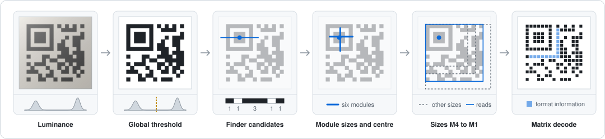
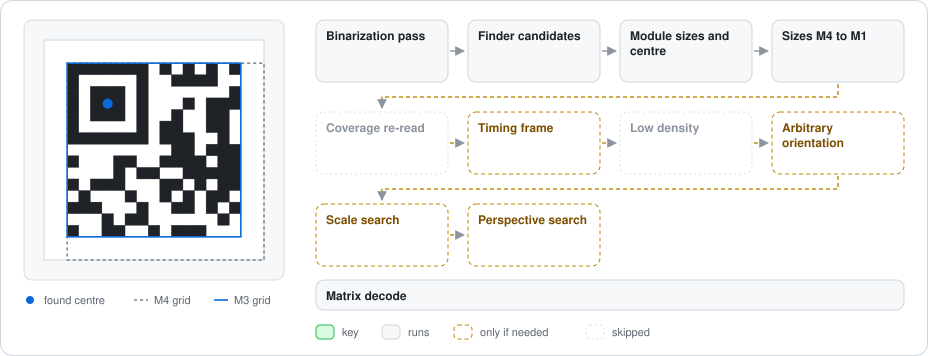
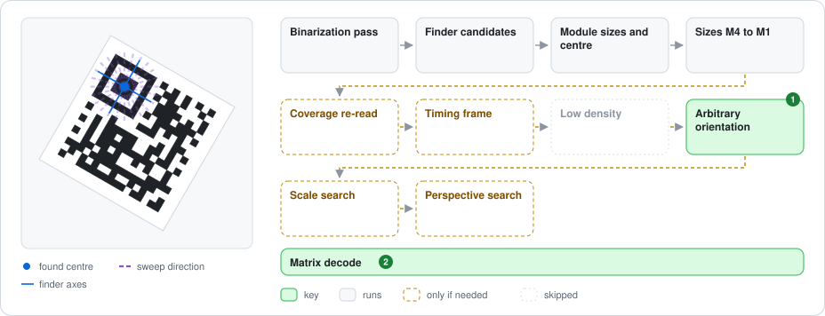
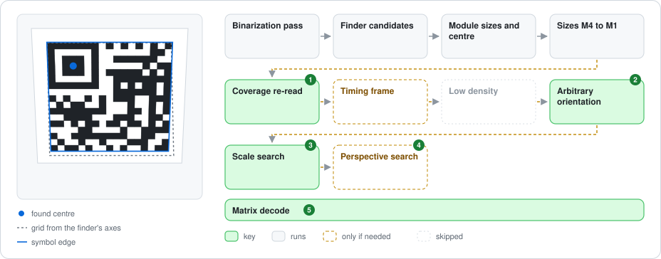
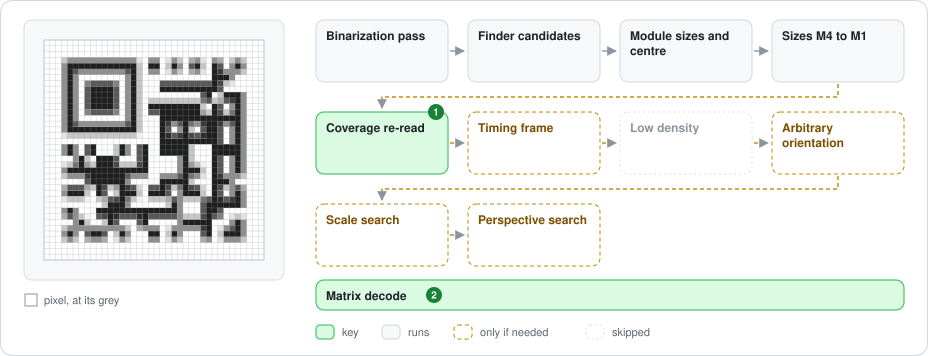
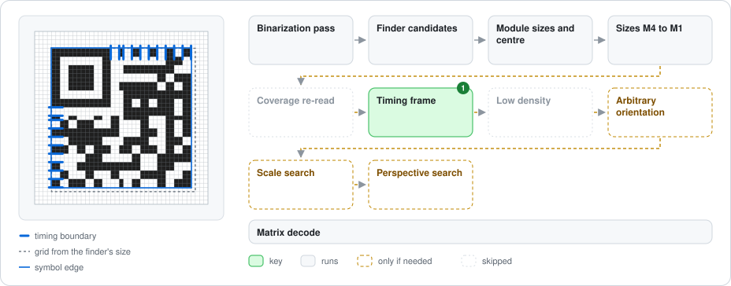
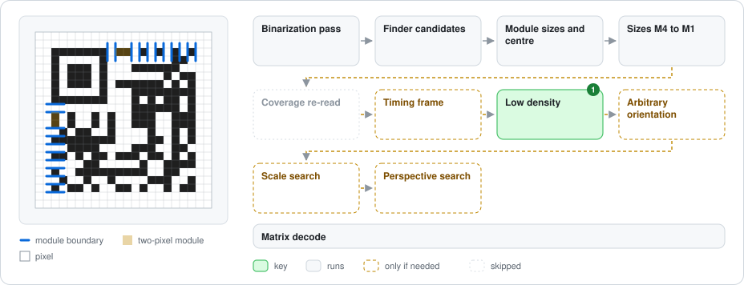

# Micro QR Decoder

Design record for the Micro QR decoder (`MicroQRCodeDecoder`, ISO/IEC 18004, M1 to M4): what it does, why, and what was learned. Code locations are in the [spec-to-code map](microqr-spec-map.md); what the three symbologies share is in [QR Symbology Architecture](qrcode-symbologies.md).

---

## What

`MicroQRCodeDecoder` decodes Micro QR symbols back into text.

### Matrix level

Input: `MicroQRCodeData`, or a byte-per-module span with its size, with or without a light quiet zone.

Behavior: locate the core, take the version from its size, read the format information, extract and unmask the codewords, correct them with Reed-Solomon up to the ISO capacity, and parse the bitstream. `MicroQRCodeDecodeInfo` reports the status, version, ECC level, mask and corrected codewords. The stages are drawn in the [spec-to-code map](microqr-spec-map.md#decoding-pipeline-overview-matrix-level).

### Image level

Input: an `SKBitmap`, or a grayscale luminance span with its width and height (`TryDecodeImage`), with an allocation-free span-destination variant.

Behavior: each of the [shared image decode passes](qrcode-symbologies.md#image-decode-passes) takes the ranked finder candidates in turn. For each, it measures the module sizes and centre, then tries:

- the axis-aligned path, in each right-angle orientation: a grid per size from M4 down to M1, then a grid fitted to the timing patterns, then, at low density, a table of module boundaries read off them;
- the arbitrary-orientation path: the finder's axes from an angular sweep, a grid per size in each frame and orientation, and a scale search and a perspective search around any grid that gets past its format information.

Each grid goes through the matrix level, keeps only the corrections its structure earns, and is read again transposed if it does not decode. In an image with grey levels, a per-size or search grid whose format word reads exactly is also read again by coverage. The stages and their order are drawn in the [spec-to-code map](microqr-spec-map.md#image-detection-and-sampling).

### Image decode figures

These figures show how the decoder reads each kind of input. [decode_figures.cs](../../../tools/decode_figures.cs) draws them from the library's own symbols and decodes each input through the public API, so no figure can show a read that does not happen. Rerun it when the pipeline changes.

#### Stage by stage

A clean M3 on the main path.

- **Luminance:** the grey input.
- **Global threshold:** one Otsu split of the histogram into ink and paper.
- **Finder candidates:** patterns that read 1:1:3:1:1 along a line through their centre and pass the cross-checks, most confirmed first.
- **Module sizes and centre:** one size along the row and one along the column, each from a dark-light-dark run through the centre spanning six modules, from the ring's inner edge on one side to its outer edge on the other.
- **Sizes M4 to M1:** a grid anchored on the finder centre for each size, largest first; the first that decodes ends the search.
- **Matrix decode:** the format information names the version, which must match the grid's size; then unmasking, Reed-Solomon and the text.

#### Reading the input figures

Each figure shows the input, with what the decoder finds drawn over it, next to the path through the [image-level stages](microqr-spec-map.md#image-detection-and-sampling). Every pass runs this path: the global threshold, the inverted image, the regional pass, then the midpoint sweep (see [image decode passes](qrcode-symbologies.md#image-decode-passes)). The matrix decode (the bar at the bottom) keeps only the corrections a grid's structure earns, and reads the grid again transposed if it does not decode.

Green and grey boxes run for this input; green marks the stages it depends on.

- **Key** (green): without this stage, the input would not read, or would read only after more grids fail than with it. A grid is one sampling; its transposed and coverage reads are the same grid.
- **Runs** (grey): runs as for any input.
- **Only if needed** (dashed): runs only when the grids before it fail.
- **Skipped** (faded): does not run for this input.

The numbers on the boxes match the numbered notes.

#### Clean

An upright, crisp M3.

The M4 grid comes first and fails at its format information both ways round; the M3 grid then reads. With only two grey levels, the grey-level stages stay off, and at this density the boundary table is not used.

#### Rotated or mirrored

Any angle, either way round.

1. **Arbitrary orientation:** the axis-aligned grids follow the image's rows and columns, so they fail on a turned symbol. Through a square finder's centre, the dark-light-dark span is shortest along the finder's own axes, so an angular sweep finds them, and a grid is sampled along each frame it gives.
2. **Matrix decode:** a mirrored capture has the same finder and a transposed grid, so a grid that does not decode is read again transposed.

Here the sweep's first frame lies along the symbol's axes, and its first grid reads transposed.

#### Keystone distortion

A flat M4 tilted away at the bottom. Its far edge is inset by as much as the measured envelope insets the top edge, on the finder's side.

1. **Coverage re-read:** a grid whose format word reads exactly is read again with each module's luminance interpolated at its centre and split halfway between the two levels. Here the scale search's grid reads this way; without it, the search's next grid reads.
2. **Arbitrary orientation:** the axis-aligned grids fail. The sweep's first frame gives a grid that gets past its format information and then fails, which starts the searches around it.
3. **Scale search:** the grid again with the centre moved slightly and each axis's module size changed by a few percent. The first variant, a slightly smaller grid, reads here.
4. **Perspective search:** the grid through a projective transform, over a small range of the two coefficients one finder leaves unknown. It does not run here, since the scale search reads first; without the scale search, it reads the symbol.
5. **Matrix decode:** Reed-Solomon corrects the data modules the grid still gets wrong; without correction, a later grid reads.

One finder cannot measure perspective, so every grid starts from the finder's axes and module sizes: correct at the finder, drifting toward the far edge (dashed).

#### Grey edges

An anti-aliased M4 at a little under two pixels per module.

1. **Coverage re-read:** the first grid fails, but its format word reads exactly, so the grid is read again by coverage, which succeeds.
2. **Matrix decode:** the coverage read still has a few data modules wrong, which Reed-Solomon corrects; without correction, a later grid reads.

Grey levels also turn on the finder centroid, which leaves the centre in place here. The midpoint sweep runs only for a polarity whose global threshold found no finder; here it found one.

#### Snapped scale

A crisp M4 at a non-integer scale, with modules snapped to whole pixels.

1. **Timing frame:** the finder measures a whole number of pixels per module, a few percent over the symbol's pitch, so the grids scaled from it drift and fail. The timing patterns on row 0 and column 0 reach the far edge: their dark runs give the size, and a line fitted to all their module boundaries gives the pitch and the corner. That grid reads.

The M4, M3 and M2 grids fail at their format information, and the M1 grid in Reed-Solomon.

#### Low density

A crisp M4 at barely over one pixel per module.

1. **Low density:** each module is one or two whole pixels, which no fitted grid follows. The module boundaries are read off the timing patterns on row 0 and column 0, and each module is sampled between its own boundaries. Here one module on each timing line is two pixels wide (marked).

The grids scaled from the finder fail first, and no timing frame is fitted.

### Supported

| Area | Coverage |
|---|---|
| Versions | M1 to M4, named by the matrix size, which the format information must agree with |
| ECC levels | L, M and Q, as each version defines them; M1 only detects errors |
| Data modes | Numeric, Alphanumeric, Byte (UTF-8 or ISO-8859-1 by heuristic, since Micro QR has no ECI), Kanji (M3 and M4, JIS X 0208; decode only) |
| Quiet zone | Matrix: any uniform light border; the finder's corner locates the core |
| Error correction | Reed-Solomon, capped at the capacity t of ISO Table 9; corrections reported |
| Format information | One 15-bit copy, up to 3 bit errors corrected |
| Output | `string` (allocates the result only) or `Span<char>` (allocation-free, image path included) |
| Image envelope | See below |

Image envelope, measured (Tier 1 to 2, kept conservative because a single finder gives few correspondences):

- clean screen-rendered or scanned images, with arbitrary rotation, mirroring and reflectance reversal;
- a shading gradient or a soft-edged shadow over part of the symbol, in images at least 33 px a side (measured in [standardqr-decoder.md](standardqr-decoder.md));
- non-integer uniform scaling, including fixed-size renders down to 1.5 px/module: when the grid scaled from the finder fails, the grid is measured on the timing patterns instead, which reach the far edge;
- crisp M2 to M4 renders between 1 and 1.5 px/module, read through a table of module boundaries instead of a fitted grid;
- anti-aliased and resampled renders from 1.5 px/module: the finder centre is the centroid of its darkness, a grid whose format word reads exactly is read again by coverage, and, after every other attempt, a finder scan runs at the midpoint of the two levels for a polarity where the global threshold found none (see the image detection lessons in [standardqr-decoder.md](standardqr-decoder.md));
- non-square modules within the envelope the symbologies share ([qrcode-symbologies.md](qrcode-symbologies.md));
- translation and quiet-zone variants;
- mild optical degradation: JPEG artifacts, low contrast, additive noise;
- keystone as measured: a symmetric top-edge inset of 2 % of the symbol width for M1 and M2, and 4 % for M3 and M4, with representative combinations of keystone and rotation, and of keystone and mirroring.

### Not supported

- Strong perspective: one finder cannot provide the independent correspondences that Standard QR's three finders and alignment patterns give.

## Why

- **An explicitly typed decoder.** `QRCodeDecoder` stays Standard QR only and Micro QR has its own entry point, so default Standard QR scanning performance is unaffected.
- **Every size is tried rather than read first.** Micro QR has four sizes, and the format word must name the size its grid was sampled at, so a grid of the wrong size almost always fails there. Larger sizes go first: a real M4 sampled as M2 reads a garbled sub-grid, while trying the real sizes first exits at the first success.
- **The axes come from the finder alone.** One finder cannot give the orientation the way Standard QR's three do. Its local axes come from an angular sweep of dark-light-dark runs, and the two projective coefficients it leaves unknown are searched. That covers arbitrary rotation and mild perspective, not strong perspective.
- **The searches start only after a format word.** The scale and perspective searches turn one grid into hundreds, so they start only once a grid's format information decodes either way round; wrong grids overwhelmingly fail before that.

## Decisions

| Decision | Choice | Revisit when |
|---|---|---|
| Correction capacity | Reed-Solomon corrections are capped at ISO Table 9's t, since the misdecode-protection codewords p make full Reed-Solomon strength wrong (M2-L: Reed-Solomon could correct 2, the standard allows 1). The cap is enforced after correction | - |
| Grid evidence | One rule in every pass: a sampled grid keeps only the corrections its structure earns. Reed-Solomon's strength at the correction count, the format word's distance, the timing modules and, when those fall short, the quiet-zone modules along the right and bottom edges are summed in bits, and a grid below the bar fails as a correction failure does. M1, which corrects nothing, is never kept on its format word and timing alone. It replaced refusals by level | A misread class that a grid's structure cannot tell from the real symbol |
| Image search budgets | At most eight finder candidates per scan, most confirmed first; at most 10,000 matrix decodes per candidate on the arbitrary-orientation path (coverage re-reads not counted), which leaves room for one complete frame (four axis assignments and four sizes) and keeps the result independent of CPU speed | A measured input class needs more |
| Coverage re-read gate | A grid is read again by coverage only when the image has grey levels and the grid read its format word exactly. A real symbol's format modules sit next to the finder, where the frame is best; texture reads a word within 3 bits about half the time and an exact one about 1 in 1,000 | - |

## Lessons learned

- The Micro QR terminator is structurally a Numeric mode indicator followed by an all-zero count field (mode bits (v−1) + numeric count bits (v+2) = 2v+1 terminator bits). Decoding it as "a zero-count Numeric segment ends the stream" needs no special terminator scanning and handles terminators truncated at capacity for free.
- The ECC codeword counts include the misdecode-protection codewords p (ISO Table 9): a decoder wired directly to full Reed-Solomon strength would silently correct ⌊ecc/2⌋ errors where the standard allows only t (for example 2 against 1 for M2-L). The capacity cap is enforced after correction and has its own equivalence-class tests.
- Quiet-zone stripping cannot reuse Standard QR's dark-bounding-box trick: Micro QR has a single finder, so the right and bottom edges are data modules with no darkness guarantee. The top-left dark module is the finder's corner, and a uniform border gives the core size.
- libzint (through the ZXingCpp wrapper) rejects UTF-8 Micro QR payloads outright ("Invalid UTF-8 in input"), and a Latin-1 payload with diacritics came back from the round trip transliterated ("naïve café" became "naive cafe"). UTF-8 fixture coverage therefore comes from the qrtool lineage only, and the sanity gate's payload comparison is what catches such silent drift before a fixture is committed.
