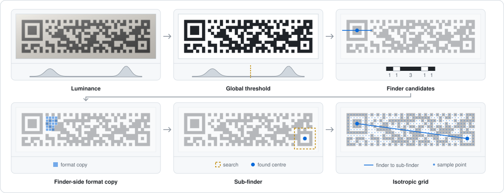
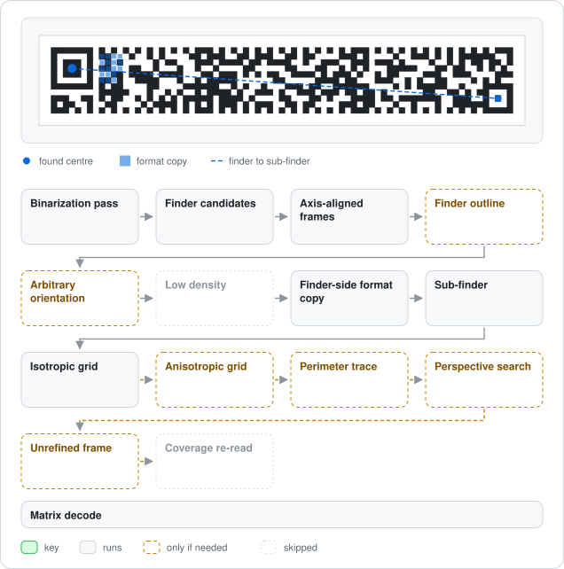
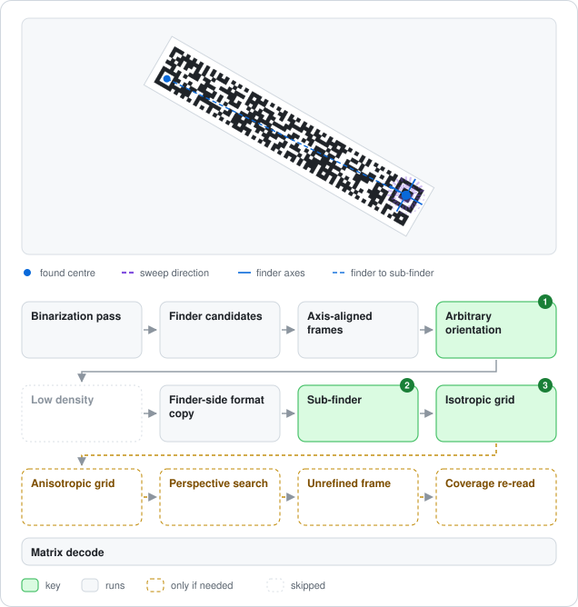
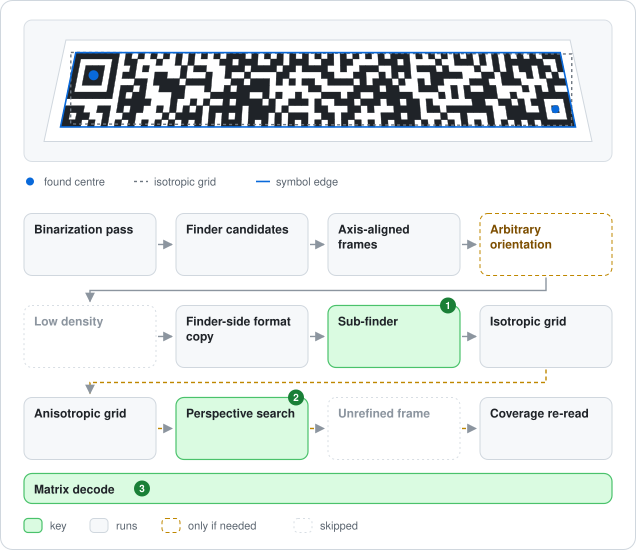
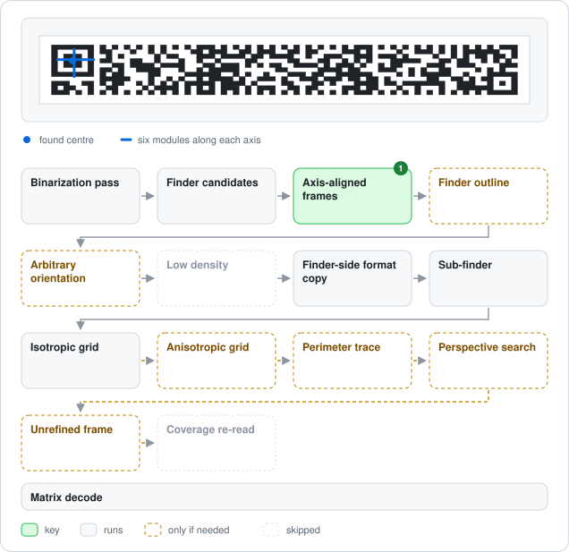
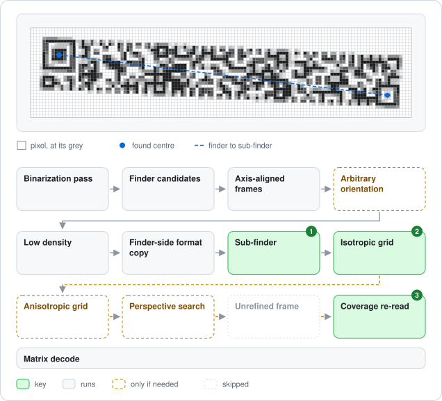
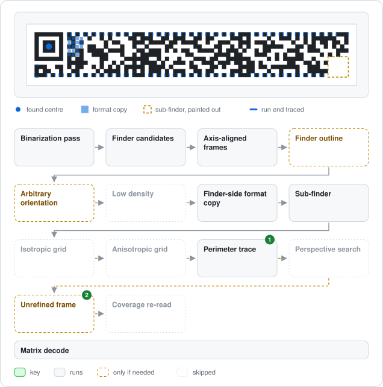
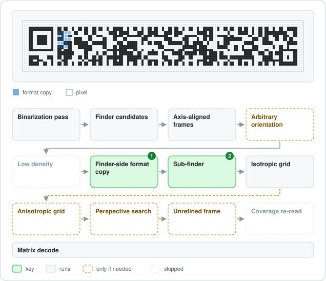
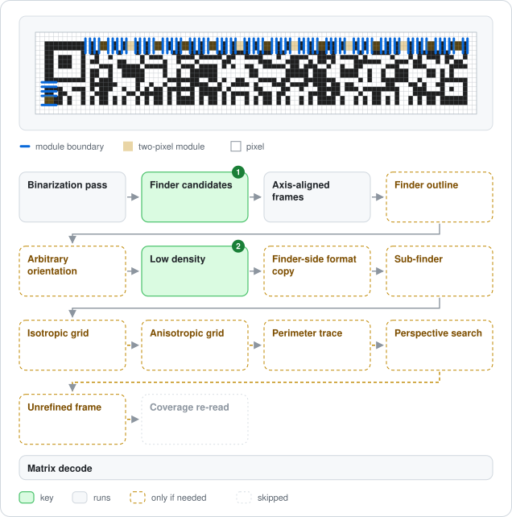

# rMQR Decoder

This record covers what the rMQR Code (ISO/IEC 23941) decoder (`RmQRCodeDecoder`) does, why it is scoped as it is, and what building it taught. The [spec-to-code map](rmqr-spec-map.md) indexes the implementation, and [rMQR Encoder](rmqr-encoder.md) covers the encoder. The rMQR implementation plan that guided the work is folded into this record and the map.

Status: the matrix level was built on 2026-08-15 and the image level on 2026-08-16. An adversarial review that day made format arbitration check the dimensions, made a too-small destination terminal for that finder, and fixed the perspective quadratic (see Decisions and Lessons learned).

---

## What

`RmQRCodeDecoder` decodes rMQR symbols back into text.

### Matrix level

The input is `RmQRCodeData`, or a span with one byte per module plus its `width` and `height` (the format `RmQRCodeGenerator.Create(Span<byte>)` produces), with or without a light quiet zone. Uniform or asymmetric borders are stripped automatically.

The decoder takes the version from the physical dimensions and reads both format-information copies. It removes the fixed mask, walks the inverse zigzag, deinterleaves the blocks, corrects each block with Reed-Solomon, and parses the bit stream into text (Numeric, Alphanumeric and Byte, with ECI segments). `RmQRCodeDecodeInfo` reports the status, version, ECC level and corrected codewords. As in `MicroQRCodeDecoder`, one overload returns a string, and an allocation-free one writes to a span destination sized by `GetMaxDecodedLength(version)`.

### Image level

The input is an `SKBitmap`, or a grayscale luminance span with its width and height (`TryDecodeImage`). An allocation-free variant writes to a span destination. When the version is unknown, size it with `GetMaxDecodedLength(RmQRVersion.R17x139)`.

The same path runs in each [shared image decode pass](qrcode-symbologies.md#image-decode-passes): the global threshold, the inverted image, the regional binarization of each polarity, and a sweep at the grey-level midpoint for a polarity whose global pass found no finder. Each pass runs these steps:

- The [shared candidate scan](qrcode-symbologies.md#single-finder-candidate-scan) ranks the finder candidates.
- Local grid frames are built around the finder, in this order:
  - The four right angles, each also transposed for mirroring.
  - Frames from the finder's own outline, measured off the inner edges of its light ring and including any perspective shear.
  - The angular sweep of the finder axis, for arbitrary rotation.
- At low density, each frame first reads a table of module boundaries off the timing lines and decodes it on its own.
- The finder-side format copy, sampled in the frame, gives the version, and so the width and height, before any grid is fitted.
- The sub-finder, located near the corner the version predicts, anchors the far end and gives the global scale and rotation in closed form.
- Affine grids are tried.
- When the frame's copy read an exact codeword, the perimeter is traced from the frame: the timing patterns of the top row, left column and bottom row are followed run by run from the finder, and one homography is fitted to their edges.
- Once an anchored grid gets past its format information, a bounded search runs over two projective coefficients and the row-axis shear, re-solving the column scale and rotation from the sub-finder each time but taking the row pitch from the frame's own scale. The sub-finder-side format copy and the edge timing patterns gate it.
- Each sampled grid goes to the matrix decoder above, followed on grey edges by a coverage re-read.

When no anchored grid gets past its format information, as when no sub-finder is found, the unrefined frame is decoded. The [spec-to-code map](rmqr-spec-map.md#image-detection-and-sampling) draws the stages and their order.

On success, the result carries the symbol's four corners in image coordinates (`RmQRCodeDecodeInfo.Corners`, with the contract in [qrcode-symbologies.md](qrcode-symbologies.md#public-api-direction)), taken from the transform of the frame that read. Frames handle a mirrored capture by swapping their axes rather than transposing the sampled grid, so that transform is always in symbol order and the corners never need swapping.

Corner accuracy depends on the grid that read. A grid anchored on the sub-finder reads a keystone through error correction without following it, so its far corners carry the remaining error. A traced grid is fitted to the symbol's own edges, outer edge included. The worst corner error, measured at 8 px per module against the rendered scene (every version, an edge shortened at both ends, 2026-09-28), is:

- Top edge shortened 1, 2, 3, 4, 6, 8 and 10 % a side: 0.97, 1.27, 1.55, 1.67, 1.81, 1.86 and 2.10 modules. The worst versions are R7x99 at 2 % (7 of 32 versions past a module), R17x43 at 8 % and R11x27 at 10 %. The decoder made each of these worst-case reads the same way before the trace was added.
- Top edge shortened 12 and 15 %, read only since the trace was added: 0.59 and 0.47.
- Left edge shortened: 0.67 or less up to 4 %, and 0.16 or less from 6 to 15 %.

The contract therefore says that under perspective the far corners can be off by about a module, or by about two modules on a symbol foreshortened by 2 % or more. Tracing the perimeter from the winning grid after a read would bring those reads to the traced figures, but a trace costs about as much as a clean decode (20 µs at R17x139), so that is left as a follow-up.

### Image decode figures

These figures show how the decoder reads each kind of input. [decode_figures.cs](../../../tools/decode_figures.cs) draws them from the library's own symbols and decodes each input through the public API, so every figure shows a real read. Rerun it when the pipeline changes.

#### Stage by stage

This clean R11x43 takes the main path.

- Luminance: the grey input.
- Global threshold: one Otsu split of the histogram into ink and paper.
- Finder candidates: patterns that read 1:1:3:1:1 along a line through their centre and pass the cross-checks, most confirmed first.
- Finder-side format copy: read beside the finder before any grid is fitted. It gives the version, and so the width and height.
- Sub-finder: searched for near the corner the version predicts.
- Isotropic grid: one rotation and one scale map the finder centre onto the sub-finder centre, and the grid is sampled at every module.

#### Reading the input figures

Each figure shows the input, with the decoder's findings drawn over it, above its path through the [image-level stages](rmqr-spec-map.md#image-detection-and-sampling). Every pass runs this path, in the order global threshold, inverted image, regional pass, midpoint sweep ([image decode passes](qrcode-symbologies.md#image-decode-passes)).

Green and grey boxes run for this input. Green marks the stages it depends on.

- Key (green): without this stage, the input would not read, or would read only after more failed grids. A grid is one sampling. Its coverage read counts as the same grid.
- Runs (grey): runs as for any input.
- Only if needed (dashed): runs only when the grids before it fail.
- Skipped (faded): does not run for this input.

The numbers on the boxes match the numbered notes.

#### Clean

This R11x77 is upright and crisp.

The format copy reads at the measured scale and gives R11x77, the sub-finder is where that version puts it, and the isotropic grid anchored on it reads first. With only two grey levels, the grey-level stages stay off. At this density, so does the boundary table.

#### Rotated or mirrored

This R11x77 is turned and seen in a mirror.

1. Finder outline: the axis-aligned frames sample no grid. From the angular sweep on, the inner edges of the light ring give the finder's own axes, and one of the outline's frames, axes swapped, reads the format copy and so the mirror.
2. Perimeter trace: from that frame, the top row, left column and bottom row are followed run by run, and the grid fitted to their edges reads. Without the outline, a sweep frame and its isotropic grid read the symbol after the same number of grids.

#### Keystone distortion

This R11x77 is in perspective, its top edge shortened by 16 %, 8 % at each end.

1. Finder outline: the columns lean 30° at the finder. The square frame built from the finder's runs (dashed) misplaces the format copy, so no axis-aligned frame reads it. The light ring's outline includes the lean, and one of its frames reads the copy.
2. Perimeter trace: each dark run of the top row, left column and bottom row is found where the step of the runs before it predicts. One homography fitted to their edges reads with no correction. Without the trace, nothing reads.

With the top edge shortened 4 % at each end, the perspective search anchored on the sub-finder reads this symbol through error correction, before the outline is measured. At 8 %, only the trace reads it.

#### Non-square modules

This upright R11x77 has modules wider than tall.

1. Axis-aligned frames: the module size is measured separately along each axis, from a six-module dark-light-dark run through the finder centre. Without the two sizes, the outline's frame reads after one more failed grid.

The isotropic grid scales the frame uniformly, so it keeps both sizes and reads first. The anisotropic grid is not needed.

#### Grey edges

This anti-aliased R11x77 is at about one and a half pixels per module, slightly turned.

1. Sub-finder: found several modules from where the version predicts it, and refined to its centre.
2. Isotropic grid: its rotation, set by the line from the finder to the sub-finder, follows the symbol's turn, which the axis-aligned frame does not.
3. Coverage re-read: the grid fails but gets past its format information, so it is re-read with each module's luminance interpolated at its centre and split halfway between the two levels, and that read succeeds.

#### Hidden sub-finder

This upright R11x77 has its sub-finder painted out, as damage or a label would.

1. Perimeter trace: no sub-finder is found, so no grid can be anchored on one. The trace needs none: it finds the runs of its three edges all the way to the painted-out corner, and the grid fitted to them reads.
2. Unrefined frame: without the trace, the frame at the scale that read the format copy is sampled on its own and reads the symbol after the same number of grids.

#### Snapped scale

This crisp R11x77 is at a non-integer scale, with modules snapped to whole pixels.

1. Finder-side format copy: at the scale measured at the finder, a few percent over the symbol's pitch, the copy does not decode. A few percent smaller, it reads and gives the version.
2. Sub-finder: found about a module from where the version predicts it. The isotropic grid anchored on it corrects the scale and reads. Without the sub-finder, the perimeter traced from the same frame reads after the same number of grids.

#### Low density

This crisp R11x77 is at a little over one pixel per module.

1. Finder candidates: the row-strided scan misses the finder, and the sweep of every row finds it.
2. Low density: each module is one or two whole pixels, which a fitted grid rarely follows, so the module boundaries are read along the top row and left column and each module is sampled between its own. The width and height counted from the boundaries give the version, and this grid reads before the format copy is tried. Two-pixel modules are marked.

### Supported

| Area | Coverage |
|---|---|
| Versions | All 32 (R7x43 … R17x139), identified by width × height and cross-checked against the format information |
| ECC levels | M, H |
| Data modes | Numeric, Alphanumeric, Byte (the same UTF-8 / ISO-8859-1 heuristics as the other symbologies), Kanji (JIS X 0208, and the generator writes it for text that JIS X 0208 covers), ECI headers 1 / 3 / 26 / 27 |
| Quiet zone | Matrix: any light border, uniform or not (the dark modules' bounding box is the core). Image: 1, 2 and 4 modules verified. The finder scan needs some light margin around the finder |
| Error correction | Reed-Solomon per block at full strength (⌊ecc/2⌋ codewords per block), with corrections reported |
| Format information | Matrix: either copy alone is enough, with ≤ 3 bit errors per copy corrected. Only copies giving the dimensions' version count, and the closer wins, so a copy miscorrected toward another version's word cannot veto the valid one. Image: the finder-side copy must be readable (≤ 3 bit errors) because it gives the version before any grid is fitted (at low density, the counted width × height does). The sub-finder-side copy gates the perspective path for consistency, and the matrix decoder then arbitrates between both copies of each sampled grid as on the matrix path |
| Output | `string` (allocates only the result) or `Span<char>` (no allocation in steady state, image path included) |
| Image envelope | Clean renders of every version × ECC at 3-13 px/module and non-integer scales. A shading gradient or soft-edged shadow over part of the symbol (images at least 33 px a side, measured in [standardqr-decoder.md](standardqr-decoder.md)). Every version at 1.5-6 px/module in four rotations. Pixel-aligned renders from 1 px/module. Non-square modules within the envelope shared with the other symbologies ([qrcode-symbologies.md](qrcode-symbologies.md)). Translation, right-angle and arbitrary rotation (every integer degree verified for R7x43 / R13x77), mirroring and reflectance reversal. JPEG q60, low contrast, additive noise. Rings printed or read thicker or thinner than their modules (ink spread, thin print, blur), which the shared finder check finds through distances between same-polarity edges ([qrcode-symbologies.md](qrcode-symbologies.md), drawn in [standardqr-decoder.md](standardqr-decoder.md#thin-or-thick-rings)). Symbols with all dark edges moved by 0.1, 0.15, 0.2 and 0.24 of a module (every version, 3-6 px/module, turned 0-60°, grey or binarized) read 597, 588, 454 and 193 of 600. Extreme aspect ratios. Keystone to 20 % at 2-6 px/module in any turn, mirrored too, narrowed along either axis or toward a corner. Of those narrowed along the short axis at 3-6 px/module, 1,278 of 1,280 read (widths 99 and 139 read 240 and 238 of 240, and the two failures are R7x139 sheared 41° at the finder, which the scan does not find). Stronger keystone at 3-6 px/module: 377 of 384 read at 20-40 %, 159 of 192 at 40-50 %. Crisp renders at 8 px/module with an edge shortened up to 8 % a side, every version except R7x139 and R9x139 at 8 % (columns lean 58° and 51° at the finder). The 148-symbol external PNG corpus |

The [image decode sweep](qrcode-test-fixtures.md#image-decode-sweep) compares this library with zxing-cpp 0.5.2 on the same images (2026-09-28: 640 cases, twenty a version, each encoded by this library and by libzint, 1,280 renders of each kind). This library reads 28,656 of 29,440 and zxing-cpp 7,771, none that this library misses. This library reads 1,272 to 1,280 of 1,280 in every kind except anti-aliased edges at 1.0-1.25 px/module (510). zxing-cpp reads at most 1,130 of any kind and no mirrored render. On the real images, both read 12 of 12.

### Not supported

- ECI assignments other than the four above (`UnsupportedContent`).
- FNC1 and Structured Append, which rMQR does not define and has no mode indicators for, so no rMQR stream can carry them (the reserved indicators are `InvalidBitstream`).
- Kanji cells outside the JIS X 0208 repertoire, reported separately as `UnmappedCharacter`.
- Keystone past 40 %, and past 20 % below 3 px/module. In measurement, 170 of 192 read at 20-40 % and 2-3 px/module, and 159 of 192 at 40-50 % and 3-6 px/module. Of the renders left, 22 find no finder and 33 fail in the data.
- Hard-edged shadows and heavy blur. Blur that makes rings read thicker or thinner than their modules is in the image envelope above.
- Heavily styled symbols below about 5 px/module. Gradients make the finder runs too fuzzy. The same styling decodes at 8+ px/module.

## Why

- The decoder is explicitly typed (no auto-detection inside `QRCodeDecoder`), as for Micro QR: Standard QR scanning keeps its performance and behavior, and a caller with an rMQR matrix knows it.
- The version comes from the dimensions, not the format information alone. A matrix whose format copies name another version is corrupt (or wrongly cropped), not a smaller symbol, and rejecting the contradiction (`FormatInformationInvalid`) is the safer default.
- The quiet zone is stripped to the dark modules' bounding box, which is exactly the core because rMQR has dark modules at all four core corners (the finder, two corner patterns and the sub-finder) and timing patterns on every edge, so no uniform border is assumed. Micro QR needed the finder-corner trick because its right and bottom edges are data.
- Format is read before geometry, so every full grid sample is made with the dimensions known. Trying all 32 rMQR sizes in each frame (the Micro QR approach, over 4 sizes) would mean 8× more sampling. The finder-side format copy carries the version and sits within 12 modules of the finder, where even a coarse local frame reads it reliably.
- The sub-finder is the far anchor. The finder's scale estimate is good to a pixel over a 12-module span (±2 % measured when it was a 7-module span, before its edges were paired by polarity), so 2-3 modules off at the far end of a 139-module symbol, and the fitted axis to about half a degree. Neither is usable over that baseline. The sub-finder is a precise far point (a 5×5 template on a half-module lattice, then the midpoint of the center dark module), so the scale along the finder→sub-finder line and the frame rotation come out exactly, in closed form, for any candidate projective coefficients.
- Row-axis shear, which leans the symbol's columns, is searched (±20° in 1° steps) with the two projective coefficients, because a 1-module feature at 8 px cannot be measured precisely enough. A keystone leans the columns at the finder by atan(shrink / height): 9° at 2 % on 17 rows, 14° at 4 %. The finder→sub-finder line runs almost along a symbol row, so the sub-finder fixes the rotation and the scale along the rows but not the columns' lean.
- The perimeter measures strong perspective, because every edge of an rMQR symbol is a timing pattern. Following it run by run, each run looked for where the step of the runs before predicts, measures what a frame at the finder can only extrapolate. Across 139 modules, a keystone changes the module pitch by a quarter and leans the columns up to 40° at the finder, beyond the search's ±12 % and ±20°. One least-squares homography over a few hundred edges averages out the pixel-level error of each edge and needs no sub-finder.
- The finder's own outline comes before the sweep's square frames, because a finder in strong perspective is a parallelogram and a square frame on it puts the format copy a module or two off. The inner edges of the light ring bound the ring whatever surrounds the pattern, so no quiet zone or separator is assumed, and where the centre chord meets them tells a finder from a 5 × 5 pattern of rings (a sub-finder or an alignment pattern). Every finder the axis-aligned frames do not read gets its outline's frames first, square or not: a rotated symbol reads through them as soon as through a sweep frame, and one narrowed along its width, whose finder stays square, in about half the time.
- Two cheap gates precede every full sample on the perspective path: the sub-finder-side format copy (18 samples) must decode to the same version within distance 1, and the edge timing patterns between the anchors (rows 0 and h−1) must alternate. Wrong coefficients bend the symbol's middle even when both anchors are right, and without the timing gate the search spent its full-decode budget on such grids.
- Correction capacity is a table, not an expression: `RmQRConstants.GetErrorCorrectionCapacity` holds all 64 version × ECC values, applied per block as in `MicroQRMatrixDecoder`. Every entry is the full RS strength `t = ⌊ecc/2⌋`, because rMQR appears to reserve no misdecode-protection codewords `p` like Micro QR's, so the cap cannot take effect today. The table lets both symbologies read the rule from one place and makes a reserved `p` a data edit. The evidence for `p = 0` is indirect (the block structure and zxing-cpp's behaviour), not a reading of Table 8 (see Decisions).

## Decisions

| Decision | Choice | Revisit when |
|---|---|---|
| Correction cap | A per-block cap from a 64-row capacity table, applied after correction (as in `MicroQRMatrixDecoder`). Every entry is `t = ⌊ecc/2⌋` because no misdecode-protection codewords `p` appear to be reserved, so the cap has no effect today and the table is where a future `p` would go. The ISO/IEC 23941 Table 8 capacity column is unread: the standard is paywalled, and the public preview stops short of it. Two checks support the table: the oracle-verified block structure leaves ≤ 1 unused ECC codeword per block on all 64 rows (60 have an even ECC count, where any `p ≥ 1` would lower `t`), and `tools/QRInteropFixtures -- probe-rmqr-capacity` measured zxing-cpp agreeing with our capacity both ways on all 64 rows (2026-08-21, [QR Test Fixtures](qrcode-test-fixtures.md)). The [Wikipedia rMQR article](https://en.wikipedia.org/wiki/Rectangular_Micro_QR_Code) was rejected as a source (2026-08-21). It has no capacity, block-count or `p` column. Its version table matches ours 64/64 on data and ECC codewords, which only confirms the derivation's input. Its claim of "1 to 4 blocks" is wrong (R15x139-H has 5, R17x139-H has 6, and 4 blocks there would need 39 ECC codewords per block, above the 30 the RS generators go up to), so it is not a reliable transcription of Table 8 | Someone reads Table 8 in the published standard (still open: do this before a release that advertises rMQR conformance), or `probe-rmqr-capacity` starts failing against a newer zxing-cpp |
| Format copy arbitration | Matrix: only copies whose version matches the dimensions are candidates. The closer wins, and a tie goes to the finder side. The 2026-08-16 review found that arbitrating before the dimension check let a copy miscorrected toward another version's word veto the valid copy. Image: the finder-side copy gives the version, and the sub-finder-side copy only gates the perspective path | Image-level recovery from a damaged finder-side copy, which would need a sub-finder-side read per candidate version through a frame accurate only near the finder, and would help only narrow symbols |
| ECI on decode | Parsed (by the shared reader, moved into `SegmentDecoders`) and mapped to ISO-8859-1 / UTF-8. Other assignments report `UnsupportedContent` | Demand for other charsets (cross-symbology decision) |
| Corpus expectations | libzint symbols decode with 0 corrections, and qrtool symbols with ≤ 1 (a documented tail defect). The same holds through the image path | qrtool fixes the defect (then regenerate, and tighten to 0) |
| Image search budgets | The shared scan's 8 finder candidates ([single-finder candidate scan](qrcode-symbologies.md#single-finder-candidate-scan)). ≤ 256 full-grid decodes per candidate. A sub-finder search radius of 6 + width/20 modules (half-module lattice, three column-axis leans). A perspective grid of ±12 % (1 % steps along the width, 2 % along the height) × ±20° shear | A measured input class needs more (then raise the constant and add its test), or profiling shows the budget dominates a common failure |
| Sub-finder search order | Outward ring by ring, stopping at the first perfect 25/25 match | Noisy inputs where the true position scores < 25 while a nearer position scores 25 (none observed) |
| Perspective search gate | The search opens once the isotropic or anisotropic grid gets past its format information. The unrefined frame runs after both and cannot open it. Letting it open the search when neither grid got that far was measured (2026-09-27). It reads 7 of the 14 failing 4 % keystones (one in the tests' renderer) and loses no read in the envelope or test suite, but slows failing decodes 2.1 to 6.2 times on Standard QR images of versions 7 to 14, whose alignment patterns are found as sub-finders, 1.5 times on 640 × 480 noise, and up to 12 times on rMQR past 8 % keystone. The frame reads the finder-side format copy through the samples that gave the version, so it passes the format information even on a Standard QR image. Also requiring the sub-finder-side copy, read through that frame, to give the version removes the cost (the gate then opened on no failing input) but keeps only 1 of the 7 reads, because under a keystone that frame is off at the far end | A condition that tells a keystoned rMQR from a Standard QR image or noise, measured against a tolerance of +3 % on common failures (no symbol, another symbology, an rMQR past correction) and at most twice the time on any unreadable distorted rMQR |
| Strong perspective | The perimeter trace (see Why) runs from each frame of the finder's outline (after the axis-aligned frames, before the sweep's) and in each axis-aligned or sweep frame whose copy read an exact codeword (after the isotropic and anisotropic grids, before the perspective search). Each part was changed on the final code and measured (2026-09-28, about 3,700 renders: strong keystones at 2-6 px/module, plain, blurred, and at low contrast with noise, plus the crisp scenes, rotations and keystones to 6 %). The net reads lost per part were as follows. The walk put back across the line after each run, switched off: 560. The outline, switched off: 179. Edges at the level midpoint, replaced by the threshold: 146. The perspective search, switched off: 115 (kept, behind the trace). The step moved halfway to each run's own, replaced by the run's own: 49. The trace in the axis-aligned and sweep frames, switched off: 37. The outer edge looked for within 0.45 of a module, replaced by 0.35 or 0.6: 13 and 4. Run ends looked for within one module, replaced by 0.8: 12 at the near end and 4 at the far end. An outline frame's copy accepted when it decodes, replaced by an exact codeword only: 10. The outline measured again along its own axes, switched off: 6. Starting the trace in axis-aligned and sweep frames only from an exact copy reads 1 render fewer than from any decoding copy, and takes 4 % less time on other symbologies' images and 1 % less on the failure set. Counting a failed traced grid as the frame's result read the same except one anti-aliased render at 1.31 px/module, lost by ending the search over scales. Skipping a trace where another frame of the finder had already traced the same side read 35 fewer of 800 noisy keystones. Running the outline first for every finder, not only one sheared 3° or more, read the same and read long-axis keystones in about half the time. These were measured and removed: the outline's seed axes swapped (−2 +2), the finder centre as a fit point (no difference measured), the left column's outer edge as fit points (no difference measured, corners no better) and four chords a side instead of two (no difference). There is still no false read on 200,000 images of noise and other symbologies | A distortion the trace cannot follow (an edge's timing pattern lost over three runs in a row, a symbol bent off the plane, or a finder sheared past about 45°, where R7x139 and R9x139 read their version and every grid fails), or the outline's measurement becoming the cost of rotated reads (2.5 % now) |
| Failed-decode cost | Two guards on `TryLocateSubFinder` (follow-up, 2026-08-18): a bounding-box rejection when no template sample of any ring position can land inside the image, and a row-wise early exit once the remaining rows cannot lift a position's score to `SubFinderMinScore`. The reflectance-retry inversion pass uses the shared `LuminanceInverter`. Since 2026-09-24, positions from the fourth ring out are first screened on the half-module lattice they sample, each point read once and shared by all positions. The template needs 24 of 25, so two certain mismatches drop a position, and a row's positions drop together in 64-bit masks. A point near a pixel edge counts as a match either way, within a margin several times the float rounding between the screen's expression and the search's, so the result equals the unscreened search's bit for bit. A point whose margin ends exactly on the image border is outside on both classification paths. Random frames never land on that float, so the vector-scalar comparison also places one point on each border (a strict comparison planted on one path had passed it). With the ring walk no longer visiting each ring's interior and a branch-free, 128-bit lattice classification, a failing rMQR decode on a noise-like image is 4-7x faster. Against `main`, a detection miss on an adversarial image goes from 12.9 to 8.8 ms, and an ordinary non-QR image from 216 to 182 µs. The guards alone gained more (14.2 → 4.7 ms, measured mid-branch), but the strideless retry that made detection correct costs a second scan pass per polarity | The 18-bit finder-side format copy passes random data about a quarter of the time, letting the sub-finder search run dozens of times per image. Tightening it was rejected (2026-09-23): accepting only copies within 1 bit cut a failing decode on 1 px noise from 123 to 10 ms but lost 457 sweep renders (170 within 2 bits), anti-aliased and bilinear ones below 2.5 px/module and keystones past 6 %, whose copy reads 2-3 bits off at the unrefined frame. The edge timing rows as a second key were no better (up to 100 % wrong at the unrefined frame, for frames that went on to read). Budgeting sub-finder searches per candidate is untried |
| Finder candidate scan performance | A reference strideless sweep (sized for Micro QR) preceded the benchmark-driven follow-up (2026-08-17), corrected in review (2026-08-18). `FindCandidates` is a plain row-strided scan (stride 4) with no fallback of its own. When the strided pass reads nothing, the image decoders rerun the whole decode through `FindCandidatesFullSweep`. The first design put the fallback inside the scan, triggered by "no candidate confirmed on two or more rows", which describes the image, not the symbol: a second QR code or a noise artefact satisfies it on the real symbol's behalf, and a differential sweep measured the loss. With the trigger in the caller, detection on an image of one symbol reads a strict superset of what a full sweep reads. After a read too long for the destination the sweep does not run, a residual of the [single-finder candidate scan](qrcode-symbologies.md#single-finder-candidate-scan). The scan is shared with the Micro QR image decoder, and since 2026-10-01 is one scan for both | The strideless retry costs a second decode pipeline on every failing image. Since 2026-09-24 it skips a candidate equal to one that the strided pass already decoded without a settled result ([image decode passes](qrcode-symbologies.md#image-decode-passes)) |
| Luminance conversion performance | After a reference per-pixel loop, the benchmark-driven fast path (follow-up, 2026-08-17) is an AVX2 kernel at 32 px per iteration, bit-exact through the `pmaddubsw` weight split `[R,G,G,B] × [77,51,99,29]` (both pairs sum to 128, the BT.601 weights to 256), with the row remainder in 8-px blocks plus one overlapping block and alpha in-vector. The ARM64 tier (2026-08-19) is a NEON kernel at 16 px per iteration on UDOT, which sums `77R + 150G + 29B` for four whole pixels without deinterleaving and weights the 4th byte 0, so RGB888x padding is free. It vectorizes every alpha shape, including arbitrary partial straight alpha, which the AVX2 tier left scalar, by classifying each row once and latching the mode (four row modes rather than two). A 128-bit tier (2026-09-30) serves every other vector target (x64 without AVX2, WebAssembly, ARM64 without the dot-product instructions) with the NEON tier's row modes: R and B share 16-bit lanes and G has its own, weighted by a 16-bit multiply-add (SSE2 `pmaddwd`, WebAssembly's dot product, a portable multiply and fold elsewhere). On WebAssembly, a partially transparent block uses the per-pixel formula and a composite-mode row the scalar loop, because the vector composite was slower there. Against the scalar loop on default NativeAOT, WebAssembly AOT and interpreted, conversion alone measures 0.21 to 0.22, 0.62 and 0.54 to 0.58 opaque, and 0.41, 1.00 and 1.01 with straight alpha. A bitmap decode with the histogram's 128-bit tier measures 0.33 to 0.42, 0.61 and 0.56 to 0.70. On ARM64 without the dot-product instructions (Apple M2, 2026-10-01: NativeAOT compiled without them, and the JIT under `DOTNET_EnableArm64Dp=0`), against main's scalar path there, it measures 0.44 to 0.51 opaque, 0.71 to 0.76 with straight alpha, and 0.57 to 0.69 for a bitmap decode. On cores with the dot-product instructions, the dot-product tier stays about twice as fast. All three symbologies share the converter | The AVX2 tier still falls back to the scalar formula for the remainder of a partial-straight-alpha row, which the NEON tier vectorizes. The exact identity `x / 255 == ((x + 1) * 257) >> 16` is worth using to close that gap, at roughly 3x the opaque path's operations. Also a layout beyond BGRA / RGBA / RGB888x |
| Grid sampling performance | A reference scalar sampler preceded three tiers (follow-up, 2026-08-20): `SampleGridSimd128` (projective), `SampleGridSimd128Affine`, and the scalar loop as parity reference and fallback below Vector128. The affine tier does not depend on typical input: `TryDecodeFrame` builds every frame before the perspective search with `perspectiveX = perspectiveY = 0`, so the denominator is exactly `1f` and dropping both divisions changes no sampled byte. The tiers measured 2.4-3.8x on the kernel and -14 to -16 % on span image decode. The Standard QR row kernel is not shared: it multiplies by one reciprocal where this one divides twice, so the two do not sample identical bytes | The gather sets the floor (0.70 ns/module, and NEON has no gather instruction), so the next step is a different data layout, not a better kernel. Axis-aligned sampling would still gain a measured 6-10 %, but that is cross-symbology work, not an rMQR item |
| Too-small destination is terminal per finder candidate | The rule, its reason and its earlier cost are in the [single-finder candidate scan](qrcode-symbologies.md#single-finder-candidate-scan), which also covers the skip of a candidate inside the symbol that read, and the coverage re-read that rMQR alone still made after a read that did not fit, until 2026-10-01 | Accepted residual: 2 of 11,200 fuzzed noise frames, holding no symbol, report `DestinationTooSmall` with a one-character destination. Revisit if a caller reports growing its buffer for an image with nothing in it |
| Codeword extraction performance | A reference per-module walk, built with the matrix decoder (2026-08-15), preceded the benchmark-driven fast path (follow-up, 2026-08-17). Per-version tables, built once from the encoder's own predicates, hold the walk order with the mask fused in and a PEXT/PDEP descriptor per column pair. Four tiers use them. On x64 with AVX2 and fast BMI2, a bit-plane kernel transposes the grid into per-column bit planes and runs one PEXT + PDEP per column. ARM64 has a pair-plane kernel (2026-08-20). x64 without fast PEXT and WebAssembly run the same pair planes on portable vectors (2026-10-01). Everything else runs a portable table walk. ARM64 has no PEXT/PDEP, so the deposit step is designed out, not emulated: one 32-bit lane holds a whole column pair, already that pair's output field with the function modules still in it, and a per-version run table compresses those modules out. The reference stays the tables' source of truth, and all four tiers are checked against it | Extraction stops being a material share of matrix decode, or a symbol shape appears whose data mask is not a small number of runs per pair |

## Lessons learned

- Once the encoder is proven module-exact against two external lineages, the decoder round trip alone is a weak test. The strong tests were the corpus (148 external symbols from both lineages, checking payload, version and ECC) and the damage classes: t errors per block corrected in every block of every version × ECC, t + 1 in one block never decoding cleanly, format copies damaged singly or jointly, a format-dimension contradiction, and remainder bits ignored.
- Two format copies make the format decoder robust with no extra effort: one copy can be destroyed outright. The rule that holds is "among the copies naming the version the dimensions give, the closer wins". The review found that arbitrating on distance alone let a copy miscorrected toward another version's word (5+ errors landing within 3 of it) veto the valid copy, so the matrix decoder now feeds the dimensions' version into the arbitration.
- Image detection on a wide symbol is a long-baseline problem: everything measured at the finder is good to a few percent, several modules over 139. The design that worked makes the far anchor (the sub-finder) the authority for scale and rotation and treats every local measurement it overrides as an approximation. The one quantity it does not override is the perspective search's row pitch, which is why a scale a few percent off can still decide that search.
- At low density, the finder-side format read, the pipeline's first exit, was the step that failed (2026-09-20). Below 2 px/module, a renderer snapping modules to whole pixels gave the finder a scale 3.5-6 % over the symbol's, most of a pixel at the copy's column 11, so the version never read and the sub-finder refinement that would have fixed the scale never ran.

  The read now tries the scales nearest the measured one (±2 to ±8 %) in turn while the frames built on them fail, because which finder modules the snapping widens depends on the orientation: a copy can read exactly at a scale a few percent off (R11x77 at 137 px turned 270° reads its copy exactly at the measured scale) while its frame still fails.

  Three measured rules bound that search, each trading reads against the time a failure takes:

  - A corrected scale must read an exact codeword. The usual 3-bit distance made a quarter of random reads a version, and the searches behind them made the no-symbol path 2.8× slower. Exact-only costs +2.5 %.
  - Scales are read only while the finder's larger axis measures under 6 px per module. This bounds cost, not accuracy: lifting it would read more (renders whose sub-finder is hidden or has as few as two wrong modules, and mildly keystoned ones) but make other symbologies' images fail more slowly, 2 to 2.8× on Micro QR and up to 2.5× on Standard QR.
  - The search stops once frames anchored on the sub-finder have read format information and failed. On a damaged symbol every scale reads the copy, and repeating those frames made the failure 3-5.3× slower.

  The unrefined frame is the exception and runs at every scale, because each scale is a different grid and on a symbol with a hidden sub-finder it is the frame that reads. Nothing cheaper separates a damaged symbol from a slightly wrong scale, since both fail in the data. The perspective search takes its row pitch from the starting scale, so a later scale can rescue a mildly warped low-density render. The stop gives those up.
- Test payloads must fit each version's capacity (R7x43-M holds 7 alphanumerics). The 13 early "decoder failures" were the generator rejecting the payload. The decoder had passed everything.
- On Apple M2, the ARM64 pair-plane extraction tier (2026-08-20) measured 0.30x the portable table walk at R17x139, 0.36x at R13x99, 0.55x at R11x59 and R7x139, and 0.92-0.94x at R7x43 and R11x27. A cost model, not a boundary, is why it has no size switch: its cost per bit falls smoothly from 0.45 to 0.14 ns over a ~35 ns fixed floor, while the portable walk costs ~0.48 ns/bit with no fixed cost, so the two cross at about 100 bits and the two smallest symbols win only 6-8 %. R7x139 was added to separate "small" from "short": wide with 5 data rows, it still wins 0.55x, so the weak cases depend on total bits, not height, and no height guard is needed.

  Unrolling every pair to its version's worst-case run count was rejected: a pair averages 1.0-2.3 runs but the worst has 5-11, and unrolling measured 2.4x slower than the portable walk on small symbols. One flat run stream for the whole symbol removed that loss. Deleting the 320-byte plane `stackalloc` saved ~5 ns of zeroing alone, about 10 % of a small symbol. At 40-600 ns per call, the prologue is part of the hot loop.
- The 128-bit pair-plane extraction (2026-10-01) is the ARM64 kernel on portable vectors, for x64 without fast PEXT and for WebAssembly, with NEON's three instructions replaced. A pair's two columns are adjacent bytes, so one 16-bit lane holds both, and `x | x >> 7` merges them where NEON unzips. The row insert is a shift and an OR where NEON has SLI, and the row-reversed word takes four swap steps, once a block, where NEON has RBIT and REV32. Against the table walk on a default NativeAOT publish, every version wins, from 0.21 at R17x139 to 0.71 at R7x43.

  On WebAssembly the sparse symbols lose (R7x43: 1.45 AOT-compiled and 1.47 interpreted). There the weak cases depend on stream bits per 8-column block, not total bits: R7x139, 544 bits at 30 a block, loses interpreted at 1.05, while R13x43, 328 bits at 55 a block, wins at 0.92. WebAssembly uses the tier from 44 bits a block, the interpreter's break-even point (AOT-compiled code's lies between 27 and 33, and one flag gates both builds). R17x139 matrix decode takes 0.24 of its earlier time on default NativeAOT, 0.28 on WebAssembly AOT and 0.49 interpreted, the 128-bit syndrome pass included. The tier's flag is false on ARM64, whose own pair planes run first, so the dispatch there drops the branch.
- `TryCorrect` recomputes the syndromes after correcting, to catch silent miscorrection, so a corrected block runs the syndrome pass twice. That second pass is most of the clean-to-corrected gap (about 10 us of 12.8 us at R17x139) and is why a faster syndrome kernel gains more on damaged input than clean: 6.47x against 4.10x when the ARM tier landed. A correction-cost estimate from a clean-only benchmark is off by roughly a factor of two.
- Correctable damage roughly doubles matrix decode time (279.6 → 554.9 ns at R7x43, 14.33 → 27.16 us at R17x139), so Berlekamp-Massey, Chien and Forney are about half of a damaged decode. The clean-only scenario set could not rank the correction path, hence `RmQR_*_Corrected_Decode`, whose damage is accepted only when the decoder reports exactly the intended number of corrected errors, because flips on function patterns carry no codeword.
- One shipped correctness fix has no discriminating test. The perspective quadratic's `|sv|²` correction is verified analytically and numerically, but reverting it to `|v|²` keeps the keystone suite green because the bias stays below the gates' tolerance. A synthetic sheared-frame probe of `TryPerspectiveVariants` would be that test.
- The qrtool tail defect in the corpus became a robustness fixture at no cost. Those symbols decode with exactly one corrected codeword, so the fixture test asserts `ErrorsCorrected ≤ 1` for that lineage and `0` for libzint.
- Codeword extraction dominated the matrix decoder. The per-module `IsFunctionModule` predicate alone was 40-70 % of extraction, and extraction was 70-91 % of `DecodeMatrix`, with Reed-Solomon correction under 1 %. Moving everything the walk derives from the version into cached tables gained more than every instruction-level trick after it (follow-up, 2026-08-17: 16-64x on the kernel, 5.0-8.0x on the matrix-decode API, -14 % on the image path, where detection dominates).
- The failure path has its own hot spots and needs its own profile. None of the functions three earlier optimization rounds targeted is near the top of a failed decode. The cost was `TryLocateSubFinder`, which barely runs on success but ran for every frame the 18-bit format copy let through, a gate random data passes about a quarter of the time (follow-up, 2026-08-18).
- Where an early exit is tested decides whether the fast path pays for it. Abandoning a template position once it cannot reach the acceptance floor cost +12 % on the largest successful decode when tested per sample: the counter, the merged bounds condition and a `goto` out of two nested loops slowed the 25-sample loop for positions that run it in full. Tested once per row of five, it cost nothing and still gave up after one row on the failing path. Only the end-to-end run showed this. The kernel benchmark did not.
- A fallback makes a stride safe only if its trigger asks about the symbol being looked for. While the fallback fired only on "found nothing", the finder scan's row stride could not be widened past `TryFind`'s, because one false candidate would suppress the fallback. Changing the trigger to "nothing confirmed on two or more rows" was taken as licence for stride 6, as if a too-coarse stride would now report itself. It does not: `Count >= 2` is evaluated over the whole candidate list, so it describes the image, not the symbol, and a second QR code, a printed logo or salt-and-pepper noise confirms on its own and suppresses the pass the real symbol needed. A differential sweep against the pre-stride build lost 69 decodes and gained 26 over 6,000 images carrying a second finder-like pattern, concentrated at 3-4 px/module under rotation, and 0 diverged over the same images without one. `TryFind`'s trigger ("no consistent triple") asks about the symbol, so it is not exposed to this.
- The first repair, making the stride itself safe, was rejected by measurement. Landing the stride in every band means measuring the band, which is 3 modules tall only while the symbol is axis-aligned. Under rotation the run ratios drift off-centre and the surviving band narrows to a floor of 5 rows at 3 px/module, which means stride 4, not 6. The same sweep showed that tightening the stride while changing the trigger to "the candidate list is empty" was worse overall than the old code (net −29 / −77 / −25 across the three corpora, against −8 / −43 / −3): any stray dark run produces a candidate, so an empty list almost never happens and that fallback is close to dead code. Testing the two changes one at a time showed this: the stride change alone helped, and the trigger change alone was the worst variant measured.
- Moving the widening out of the scan made it sound. The one question about the symbol, "did anything decode", belongs to the image decoders, which run the strided scan and rerun the whole decode through a strideless sweep when nothing decoded. By construction this restores exact parity with a full sweep on an image of one symbol (0 regressions over 15,980 images), keeps the strided scan on every successful decode, and pays for the sweep only on images that were going to fail. `TryFind` always had this shape. A scan that returns candidates cannot ask a question about a symbol.
- The image path's largest single cost was not rMQR-specific: grayscale conversion was 69 % of `TryDecode(SKBitmap)` on both the smallest and the largest symbol. No benchmark went through that entry point, so the cost stayed invisible until one did (follow-up, 2026-08-17: 14-30× on the conversion, `TryDecode(SKBitmap)` -68 to -69 %, converter share now 7-15 %). Measure the entry points users call, not only the convenient ones.
- Exactness can come from the coefficients instead of wider arithmetic. The BT.601 weights sum to 256, which lets a `pmaddubsw` pair split stay under saturation (51 + 99 for green makes both pairs exactly 128), keeps the weighted sum inside 16 bits unsigned, and collapses the premultiplied composite to a single add on the luminance. A formula's constants are part of what makes it vectorizable.
- A fast path that handles only the regular case leaves its own guard as the bottleneck. Splitting column pairs into "clean" (both columns data on every row) and "irregular" covered only 39-45 % of the bits on the 27-wide versions, so the transpose was paid in full while most bits still took a per-bit loop, and those versions regressed against the plain table walk. PEXT and PDEP take arbitrary masks, so an irregular pair is the same two instructions with other constants. Deleting the split removed the regression and was the largest single win after the tables.
- A test that derives its expectation from the API under test no longer tests it. `Damage_WithinCorrectionCapacity` originally flipped `ECCPerBlock / 2` codewords per block (the Reed-Solomon strength), the only check of "rMQR reserves no `p`". Rewritten to call `GetErrorCorrectionCapacity`, it agreed with any capacity, however wrong: injecting `capacity - 1` left all 133 robustness tests green while the decoder silently refused corrections the code could make, and only the test of the constants' values caught it. Damage tests must check the claimed property (what RS can do), not the constant that claims it.
- Restructuring is not evidence. Moving the capacity rule into a named function and a 64-row table made the decoder better factored but added no knowledge, and the doc changes that came with it turned an open question into an asserted fact whose stated source (Table 8) had never been read. Measuring the reference implementation closed the gap (`probe-rmqr-capacity`, both directions, 64/64). Record the provenance you have, and keep the revisit trigger pointed at the evidence you still lack.
- The anisotropic grid is kept for crisp renders with rows under 2 px, not for anything inside the measured envelope. Non-square modules are handled before it (the frame measures each axis on its own, and the isotropic grid scales that frame uniformly), so on non-square renders up to 1.65:1 either way (short side 3 to 8 px, every version, right angles) it never ran.

  With it switched off over the envelope (2026-09-27: the test suite and about 49,000 renders of every version, clean, rotated, mirrored, non-square and keystoned, crisp and anti-aliased), another grid read 60 of the 61 inputs it had been first to read. The one lost is R15x43 at 1.5 px, anti-aliased, mirrored and turned 45°, where neighbouring angles already fail. As the perspective search's gate, it never decided a read.

  It does decide 105 of 8,684 reads of crisp renders with rows of 1.6 to 1.95 px and columns of 2.5 to 4 px (1.43:1 to 2.3:1), and not because of the modules' shape. On R11x77 at 3.05 × 1.95 px, the finder measures rows of 2.0 px and the sub-finder lands 0.25 px above its snapped centre row, so the isotropic grid turns 0.38° and misses the far rows, while the anisotropic grid has no turn and its row scale, though 10 % short, still puts all eleven rows on their pixels. Neither alternative replaces it there: centring the sub-finder on its ring edges reads that input but loses 76 of the 8,684 reads, and the unrefined frame, which keeps the finder's column scale (1.6 % short), reads 2.

  It costs one grid wherever the isotropic grid fails with a sub-finder found: 16 to 24 % of a keystone read with the left edge shortened, and 1.5 to 3.5 % with the top shortened. Failing decodes do not change.
- An edge is located at the midpoint of the two levels, not at the threshold (2026-09-28). On an image of only 0 and 255, the Otsu threshold is 1, one level above dark, so a crossing there puts every edge on the centre of its dark pixel, half a pixel into the dark. On crisp keystoned renders at 8 px/module, the finder's outline came out 6 to 7 % large and its format copies did not read. The histogram pass that finds the threshold already has both levels, so the edge level is free. A pass of its own cost a small clean read 4 %.
- Chords across a finder must stay off the edge of its centre square. Seeded 0.75 module apart, the outer chords ran along that edge, whose grey pixels cross the level. Chords half a module apart from the seed, then a module apart along the outline's own axes, cross the ring squarely and halve the axis error (median 0.62° → 0.32°). A finder measured at under 2.5 px/module through two-module chords shows up to 8° of shear when it has none, so the 3° gate judges the second measurement.
- A search that stops at the first hit should start sampling where the answer probably is. The trace predicts each edge within a sample or two. A crossing search over its whole window cost 69 ns, while sampling outward from the middle until no pair further out can be nearer costs 42 and finds the same crossing to the bit. A trace of R17x139 at 8 px/module went from 44 to 20 µs.
- A variant measured on a set every variant reads says nothing. The strong keystones read 575 of 576 whichever guard was off, so each guard looked dead. The same keystones at 2-3 px/module, blurred and with noise, told the parts apart, and led to moving both end windows to a module (0.5 and 0.4 before) and removing the step's anchor on the last run, which then cost reads. Each change shifted what the others decide, so every part was measured again on the final code and each part's test renders were chosen again.
- Timing needs the JIT held fixed. With tiered compilation on, the builds before and after this change measured 109 and 410 µs over the same images, a difference neither build's code caused. With it off and the runs interleaved, both measured about 100.
- Both the work a search skips and a result that ends a search need measuring. Skipping a trace because another frame of the finder had already traced that side cost 35 of 800 noisy keystones: the start decides a trace, and the second start was the one that read. A traced grid that got past its format information and failed, counted as the frame's result, ended the search over scales at 1.31 px/module, before the scale whose anchored grid reads.
- A search over positions that share their samples is a search over the samples (2026-09-24). A failing decode on 512 × 512 noise spent 87 % of its time in `TryLocateSubFinder`, where the 2,601 positions of one lean on the widest symbol read the same 3,481 half-module lattice points up to 25 times each. Now each point is classified once (dark, light, outside or edge). A position with two certain mismatches cannot reach the 24 of 25 it needs, and whole rows of positions drop at once in 64-bit masks. The first three rings are scored as before, since a sub-finder near its prediction is found before the screen pays off. Exactness came from a margin, not from reproducing the float expression: a point within a few roundings of a pixel edge counts as a match either way.

  Removing the dominant cost exposed two costs no profile of the old code showed: the ring walk visited every ring's interior (O(r³)), and on texture the pixel branch mispredicted half the time (1.5x on its own). Per lever on 8-bit noise, the speedups were the screen 2.0x, with the ring walk 2.6x, the vector classification 3.5x, the branch-free read 5.4x, and with the sweep skip 6.3x end to end. The search went from 221 to 17 ms a decode (13x), every result unchanged.
- The true-transform column ([qrcode-test-fixtures.md](qrcode-test-fixtures.md#image-decode-sweep)) says the frame, not which frame. Every keystoned render that failed did read through the geometry it was drawn with, which ruled out the pixels before anything was built, but the column could not say which frame would read them. The answer was in the symbol's own geometry, its timing-pattern perimeter.
- Two format copies hide a fault in reading one (2026-09-29). When the matrix decoder's reader walked a copy's block by rows, or read the finder side's last three bits on the sub-finder side, every round trip still read from the other copy. Only `RmQRCodeDecoderRobustnessTest`, which damages one copy, failed. So a format reader's test damages the copy it does not read, or reads each bit alone, as `RmQRFormatPositionTest` does for both readers. The matrix decoder's test came on 2026-09-30. Before it, a reader that never read the finder-side copy's last bit, the level bit (1 in every H symbol), had passed every other test. Under that reader, an H symbol whose sub-finder copy is destroyed still reads, but stops once its finder-side copy has three bit errors, which the correct reader corrects.
- A position helper asked per bit cost a percent where the reader runs (2026-09-29). The format positions are stated once, in `RmQRConstants`. Asking for each bit's module measured about 1 % slower on an image that does not read, where the image decoder's reader runs for every frame tried, and on a clean R17x139 matrix. Aggressive inlining on the helper did not recover it. Both readers walk the block from `GetFormatBlock` with their own loops. Only the placer asks per bit, writing a cached template once per version and level. On default NativeAOT, the matrix decoder's reader still called `GetFormatBlock` and `GetFormatTail`, which the JIT inlines but ILC did not. Marking both `AggressiveInlining` (2026-10-01) took `ReadFormatCopies` from 127 to 105 instructions on x64 and from 125 to 103 on ARM64.
