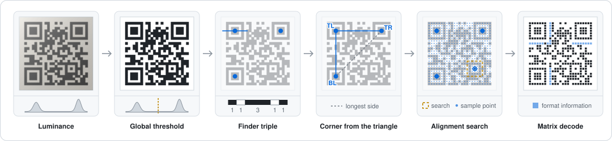
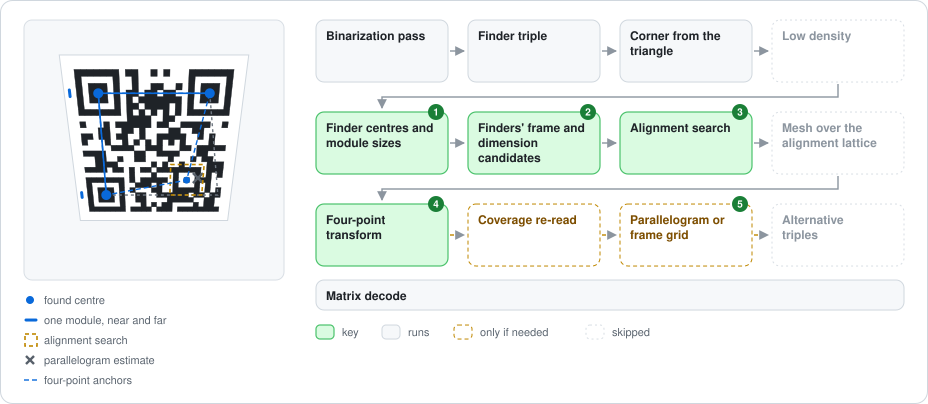
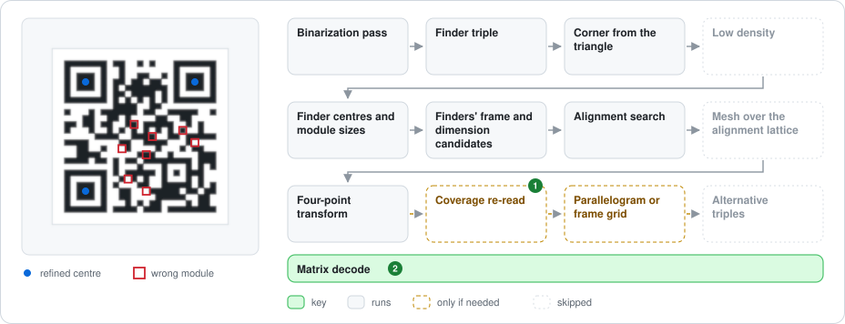
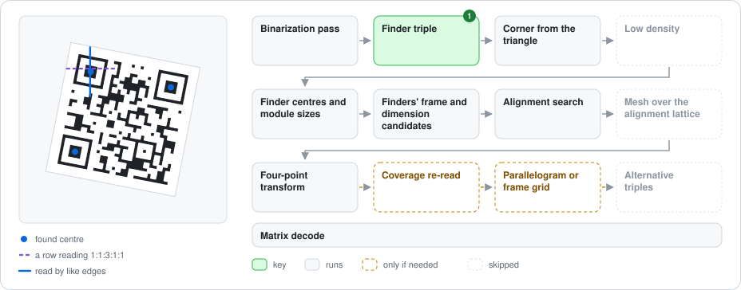
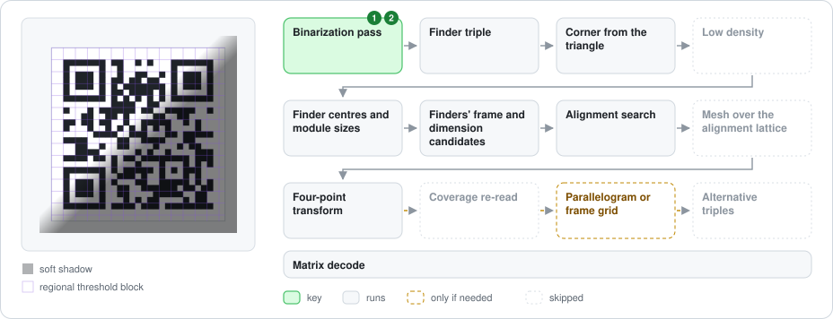
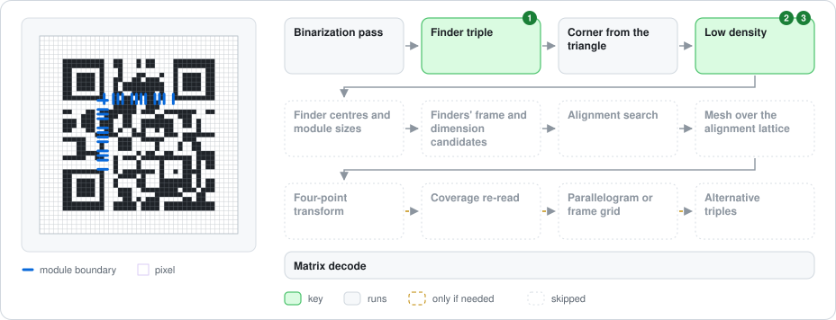
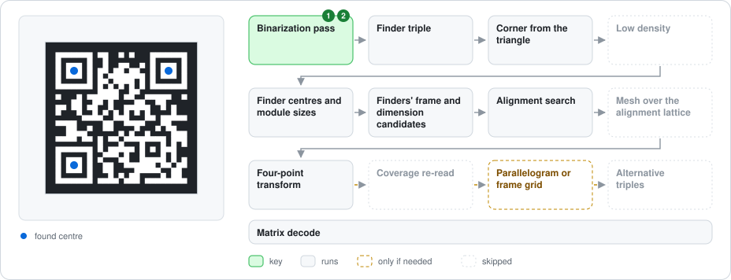
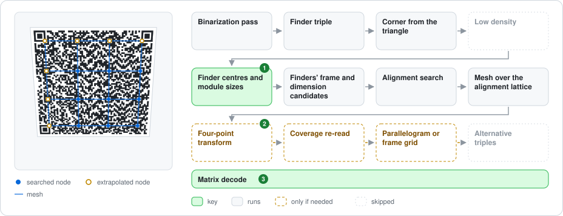

# Standard QR Decoder

Design record for the Standard QR decode feature (`QRCodeDecoder`): what it does, why it is scoped the way it is, and what was learned during implementation. Implementation details live in code comments next to the code (see the [spec-to-code map](standardqr-spec-map.md)). Micro QR and rMQR have their own: [Micro QR Decoder](microqr-decoder.md) and [rMQR Decoder](rmqr-decoder.md); what the three share is in [QR Symbology Architecture](qrcode-symbologies.md).

---

## What

`QRCodeDecoder` decodes QR codes back into text at two levels.

### Matrix level

Input: `QRCodeData` or a byte-per-module span (the same format `QRCodeGenerator.Create(Span<byte>)` produces).

Behavior: runs the full inverse pipeline, format info → unmask → codeword extraction → deinterleave → Reed-Solomon correction → bit stream parsing. The `Span<char>` overloads complete allocation-free in steady state.

### Image level

Input: `SKBitmap` or a grayscale luminance span.

Behavior: adds binarization (Otsu, and a regional pass when the global threshold reads nothing, and gives no verdict on the content, in either polarity), finder pattern detection, orientation resolution, bottom-right alignment pattern search (version 2+), and projective grid sampling (4-point perspective transform) in front of the matrix pipeline. The stages and their order are drawn in the [spec-to-code map](standardqr-spec-map.md#image-level). The alignment pattern is searched, with the grid axes there, where the finders' frame puts it: the projective map that the three finder centres and the module sizes at both ends of the two finder lines determine together, since a flat symbol in perspective foreshortens along each line and one plane fits the centres and both changes of size. Each finder is a candidate when each line it is cross-checked along reads 1:1:3:1:1 on its own scale, so the one a strong perspective draws up to twice as tall as wide is found, and where the frame foreshortens the dimension is counted along each finder line by the geometric mean of its two ends, the count the frame implies. A cross-check line whose dark runs are all longer or all shorter than their modules (ink spread, a thin print, a blurred ring) is read by the distances between its edges of the same polarity, and a finder read so must read its rising diagonal too. When the triple does not settle (neither reads nor gives a verdict on the content) from the corner its shape names, each other corner is decoded once its timing patterns read. When the selected triple still does not settle and more than three candidates were found, up to two other triples, ranked by the height in modules their least confirmed finder was confirmed over, are each decoded once, from the first of their corners whose timing patterns read through its own frame. When nothing anchors the fourth corner (version 1, or no alignment pattern found), the global grid is the parallelogram of the finder centres, and the finders' frame is sampled after it when the frame foreshortens; the timing match reads the timing patterns through the frame. Version 14+ symbols additionally build a piecewise-bilinear mesh over the full alignment-pattern lattice (wavefront detection with iterated homography refinement), and versions 7-13 one over their 3 × 3 lattice (the interior nodes searched where the finders' frame puts them, the rest placed by a least-squares plane). A partially-detected mesh falls back to the global transform, so the mesh can never decode worse than it. A global transform anchored on the bottom-right alignment pattern falls back, on failure, to the parallelogram of the three finder centres, whose centres are resolved much more finely at low density, read by coverage too on an image with grey levels. The resample is decoded only when it samples different modules, and not at the runner-up dimension, which is a guess. When the estimated dimension fails, the two timing patterns are counted (their dark runs give the version directly) and the version 7+ version information is read from that sampling; the dimensions they name are tried in that order, then the timing match's, then the estimate's runner-up. An estimate that lands past the version range is not taken as proof of a wrong finder triple: the timing patterns are counted, and a count both lines agree on is sampled, or failing that the timing match's.

On success the result carries the symbol's four corners in image coordinates (`QRCodeDecodeInfo.Corners`; contract in [qrcode-symbologies.md](qrcode-symbologies.md#public-api-direction)). They come from the mapping that decoded. On the global path that is the 4-point transform. On the mesh path (version 7 and up, when nothing anchored the fourth corner or the anchored grid did not read) the four-point transform had no fourth anchor or failed, so the corners come instead from a transform anchored on the three finder centres and the mesh's diagonal-last lattice node (at its last grid coordinate). That node is a detected alignment pattern in the ordinary case; when that pattern was missed it is a refinement-round prediction from version 14, and at versions 7 to 13 the least-squares plane's placement. Anchoring instead on the nearest node the mesh actually detected was tried from version 14 and produced byte-identical corners on every version and tilt measured, with the pattern erased included, so the simpler form is what ships. Bilinear extrapolation of the outer mesh cell was tried first and left the top-left 0.6 to 0.75 module short, because the finder side of the mesh is only as straight as its first alignment row. Version 1 has no alignment pattern, so under perspective its bottom-right corner is the parallelogram estimate the sampler also uses whenever that grid decodes, which error correction does under a few percent of keystone, which is why the corner tests hold a version-2+ keystone to half a module and cover version 1 only flat and rotated (measured: v1 stays within 0.18 module over a full rotation sweep, its gap is keystone alone). Past that the parallelogram fails and the finders' frame decodes, and its corners are the frame's (within half a module on the keystoned version 1 renders of `KeystoneFrameDecodeTest`). That parallelogram fallback is not version 1's alone: `BuildGridTransform` reaches it on any version once all three `allowance` windows fail to find the bottom-right alignment pattern, and a review round measured that one erased module there is enough: the symbol still decodes on error correction and reports that corner up to about a module and a half out (v2 at 2 % keystone in either direction: 0.82 module; it used to read a little further in one keystone direction only, see the pixel-convention lesson). From version 7 the rest of the alignment lattice anchors the mesh first, and the corners come from it: the v10 at 0.75 % that measured 0.83 module through the parallelogram reports 0.07 through the mesh, in either keystone direction (`SymbolCornersTest` holds it to half a module). The corners themselves are also only half-module accurate from about 8 px per module up, because the alignment centre is pixel-resolved: its error holds near 4 px at 6, 8 and 12 px per module (4.09, 3.63, 3.94), which is 0.68 module at the coarse end and 0.33 at the fine one. Both facts are in the public contract. On an image with grey levels the alignment centre has since been refined to a fraction of a pixel (the centroid lesson below), and these corner figures were not measured again; on a two-level image it is still pixel-resolved.

### Image decode figures

These figures show how the image decoder reads each kind of input. [decode_figures.cs](../../../tools/decode_figures.cs) draws them from the library's own symbols. It also renders every input and decodes it through the public API, so a figure cannot show a read that does not happen. Rerun it when the pipeline changes.

#### Stage by stage

A clean symbol through the main path.

- **Luminance:** a grey image comes in.
- **Global threshold:** one Otsu split of the histogram separates ink from paper.
- **Finder triple:** each finder reads 1:1:3:1:1 along a line through its centre.
- **Corner from the triangle:** the top-left finder is the one opposite the longest side.
- **Alignment search:** the alignment pattern is searched for where the finders' frame predicts it. It then anchors the four-point transform that samples the grid.
- **Matrix decode:** format information, unmasking, deinterleaving and Reed-Solomon, then the text.

#### Reading the input figures

Each figure shows the input, with what the decoder finds drawn over it, beside the path through the [image-level stages](standardqr-spec-map.md#image-level). Every binarization pass runs this path: the global threshold, then the inverted image, then the regional pass (see [image decode passes](qrcode-symbologies.md#image-decode-passes)). The matrix decode at the bottom reads every grid, and reads it again transposed unless the first read settles it.

Green and grey boxes run for this input; green marks the stages it depends on.

- **Key** (green): without this stage, the input would not read, or would read only after more grids fail than with it. A grid is one sampling of the symbol: reading it again transposed or by coverage is the same grid.
- **Runs** (grey): the stage runs as it does for any input.
- **Only if needed** (dashed): the stage runs only when the grids before it fail.
- **Skipped** (faded): the stage does not run for this input.

Numbers on the boxes match the numbered notes under each figure.

#### Clean

A screenshot, a render or a flat scan: upright, crisp and flat. The first grid decodes.

With only two grey levels, one global threshold splits ink from paper, and the stages that need grey levels stay off. The strided row scan crosses each finder's centre band, and the column, the row again and the falling diagonal confirm each candidate. The top-left finder is the vertex opposite the longest side, and the cross product tells the other two apart. In whole pixels the module sizes agree at both ends of each finder line, so the finders' frame is the parallelogram of the centres. The alignment pattern is found where the frame predicts it, and it anchors the fourth corner.

#### Rotated or mirrored

Any angle, either way round.

1. **Finder centres and module sizes:** sizes are measured along the finder lines. An image row crosses a turned finder on the slant and reads it up to √2 too long.
2. **Matrix decode:** a mirrored capture has the same finders but a transposed grid, so a grid that does not settle is decoded again, transposed.

A finder reads 1:1:3:1:1 along any line through its centre, so the row scan finds it at any angle. The longest side of the centres' triangle is still the diagonal, so the corner does not depend on the angle. The transform carries the turn into the grid, and sampling works as it does upright.

#### Keystone distortion

A flat symbol tilted away at the bottom, so near modules look larger than far ones.

1. **Finder centres and module sizes:** along a finder line that runs into the distance (here the left one), the module size differs at its two ends.
2. **Finders' frame and dimension candidates:** one plane fits the three centres and both lines' changes of size. That plane is the finders' frame.
3. **Alignment search:** the frame predicts where the alignment pattern sits and how the grid turns there. The parallelogram of the centres drifts away from it as the tilt grows.
4. **Four-point transform:** the three finder centres and the alignment centre anchor a four-point transform, which samples the grid.
5. **Parallelogram or frame grid:** if the anchored grid fails, the parallelogram grid is tried. With no alignment pattern found, the parallelogram comes first and the frame after it.

Perspective also makes a finder taller or shorter than it is wide, as here. The column cross-check accepts that stretch within a window of its row, and beyond it only if the rising diagonal also reads 1:1:3:1:1, which a steeper tilt needs. Whenever the frame foreshortens, each finder line's module count uses the geometric mean of its two end sizes, which is the count the frame implies. On a version this small the plain mean snaps to the same size; on a large one it would come up short. If the corner the shape names does not settle, each other corner is decoded once its timing patterns read. With more than three candidates, further triples follow, each decoded once from the first of its corners (the shape's included) whose timing patterns read. Here every finder column stays within its row's window, the shape's corner is right, and only three candidates are found.

#### Grey edges and wrong modules

Anti-aliased or resampled edges, and a few modules read the wrong way.

1. **Coverage re-read:** if the grid fails, it is read again by coverage: each module centre is interpolated and split halfway between the two levels.
2. **Matrix decode:** Reed-Solomon corrects the wrong modules, up to each block's capacity.

Grey pixels at the edges put values between the histogram's two levels, which turns on the grey-level stages. Each finder centre moves to the centroid of its centre square's darkness, a fraction of a pixel, and the module sizes are measured again to sub-pixel edges. Here the grid reads without them. At a lower density, a finder whose runs just miss 1:1:3:1:1 is measured again from the grey levels before it is rejected. Heavy blur or heavy damage is out of scope.

#### Thin or thick rings

A thin print, ink spread, or a blurred ring cut by one threshold: every dark edge moved the same way, here inward.

1. **Finder triple:** through a finder's centre every dark run is shorter than its modules and every light run longer, so the column, the row again and both diagonals miss 1:1:3:1:1. Each is read again by the distances between its edges of the same polarity, which a uniform shift of the dark edges leaves at 2, 4, 4 and 2 modules. A finder read so must read its rising diagonal too, as a closed ring does.

The row scan still takes only 1:1:3:1:1, and finds each finder on a row off its centre that reads it. A finder whose edges moved by a quarter of a module or more, or which no row reads as 1:1:3:1:1, is not found (see [Input envelope](#input-envelope)). The first grid then reads.

#### Uneven lighting

A soft-edged shadow over part of the symbol. The global threshold falls between lit and shadowed paper, so the shadowed paper reads as ink.

1. **Binarization pass:** when no single threshold splits ink from paper, the global passes read nothing and the regional pass runs. Each pixel is compared with the mean black point of the blocks around its own.
2. **Binarization pass:** the regional pass binarizes the positive image first and runs the same path on it. Here that reads, so the negative is never binarized.

The result has only two levels, so the grey-level stages stay off: the centres are not refined and no grid is read by coverage. The regional pass is skipped after a global pass gives a verdict on the content, for an image too small for one neighbourhood of blocks, and for a polarity it would binarize exactly as the global threshold did. A hard-edged shadow is out of scope.

#### Low density

A crisp render near one pixel per module: each module is one or two pixels wide.

1. **Finder triple:** the runs come out in whole pixels, one or two per module, too coarse for a ratio check. A crisp finder is accepted when the row above or below repeats its runs pixel for pixel and all 49 of its modules read, through the edges its row and column measured.
2. **Low density:** for an upright or right-angle symbol, the module boundaries are read off the two timing patterns, finder to finder, and off the finders' own lines. The grid is sampled between them, at each module wherever its edges fell.
3. **Low density:** both timing lines must read as timing patterns of the same dimension, which names the version.

This path is tried first for every corner. When it reads, nothing after it runs.

#### Light on dark

Light modules on a dark background, as on a dark-mode screen.

1. **Binarization pass:** in the positive image the finders' rings do not read 1:1:3:1:1, so the global positive pass reads nothing.
2. **Binarization pass:** the inverted pass decodes the inverted image, mirroring the histogram instead of counting it again, and runs the same path.

From the finder triple on, it is the clean path.

#### Large version

Version 14 and up, in perspective, with the bottom-right alignment pattern lost. The rest of the alignment lattice anchors a mesh.

1. **Mesh over the alignment lattice:** nothing anchors the four-point transform's fourth corner, so the mesh is decoded first. Without it, the parallelogram and its coverage re-read fail, and the frame grid reads after them.

An intact symbol reads through the anchored four-point transform, as in the keystone figure: a flat symbol in perspective is one projective map, which four correct points fix, while the mesh only interpolates between measured nodes. When the alignment search anchors the transform, the mesh follows it and its coverage re-read, for what they do not read: a symbol bent off the plane, or a fourth anchor found on another mark.

From version 14 the alignment patterns form a lattice of 4 × 4 positions or more. The interior nodes are searched around a prediction carried node by node from the finders. Missing ones are searched again through a homography anchored on the three finder centres and the farthest node found. The row and column at coordinate 6 lie on the timing patterns and are not searched; once the mesh is kept, they are extrapolated from the interior nodes. The mesh is kept when enough of the searched nodes are found, and each cell is sampled between its four nodes.

Versions 7 to 13 have a 3 × 3 lattice, two interior nodes to a line, too few to extrapolate an edge line through. Their four interior nodes are searched where the finders' frame puts them, and every other node, the row and column at coordinate 6 with any interior node not found, is placed by the plane that best fits the finder centres and the nodes found. The same rule keeps the mesh, and it runs in the same place in the order.

### Support tiers

"Tier" is this project's own shorthand for image-input difficulty, it is not standard QR terminology. The tiers staged the implementation and now name the scope line:

| Tier | Input class | Status |
|---|---|---|
| Tier 1 | Clean images: screenshots, rendered QR codes, flatbed scans, arbitrary rotation, mirroring, reflectance reversal, a shading gradient or a soft-edged shadow over part of the symbol (images at least 33 px a side; measured limits under Lighting below); no meaningful perspective distortion | Supported |
| Tier 2 | Tier-1-clean images in perspective (keystone): a 4-point homography anchored on the alignment pattern the finders' frame predicts, that frame itself where nothing anchors the fourth corner, plus the piecewise mesh for version 7+ | Supported within the measured envelope, see [Input envelope](#input-envelope) |
| Tier 3 | Real-world camera photos: strong perspective, hard-edged shadows, blur, heavily damaged symbols | Out of scope by design (see [Why](#why)) |

Matrix-level decoding takes an exact module matrix as input, so the tiers apply only to the image level.

### Supported

| Area | Coverage |
|---|---|
| Versions | 1–40 |
| ECC levels | All |
| Segment modes | Numeric, Alphanumeric, Byte, Kanji (JIS X 0208; the generator writes it for text JIS X 0208 holds) |
| ECI | ISO-8859-1, UTF-8 |
| Text handling | UTF-8 BOM, multi-segment streams |
| Structured Append | The header is read wherever it sits in the stream and reported as `QRCodeDecodeInfo.StructuredAppend` (0-based index, count, parity); the symbol yields its own part of the text, and reassembly is the caller's (rules on `QRStructuredAppend`). A header past its count, a second header, or a truncated one is `InvalidBitstream`. A part is text, not bytes: a set whose encoder cut the byte stream inside a multi-byte character decodes with U+FFFD at the two edges where its symbols declare UTF-8, and with the Byte segment on each side of the cut read as ISO-8859-1 where they declare nothing (the charset is resolved per Byte segment, and one that is not valid UTF-8 is read as the default charset), which is how it shows; both are the byte-segment decoder's own behaviour, held by `ByteSegmentAndEciBoundaryTest` (`DeclaredUtf8_WithInvalidBytes_SubstitutesRatherThanFallingBackToLatin1`, `InvalidUtf8_FallsBackToLatin1`, and `UnspecifiedCharset_IsResolvedPerByteSegment` for a valid and an invalid segment in one stream); this library and the pinned encoder oracles cut between characters, and returning the bytes of a part would be new public surface, added on a request rather than ahead of one |
| Image transforms | Arbitrary rotation, mirroring, reflectance reversal (light-on-dark) |
| Lighting | A shading gradient, or a soft-edged shadow (its edge a few modules wide) over part of the symbol, on images at least 33 px a side (measured limits under Lighting below), through a regional binarization tried after both polarities fail on the global threshold (see [Lessons Learned](#image-detection-and-sampling)) |
| Perspective (Tier 2) | Keystone to 40 % at 3-6 px/module and to 20 % from 2 px/module in every version, see [Input envelope](#input-envelope) |

### Unsupported

The following are detected and reported; they are never misdecoded:

- FNC1
- Other ECI charsets

### Input envelope

Image support targets clean inputs: screenshots, rendered QR codes, scans, with arbitrary rotation, mirroring, reflectance reversal (light-on-dark, one inverted retry), and perspective within the measured keystone envelope. Non-square modules, from thermal printers and laser markers, decode within the envelope shared with the other symbologies ([qrcode-symbologies.md](qrcode-symbologies.md)).

Density: a crisp render (every pixel wholly dark or light, the symbol along the image axes) reads from 1 px/module, whole or fractional. Anti-aliased or resampled edges read from about 1.5 px/module, and rotated or keystoned symbols from about 2. One exception was seen and not checked again: a crisp, evenly lit version 1 at exactly 1.95 px/module failed at levels L, M and Q (2026-09-23), where 1.93, 1.94, 1.96 and 1.97 read.

Against other readers, the [image decode sweep](qrcode-test-fixtures.md#image-decode-sweep) on the same images (2026-09-28): 400 cases, ten a version at a random level, numeric, alphanumeric or URL-like payloads longer than the version below holds, each encoded by six libraries (four of them with an image writer, the last row) and drawn once a kind; zxing-cpp 0.5.2 and ZXing.Net 0.16.11 read the same grayscale buffer.

| Kind, px/module | This library | zxing-cpp | ZXing.Net |
|---|---|---|---|
| Crisp nearest-neighbour, random offset, 1.0-1.25 | 2,400 of 2,400 | 561 | 111 |
| Crisp, 1.25-1.5 | 2,400 | 2,076 | 759 |
| Crisp, 1.5-2 / 2-3 / 3-6 | 2,400 each | 2,370 / 2,387 / 2,400 | 1,896 / 2,185 / 2,346 |
| Anti-aliased path, 1.0-1.25 | 356 | 41 | 6 |
| Anti-aliased path, 1.25-1.5 | 2,371 | 1,655 | 445 |
| Anti-aliased path, 1.5-2 / 2-3 / 3-6 | 2,400 each | 2,328 / 2,399 / 2,400 | 983 / 1,669 / 2,226 |
| Bilinear upscale of a 1 px/module image, 1.5-2 | 2,400 | 2,213 | 549 |
| Bilinear upscale, 2-2.5 / 2.5-3.5 | 2,400 each | 2,393 / 2,385 | 1,319 / 1,648 |
| Downscale of an 8 px/module image, 1.5-2.5 / 2.5-4 | 2,400 each | 2,394 / 2,399 | 1,440 / 1,998 |
| Right-angle turn / mirrored, crisp, 1.5-3 | 2,400 each | 2,400 / 2,394 | 2,053 / 2,058 |
| Supersampled at any rotation, 2-3 / 3-6 | 2,400 each | 2,354 / 2,400 | 1,143 / 1,922 |
| Supersampled, keystone up to 6 % (2-6) / 6-20 % (3-6) | 2,400 each | 2,400 each | 1,466 / 865 |
| JPEG quality 50-90, crisp, 2-4 | 2,400 | 2,394 | 2,160 |
| Each encoder's own image writer | 1,600 of 1,600 | 1,595 | 1,298 |

zxing-cpp reads 18 renders this library does not, all anti-aliased at 1.0-1.25 px/module, below the envelope; this library reads 3,607 that zxing-cpp does not. On the first baseline (2026-09-21, seven encoders) zxing-cpp read 2,002 of 63,600 renders this library did not, nearly all in five kinds: anti-aliased edges at 1.25-2 px/module, bilinear upscales at 1.5-2, any rotation at 2-3 and keystone 6-20 %. The lessons below record what closed each. On the real images the gap is 28 reads of 548, each with a recorded cause ([qrcode-test-fixtures.md](qrcode-test-fixtures.md#where-the-gap-stands)).

Rings printed or read thicker or thinner than their modules (ink spread, a thin print, blur): a finder is found while every dark edge has moved by under a quarter of a module and some row through it still reads 1:1:3:1:1. Symbols whose dark edges all moved by 0.1, 0.15, 0.2 and 0.24 of a module (versions 1-10, 3-6 px/module, turned 0-60°, grey or binarized) read 590, 560, 408 and 144 of 600.

Measured keystone envelope (Tier 2), one edge of the symbol shortened by the keystone's share of its width, drawn with 2 × 2 supersampling at any turn, ten payloads of each version from 1 to 40 per cell; renders read, with zxing-cpp 0.5.2 (`TryHarder`) on the same images in brackets:

| Keystone | 3-6 px/module | 2-3 px/module |
|---|---|---|
| Up to 6 % | 400 of 400 (400) | 400 (388) |
| 6-20 % | 400 (399) | 400 (376) |
| 20-30 % | 400 (397) | 390 (327) |
| 30-40 % | 400 (242) | |
| 40-50 % | 397 (29) | |

Every version reads to 40 % at 3-6 px/module and to 20 % from 2 px/module. The three left at 40-50 % are at 48-49 % keystone: each selects a triple holding a false candidate, and the drawn triple, which comes next, is not verified. Two were first put down to a count further from the dimension than the timing match searches; re-measured on 2026-09-28 over 40,000 envelope renders, no drawn triple's count was that far off, and the 47 drawn triples left unverified (each the first or second alternative, its estimate within 4.5 modules) fail because their timing patterns do not read through their own frame. At 20-30 % and 2-3 px/module eight of the ten that fail miss a finder at about 2 px/module whose falling diagonal does not read 1:1:3:1:1, a limit of the finder at low density that reading rings by their like edges did not move.

The other readers on the same one-axis renders (2026-09-25): ZXing.Net and CodeGlyphX, the second given 1 s an image, read 296 and 106 up to 6 %, 142 and 7 at 6-20 %, 35 and 0 at 20-30 %, 8 and 0 at 30-40 % and none at 40-50 % (3-6 px/module), and 155 and 25, 69 and 1, 9 and 0 at 2-3 px/module. Mean time an image, one thread, wrappers included, this library / zxing-cpp (`TryHarder`) / ZXing.Net: 0.30 / 2.06 / 5.3 ms up to 6 %, 0.34 / 2.23 / 7.6 at 6-20 %, 0.97 / 1.90 / 9.4 at 30-40 %.

The plane tilted about both axes, the narrowing turned from the symbol's own vertical to any direction or to a corner (45° off an axis), measured on another set of payloads, whose renders narrowed at the top edge read 400, 400, 399 and 398 at 3-6 px/module and 393 at 2-3, and narrowed at any of the four edges 400, 400, 399, 395 and 391. The renderer tilts the plane about any axis with the same depth ratio, 1/(1 − k), and at no tilt draws the old path bit for bit; every module centre through the transform it reports lands on the module's colour, and where zxing-cpp reads a render its corners lie a median 0.15 to 0.3 module from the drawn ones.

| Keystone | Tilted in any direction | Toward a corner |
|---|---|---|
| 6-20 %, 3-6 px/module | 400 (398) | 400 (400) |
| 20-30 % | 399 (400) | 400 (396) |
| 30-40 % | 399 (302) | 400 (237) |
| 40-50 % | 398 (137) | 398 (107) |
| 20-30 %, 2-3 px/module | 393 (366) | 394 (363) |

At 3-6 px/module the full sweep's list holds every drawn finder of 9,600 but one (at 6-20 %, in a render that reads), and what fails is the triple, as along an axis: the drawn triple an alternative past the two verified (four renders) or the first and not read (one), or a finder the stride pass left out of the list (one). At 2-3 px/module seven drawn finders of 2,400 are not candidates, refused by the falling diagonal or the row again at about 2 px/module as along an axis; five renders select the drawn triple, count it right and fail after it, and one has the drawn triple fifth.

Lighting was measured on symbols printed with ink at 30 and paper at 220 (about 7:1), the image cropped to the symbol and its quiet zone, a shadow whose edge is three modules wide, eight directions of light, Standard QR versions 1-5 at every level, Micro QR M2-M4 and rMQR R7x43, R11x27 and R13x43 at both levels, and sub-pixel placements varied, counting only renders that read under even light (a turned symbol near its density limit can fail at some placements unlit, which is geometry, not light). The bounds below are the ones every sweep held to; a single placement often reads further, so they are measurements, not a contract. The README and the public remarks carry no number for the same reason: each number put there kept needing a condition it did not state (density, anti-aliasing, rotation, contrast, margin), so they say "a shading gradient or a soft-edged shadow over part of the symbol" and the limits live here:

- A linear ramp that takes 80 % of the light across the image: a crisp symbol at 4 px/module reads in every direction, but for rMQR R7x43, which loses 2 of 8.
- A shadow on a crisp symbol along the image axes: 40 % from 2.6 px/module, and from 2 in all but a few renders in a thousand (a render that is exactly the grid and its quiet zone reads to 42 % and first fails at 43-44 %, on small Standard QR versions).
- A shadow on a crisp turned symbol: 40 % from 3.6 px/module, but for Standard QR version 1 turned near 45° with the light along the diagonal, which loses up to about 1 render in 200 from 38 % (none at 36 %).
- A shadow on anti-aliased edges, turned or not: the same from 4.5 px/module, and from 3.5 in all but a few renders in a thousand; Micro QR M4 turned near 220-225° with the light toward 45° also loses a few in a thousand at 40 % (none at 36 %). Below that losses come early: from 30 % at 3 px/module turned, and at 2 px/module from about 4 % at some sub-pixel placements.
- Lower contrast holds less: ink at 60 on paper at 200 to about 30 %, ink at 100 on paper at 170 to about 17 %, and a few renders in a thousand, turned, lost from there to 37 % and 23 %.
- A margin wider than the quiet zone makes the global threshold split lit paper from shadowed paper instead of ink from paper. The regional pass reads most of what that loses, but turned version 1 symbols lose renders from 36 % with 2 extra modules, other symbols from about 27 % with 12 or more, and from 26 % at 8 px/module, where the modules line up with the blocks (below).
- Micro QR M1 holds the same 40 % shadow: 9,987, 9,996 and 9,998 of 10,000 renders that read evenly lit, crisp along the axes from 2.6 px/module, crisp turned from 3.6 and anti-aliased from 3.5, where the global threshold alone read 3,265, 101 and 0 (the regional pass refused M1 until its grids had to earn their corrections, see [microqr-decoder.md](microqr-decoder.md#lessons-learned)).

Deeper shadows read at some scales and not others. At 4 and 6 px/module, whole pixels along the axes, they read everywhere to about 54 %, but where the modules line up with the 8 × 8 blocks (8 and 16 px/module, whole pixels) every block is flat and takes its black point from the lit blocks above and to its left: once the global threshold stops reading (between 45 and 48 % for the version 3 symbol tested, earlier for small versions), the regional pass reads only the directions whose shadow falls away from those blocks (4 to 7 of 8 from 48 to 60 %), as ZXing's own hybrid binarizer does. At 4 px/module and 75 % every reader measured here reads the version 3 symbol in only some directions (zxing-cpp and ZXing.Net included: 2 of 8), and at 85 % none reads it, because its modules on either side of the shadow's edge share one neighbourhood; larger versions and rMQR still read in some directions there. Reading past half on block-aligned modules is open; zxing-cpp reads none at 8 px/module. Against zxing-cpp on the same renders (2026-09-23, not measured since): at 4 px/module this library read at or above it at every depth and symbology probed (Micro QR shadow at 65 %: 5 of 8 directions against 1; rMQR at 80 %: 5 against 0), and at 3 px/module zxing-cpp read a few more Micro QR and rMQR renders (Micro QR shadow at 50 %: 8 against 6; rMQR ramp at 80 %: 7 against 5), a class the sweep's kinds do not draw. An image under 33 px a side has no 5 × 5 neighbourhood of blocks and is read with the global threshold only.

Real-world photo robustness (strong perspective, hard-edged shadows, blur) is deliberately out of scope. The README and the API docs name no other reader for such images: which one to use is the caller's choice.

---

## Why

- **Tier-1/2 scope by design.** Image support targets clean inputs rather than unconstrained camera photos. Real-world photo robustness is a computer-vision problem that ZXing spent years on. Keeping this library dependency-free and auditable requires drawing the line here.
- **Encoder-decoder parity by construction.** The decoder reads the encoder's own per-version placement tables (`ModulePlacer.GetLayout`, built by the reference function-pattern painters) for its blocked-module map, and the format-information decoder matches against patterns generated by the encoder's own `GetFormatBits`. The two sides cannot drift apart. Codeword extraction goes further and reads the encoder's placement runs themselves, which has a price: a round trip can no longer notice a wrong table, because both sides would be wrong together and only another reader would fail. The per-module zigzag walk stays in the assembly as the reference for that reason, reads neither `Ops` nor `Index`, and `QRMatrixDecoderExtractParityTest` holds the run walk to it for every version and mask.
- **Round-trip testing strengthens the encoder.** Every `Create` output is verifiable in-process (`encode → decode == input`), independent of ZXing. Combined with the existing ZXing-decodes-our-output tests and the ours-decodes-ZXing-output tests, both directions are cross-validated against an independent implementation.
- **Fail closed.** Reed-Solomon correction re-verifies syndromes after applying corrections, and format decoding requires Hamming distance ≤ 3 (the BCH(15,5) correction bound). A wrong decode is strictly worse than a failed decode.
- **Zero allocation in steady state.** Matrix decoding uses stackalloc below 512 working bytes and `ArrayPool` above; codeword extraction reads the encoder's per-version placement tables (built once per version actually used, shared with the encoder) and adds no table of its own per version or per mask: what it adds is one 1,152-byte mask table for all 40 versions. The `Span<char>` overloads complete without any heap allocation (verified by a Release-only test).

---

## Decisions

| Decision | Choice | Revisit when |
|---|---|---|
| Version | On the matrix path the size gives the version exactly. On the image path the dimension estimate snaps to the nearest valid size, and the version information blocks (version 7 and up) are read as well. They were first judged to matter only on heavily damaged symbols, but that was wrong: clean anti-aliased renders at 3 to 4 px/module put the estimate two or more versions off, and the blocks are what reads them (see [Image detection and sampling](#image-detection-and-sampling)) | - |
| Codeword extraction | Walk the encoder's placement runs, chosen on memory rather than speed. On x64 the per-module walk took 104 to 150 µs at versions 39 and 40. Of three table forms measured against it, the fastest, the encoder's stream-order index with a cached mask stream per version and mask, took 9.0 to 9.5 µs, but its mask streams stay resident and grow with every version and mask seen (29.6 KB at version 40, 441 KB at worst), and each decode streams 59 KB of index. The run walk took 10.2 to 11.1 µs, reads 6.5 KB of ops per decode, and adds 1,152 bytes in total, because the mask bits under one output byte depend only on the pattern, the walk direction and the row and column phase. Reading `QRCodeData`'s packed bits directly, to skip the unpack, took 14.9 to 15.1 µs against 11.3 for the byte walk behind a vector unpack, and would be a second kernel to keep in parity, so it was not taken, and on ARM64 it was refuted too (Apple M2, 2026-09-21: 1.18x to 1.28x slower end to end at version 40, 1.07x to 1.10x at version 1, faster nowhere, with the x64 kernel figures reproduced within a few percent). The browser is unmeasured, and no ordering is claimed there | - |
| Matrix decode performance | Stopped where reading an image stops noticing it. After the extraction, reader and ARM syndrome changes, a version 40 Byte symbol decodes in 15 µs on x64 (extraction about 10.5, deinterleave 1.8, Reed-Solomon 1.3, the rest under 1.5) and in 16.7 µs on an Apple M2 (10.2, 2.5, 2.5), from 170 µs when the round started. Extraction is 60 to 70 % of it, and three candidates were still open: a bit-plane extraction kernel as in rMQR (estimated 6 to 8 µs with PEXT on x64; a 177-row column needs 8-row bands, and ARM64, having no PEXT, would have to gather rows that sit a row apart in memory), five Numeric groups per window load (about 2 µs on one payload kind), and the deinterleave loop (never opened). Reading a version 40 symbol from a clean synthetic image takes 380 to 480 µs on x64 and a version 6 one 11 to 23 µs, and the matrix decode is 3 to 4 % of either, so each candidate is worth 1.5 % of a read or less; they were closed on that measurement rather than on their own merits. They matter only to callers that decode a `QRCodeData` or a module matrix directly, the verify-what-I-just-encoded path, which is already 11x faster; otherwise the next microsecond is in the image path | Such a caller turns up with a profile |
| Image path performance | Stage by stage, under one rule (the same result bit for bit), until the profile ran out of stages. Between 2026-09-21 and 23 the threshold fill, the inverted retry, the piecewise mesh sampler and the finder search (its cross-check walks, their bounds and the row kernel) were each rewritten with the stage they replaced kept as the reference: the same threshold and grey levels, the same candidates, the same sampled pixels, and so the same text, status and corners on every fixture. Nothing resident grows with the images seen (the finder's edge buffer and the ARM64 histogram lanes are one rental per call), the not-found path got faster on both machines, and each verdict was taken per input class, since a hard-edged render, a fractional-pitch one, a soft one and a rotated one stress different branches of the same stage. A version 40 symbol from a clean render at 3 px/module went from about 527 to 94 µs on x64 (`QRCodeImageDecodeEndToEnd`, span entry, BenchmarkDotNet means) and from 782 to 115 on an Apple M2 (stage harness); a 740 × 740 image with no symbol from about 2,700 to 1,400 and from 3,827 to 1,756; a smooth gradient from 1,776 to 322 and from 2,274 to 321. Version 6 moved less (20.6 to 10, and 34 to 11.6), since a small image was never dominated by the stages that got a vector form | What is left, each with its size so the next round starts from a number. On an image with no symbol, three quarters of the row kernel's time is the coverage measurement on near misses (5,228 per polarity on 740 × 740 noise on the M2), which every kernel pays and no round has looked at. The `SKBitmap` conversion is 6 to 13 % of a bitmap decode at 3 and 4 px/module and 13 to 28 % at 8 px, on a kernel already made 14x to 30x faster. An image whose two values are not 0 and 255 (a symbol drawn #222 on #EEE) never takes the histogram's counted path and costs what it did before. Version 20 rotated at 3 and 4 px/module decodes on its second attempt, about 45 µs of a 140 to 200 µs decode, a question for the order of the retries rather than for any stage's speed. The matrix decode is 2 to 4 %, closed in the row above. The browser is unmeasured. Three planted faults in the row kernel that only over-report windows are caught by no test in this repository, since the cross-checks refuse what they send |
| Format decoding | Only 32 patterns are valid, so they are matched exhaustively by Hamming distance instead of BCH syndrome decoding: simpler, branch-free, and the minimum-distance decision falls out directly | - |
| Failure diagnostics | When an image does not read, each level of the search reports its main path's attempt (the selected triple, the corner its shape names, the grids from the finders, the estimated dimension, the grid through the transform, the grid as sampled) unless another attempt settles, rather than the failure that got furthest, which Micro QR and rMQR report. The format word names no version, so a grid sampled at a guessed dimension gets past it by chance and fails at Reed-Solomon with its own dimension's version; tried on 2026-09-30, the furthest rule reported symbols with their format information destroyed as `DataUncorrectable` one version too small ([qrcode-symbologies.md](qrcode-symbologies.md#internal-organization), the result rule) | A signal of its own that a grid lies on the symbol, such as a format word read with no bit corrected (by chance about 1 word in 1,000), measured the same way |
| Byte-mode charset heuristic | Validate as UTF-8 (strict RFC 3629) first, since UTF-8 payloads are common in the wild, falling back to ISO-8859-1, the standard's default without an ECI header. ASCII decodes the same either way, so the heuristic can only change high-byte payloads | A request to guess other charsets. Eleven of the real-image corpus's photographs carry Shift_JIS in Byte mode with no ECI header; zxing-cpp reads them by guessing the charset, and this library returns the ISO-8859-1 reading ([qrcode-test-fixtures.md](qrcode-test-fixtures.md#image-decode-sweep), content column) |
| Structured Append | `Index` is 0-based, as on the wire, so `Index < Count` holds directly; a 1-based index invites an off-by-one `<=`. The header is accepted anywhere in the stream, because refusing one after its ECI would refuse symbols other readers accept and buy nothing; the encoder writes it first. `Index >= Count` is `InvalidBitstream`, the class of a character count that overruns the stream. A set of one is accepted, though the encoder never writes one. Reassembly is the caller's, by four rules: every symbol reports the same `Count` and `Parity`; each index `0 .. Count-1` appears once; texts are joined in index order; `Parity` identifies the set and is not a checksum to recompute, since a reader cannot know which charset the encoder XORed. No combine helper ships: the policy it would fix (a missing symbol, a duplicate, a parity mismatch) could not be removed later | A request for a combine helper |
| Kanji mode | Decoded. Japanese-market encoders emit it, and a decoder that rejects those symbols leaves callers no way through. Since 2.0.0 the generator writes it too, for text JIS X 0208 holds ([When Kanji mode is written](qrcode-symbologies.md#when-kanji-mode-is-written)); that changed nothing on this side. The Shift_JIS conversion uses a generated 16 KB JIS X 0208 table rather than `System.Text.Encoding.CodePages`, so no dependency is added, and the mapping is JIS X 0208 rather than CP932 (they differ on seven cells). See [QR Symbology Architecture](qrcode-symbologies.md) | - |

---

## Lessons Learned

### Image detection and sampling

- **Horizontal-scan module size breaks under rotation.** The finder detector's run widths are measured along image rows; at 45° they inflate by √2 and the dimension estimate misses by an entire version step (first implementation returned `NotDetected` for every 45° input). Module size must be measured along the actual finder-to-finder lines (dark-light-dark runs through the pattern centers), which is rotation-invariant. The scan-derived value survives only as a fallback when those runs leave the image.
- **The light-dark-light alignment signature matches every isolated dark data module.** A single dark module with light neighbors on all four sides, extremely common in data areas, passes both the horizontal triple and the vertical cross-check, and one false positive shears the whole sampling transform into ~50% mis-sampled garbage. Only the 5×5 dark border ring distinguishes the real pattern: all eight ring samples at ±2 modules must be dark.
- **Ring validation must follow the grid axes, not the image axes.** With image-axis offsets the ±2-module ring corners land outside a rotated pattern and reject the true alignment pattern, the fix that rescued keystone-only inputs broke rotation+keystone combinations until the ring samples were taken along the finder-derived grid axis vectors.
- **Coordinate-6 lattice lines lie on the timing patterns**, their perfect 1-module alternation floods the light-dark-light alignment signature with false candidates, so edge lattice nodes are never searched, only derived.
- **Pixel-quantized module-size measurement biases the dimension estimate one whole version low.** The dark-light-dark runs walk in 1-pixel steps and originally returned the position of the first light pixel, the boundary rounded *up*, a systematic +0.07..+0.25 px overestimate of the module size. Divided into the finder distance, that undershoots the module count by several modules at small pixels-per-module: a fixed 512 px canvas read version 14 (6.32 px/module) as version 13, and versions 17+ as one lower, while 15/16 (near-integer px/module) happened to survive, a *non-monotonic* failure pattern that looked style-dependent but reproduced with plain black-and-white renders. Fixes: report run boundaries at step − 0.5 (centers the quantization error), and keep the second-nearest valid dimension as a one-shot retry when the primary fails. Regression-tested by decoding versions 12–25 on a fixed 512 px canvas.
- **The finder triple is chosen by its shape, because module size cannot tell a false finder from a real one.** Data around the alignment pattern can form a 1:1:3:1:1 cross that passes every cross-check (its ring, a light module and two dark data modules; the vertical run is 1:1:5:1:1, inside the 50 % tolerance), and from 5 px/module up the row scan confirms it on more than one row. The selection used to score only neighbours in module-size order by `spread / count`. On a render at a whole number of pixels per module every candidate measures exactly the same size, so the score was zero everywhere, the count never counted, and the tie went to scan order, which left the real bottom-left finder out of both windows it scored. The same tie mixed finders from two symbols in one frame whenever both were rendered at the same density. Every triple is now scored by its distance from a right isosceles triangle (from the squared sides, so rotation and mirroring do not matter) plus the relative module-size spread, with the confirmation count breaking ties, and nothing is rejected that was accepted before. A tie is anything within 0.05 of the best score, found in a second pass so small differences cannot chain: the first tolerance, 1e-3, was sized on exact renders, and under keystone a false candidate at the fourth corner of the square (any three corners of a square form a right isosceles triangle) scored 0.016 better than the real triple while confirmed on under a third of the rows. A differential sweep of 20,000 renders (flat, rotated, keystoned, two symbols) lost nothing and gained 364. The cost is cubic in the candidate count: three candidates, the ordinary success path, return before any scoring, and a full list of 32 with no good triangle takes about 41 µs with the two passes, a list that noise images were not measured to produce.
- **A count taken under a row stride is an undercount, so a poor triple chosen with once-seen candidates left out is not an answer.** At about 1.9 px/module a finder's 3-module band is 5 rows and the stride of 3 can hit it once, while a false candidate in the data is hit twice; dropping candidates seen on one row then left exactly three, which return unscored, and the symbol failed as `DataUncorrectable` on a bottom-left "finder" 15 modules from the real one. The selection now reports when it dropped such candidates and the triple it chose scores past 0.25 (skew plus module-size spread; flat real triples score up to 0.11, a triple holding a false candidate 0.33 and up), and the scan then covers the rows it skipped, as it does when no triple is found. The bound only buys a sweep: a keystoned real triple scores past it too (up to 0.88 at 20 % keystone), and the rows that confirm its finders also confirm false candidates inside the symbol, one of which can close a better triangle over one side of the symbol. So the sweep's triple replaces the stride's only when it is confirmed over at least as much height, in rows divided by module size, because a false candidate of twice the module size is confirmed on as many rows as a real finder. Scoring the once-seen candidates directly was measured first and lost keystoned renders. Measured: 103,037 → 103,040 of 103,040 builder renders (versions 1-40, four levels, every size from 1.5 to 3 px/module), 4,000 supersampled renders with keystone up to 20 % identical render for render, and +1.8 % decode time on that keystoned set, nothing on flat renders.
- **A finder in perspective is not square, and the column's window is the widest finder the envelope draws.** Past 30 % keystone nearly every render that failed did so because the finder at the wide edge was never a candidate (118 of 124 at 30-40 % and 3-6 px/module). A plane at keystone k stretches that finder 1/(1 − k), 1.56 at 36 %; each of its lines reads 1:1:3:1:1 on its own scale (a row of 33 px against a column of 49), and the column was refused for being 40 % or more from the row, a bound ZXing.Net, CodeGlyphX and go-qr share. Stretched along its own axes, a finder's column is at most that factor from its row at any turn, 2 at 50 %. Stretched off them it can be further, up to 2.31 at a stretch of 2 for any affine image of the rings, and that is not only a tilt about both axes: the keystone's slanted sides turn the stretch of a corner finder 8-9° off its axes, and one-axis renders at 40-50 % drew columns up to 1.08 times the stretch. Searched over every tilt direction and turn at 50 %, version 40 with a 4-module quiet zone, the renderer's plane draws at most 2.24 along an axis and 2.27 in any direction, and whole-pixel runs on that finder at 3-4 px/module measure 2.33, a finder that stays a candidate with its rising diagonal reading. The column's window is 5/12 to 12/5, derived as that factor and a fifth for whole pixels and 3 % above the worst measured. The finder is taken on whichever row of its centre band passes, not only at its centre, so what the window must reach is lower than the centre's ratio: over 3,234 renders near that geometry (versions 32, 36 and 40 at 48 and 50 %, tilted 96-108°, 3-4 px/module), narrowed to 2 it loses a drawn finder in 565, to 2.1 in 2 and to 11/5 in none; the row again, the same line through a refined centre, keeps 40 %. The bounded walk is derived for each window, so a refused column still stops at the first run no accepted cross section has, and `FinderRunBoundsTest` holds both sets of bounds against the verdict. zxing-cpp allows 5 between any two of its four lines and walks up to four times the row with no early stop. Switched off alone, 30-40 % falls from 400 to 282 of 400 and 40-50 % from 397 to 189; the corpus's three `qrcode-2` gains are this window's.
- **Widening what a cross-check admits is paid for where it admits noise, and a finder's fourth line pays it back.** The wider window alone raised the candidates a full sweep keeps on 540 two-level noise images from 444 to 609, and the images that yield a triple, each a failed decode more on an image with no symbol, from 60 to 84 (20 8-bit noise images: 128 to 159 candidates). A finder a plane stretches is still an affine image of concentric squares, so every line through its centre reads 1:1:3:1:1, the rising diagonal too, and a cross in texture that fits the ratio on its row, its column and one diagonal rarely fits a fourth. A column outside the row's own 40 % is taken only when the rising diagonal reads as well; one inside it is judged exactly as before, so no flat render can move. Noise came back to 474 candidates and to the same 60 images with a triple, image for image (8-bit: 130, 14 as before), and keystone gained by it (40-50 %: 396 → 397, binarized keystone renders two more, a flat binarized one no longer lost), because fewer false candidates means fewer wrong triples.
- **The dimension divides each finder line by its own two ends, and a mean over both lines is wrong in two ways.** Under the frame's model the module count between two finder centres is their distance over the geometric mean of the sizes at the two ends, exactly; the mean of the four sizes is larger by (w + 1/w)/2 on a foreshortened line, 13 % at a size ratio of 3, five versions at version 40 and further than the timing match searched. An earlier round had built this, moved nothing, and removed it, on sets where the stretched finder was never found; behind the wider window it is worth 20 renders at 40-50 % (377 → 397 of 400). Its first form here divided a line the frame takes as flat by the mean of all four sizes, and 15 of 4,000 binarized keystone renders that read before failed: one line's whole-pixel runs were one size, the other line's far end 40 % larger, and that end inside the flat line's mean put a version 40 two versions short. Each line now divides by its own sizes whenever the frame is not the parallelogram, and by the mean of four only where it is, which keeps every flat render as it was; the timing match searches around the same count. One binarized render of 4,000 was lost to it when it shipped, a version 28 at 2.3 px/module whose whole-pixel runs are ±9 % of the size, where neither estimate is the dimension (the mean says 134, the lines 138 and 134, the symbol is 129).
- **Past 30 % keystone a triangle's shape cannot pick the triple, and how many rows confirm each finder can.** With every finder found, what failed was the selection: the stretched finder's row-scan size is up to twice the others', so the size spread that keeps false triples out charged the real triple more than a false candidate inside the symbol, which also makes the better triangle with two real finders, and the drawn triple ranked anywhere from second to 142nd. A finder's centre band is three modules tall whatever perspective does to its shape, and a false candidate is a coincidence few rows repeat: ordered by the height, rows over module size, its least confirmed member was seen over, the drawn triple came first after the selected one in every failing render. That order cannot replace the selection (three well-confirmed finders from two symbols are its best triple), so its first triple is decoded only after the selected one fails, and only once its two timing patterns read through its own frame: through their frames the drawn triples read no timing module wrong and triples holding a false candidate read 20 to 49 %. Where the stride pass selected and returned, the list counts each finder on a third of its rows, once or twice, and the order is coarse: three renders in 1,600 needed the second triple, so a failed decode verifies two, and eight or 64 read none more. Sweeping the skipped rows before taking the order made the first triple enough and doubled the benchmark's 740 × 740 noise (3.1 to 6.2 ms), because every failing attempt then paid a sweep; the 512 × 512 noise the change had first been timed on comes from another generator and did not show it. zxing-cpp keeps up to 256 triples in order of their longer leg and decodes each in turn. Switched off alone, 30-40 % falls from 400 to 392, 40-50 % from 397 to 383 and 20-30 % at 2-3 px/module from 390 to 382, and the four grey keystone renders of 4,000 gained below 20 % are its.
- **A triangle's shape names the corner only while its hypotenuse is its longest side, and the timing patterns name it always.** Tilted about both axes toward the top-left finder, a plane draws that finder nearest and the corner without one farthest, and past about 43 % keystone a leg of the image triangle is longer than its hypotenuse (1.10 times it at 50 % on version 40; along an axis the leg never passes 0.82 of it). The vertex opposite the longest side, the rule every reader in `.references` uses, is then another finder, and every size, dimension and grid after it is built on the wrong corner: toward a corner at 40-50 % keystone, 24 of 400 renders failed so, each reading through its drawn grid. The count was not what failed: from the wrong corner the estimate stayed within 3.2 modules of the dimension, and the timing patterns read in none of the 37 renders tilted toward a corner or in any direction. zxing-cpp weighs each side by the ratio of its two finders' sizes, its repair for a sample of this kind; with the near finder at the corner both legs have the large end, and they grow. Three centres cannot tell the corner, since a projective map puts a triangle's right angle at any vertex. What only the true corner has is the two timing patterns running from it: from either other vertex one of the two lines crosses the data, and on flat symbols of versions 2, 25 and 40 neither reads. So when the shape's corner does not settle, each other corner is decoded once its timing patterns read through its own frame, and an alternative triple takes its corner the same way, the shape's first. A read from the shape's corner costs nothing more. Toward a corner 40-50 % went from 373 to 398 of 400 and in any direction from 385 to 398, the corpus's `qrcode-2/fix-finderpattern-order.webp` reads at all four turns, and no other envelope cell, sweep or corpus image moved. Switched off alone, the selected triple's other corners are all of the envelope's gain and the photograph; the alternatives' corner reads 19 more of 2,000 renders tilted toward the top-left finder at 40-50 % (10 at 2-3 px/module). Without the timing check first, every failed triple would pay two decodes more, 70-80 % on a failure. A content verdict from the shape's corner ends the triple as a read does: decoded from their two wrong corners, the drawn triples of 116,948 renders (versions 1-40, flat, keystoned to 30 % and tilted 44-50 % toward the top-left finder) gave 233,896 failures and nothing past Reed-Solomon, so a verdict there needs the event that would give a read, and guarding the verdict alone would add a path nothing reaches.
- **Whole-pixel runs cannot hold the 1:1:3:1:1 ratio on grey edges at about 2 px/module, and loosening the ratio is the wrong repair.** An anti-aliased or resampled edge leaves a grey pixel, and whichever side of the threshold it falls, the run is a pixel off its module: a 2.1 px light module covering 0.55 + 1 + 0.55 of three pixels reads 1 px under a threshold of 144 (Otsu puts it there, because the edge greys fall into the dark class and raise its mean), outside the half-module tolerance, and the symbol is `NotDetected`. It reached all three symbologies and the builders' own rounded and circular finder shapes, which are drawn anti-aliased. A tolerance floor of 1.5 px reads those renders, and on 1-2 px noise it filled the candidate list (5 candidates to the cap of 32) and made the single-finder symbologies' failure paths 2-4x slower; retrying the failed image at twice the size read slightly more and cost every unreadable image 2.5-18x. What ships keeps the ratio and changes the measurement: runs that fail by less than 1.5 px, the same budget on every one of the five, are measured again from grey levels, each edge moved off its pixel boundary by the coverage of the pixels beside it, and held to the same half-module tolerance, in the row scan and in all three cross-checks. The dark and light levels are the means of each threshold class's outer half, since the inner halves are the edge pixels being measured. An image with no pixel between the two levels would measure exactly as its whole pixels did, so the second look is off for it: two-level noise and crisp renders scan as before, candidate for candidate. From about 2.9 px/module the half-module tolerance on the outer runs is the wider of the two, so a finder there is never re-measured. On the three-module centre run the strict tolerance is already the wider one at every density the decoder supports, so a window that fails the strict check on its centre is never re-measured at all. The remaining cost is on grey texture with no symbol in it (blurred 1 px noise at 512 px: 1.1 to 2.1 ms `NotDetected`), and it is the near-miss test on every window rather than the measurement, which two restructurings did not move. The near-miss tolerance is an absolute number of pixels, so the centre run gets the same budget as the outer ones and not three times it: scaling it by the run's width, the way the strict check scales its own per-module tolerance, made a 1:1:1:1:1 run a near miss, and the review round measured that admitting a cross whose two axes read 1:1:3:1:1 and whose diagonal does not. Which leaves one thing it still cannot do: below 2.25 px/module that same cross is admitted anyway, on a shape the whole-pixel scan refuses, because the coverage measurement crosses module corners, where a pixel's darkness is not the position of one edge. Measured over that shape at every density from 2.0 to 4.0 and 256 sub-pixel offsets each, the second look adds no acceptance from 2.25 up, and below it the route is the two axis cross-checks down to 2.05, the diagonal only below that: measuring the diagonal on whole pixels instead changes nothing from 2.05 up, removes the class below it, and costs 19 anti-aliased renders their decode, so the repair is the corner model. It is a candidate the three-pattern selection then has to score away rather than a wrong read.
- **Between 1 and 1.5 px/module a crisp symbol is all there, and nothing built on ratios or on finder centres reads it.** A crisp render at a fractional scale, the builders' own or any nearest-neighbour resize, draws each module 1 or 2 px wide. Every module is a whole pixel or more, so no information is missing, but two things the decoders rest on stop meaning anything. A run is up to a whole module off, so the half-module tolerance of the 1:1:3:1:1 check refuses most finders (`NotDetected` on 57-73 % of crisp renders), and there is no grey to measure instead. And a sample has (pitch − 1) / 2 to spare, an eighth of a pixel at 1.25 px/module, against finder centres good to half a pixel, so every grid extrapolated from a centre fails in the data. Both repairs read edges instead of measuring sizes. **The finder** is accepted as a whole pattern: runs with the shape a small crisp finder leaves (four runs of 1 or 2 px around one of 3 to 5), repeated pixel for pixel on a neighbouring row, then all 49 modules read through the six edges the row and the column measured. That is exact, where three ratios are not, and over 18 two-level noise images it admits no candidate the ratio scan did not; the shape test is ordered centre run first because on fine noise it is asked of every window, and the row comparison is what keeps noise from reaching the cross-checks at all. A render that passes the ratio is still accepted the old way, on three lines through the centre, so a finder with one ring module wrong is refused only where the ratio fails it. **The grid** is not fitted at all (`ModuleBoundaryReader`, shared by the three symbologies): a timing pattern crosses every module boundary past the finder, a finder's centre line crosses four of its own, and the two inside a three-module run (a finder's centre square, an rMQR alignment or corner pattern sitting on the timing row) show in the modules in line with it, because a crisp module has no edge inside it. Each module is then read at the middle pixel of the cell its boundaries frame, however wide it came out; a least-squares fit fills only the boundaries nothing crossed, and a line that does not read as a timing pattern refuses the whole table. Run lengths say what a run is while a module is at most 2 px: one module is 1-2 px, three are 3-6, seven are 7 or more, which is why the single-module bound is 1.2 times the finder's module size and not the 1.6 the fitted timing lines use (at 1.6 a three-pixel alignment run on an rMQR timing row counted as one module and the width came out two short). A least-squares grid through the same boundaries was tried first and left about a tenth of the renders below 1.25 px/module unread; the table leaves none. It applies below 1.75 px/module measured at the finder, on symbols lying along the image axes (any right angle, mirrored or not), and for Standard QR and rMQR it goes before the fitted grids there (Micro QR tries its fitted frames first, and their corners held in every builder render): where both read, its corners are the symbol's own edges and theirs are extrapolated to within a module, and for rMQR the perspective search could otherwise spend the whole attempt budget first. Anti-aliased input at this density is not the table's to read, since a module centre covers well under half of any pixel: the coverage reading through the grey-level frame (below) reads some of it, 356 of 2,400 sweep renders at 1.0-1.25 px/module where 36 read before, and it stays outside the envelope.
- **Measure between edges of the same polarity.** The module size used to be the outer-to-outer span of the finder through its center (7 modules). Grey edge pixels on one side of the threshold move a dark-to-light edge and a light-to-dark edge in opposite directions, so that span carried both edges' shift: one pixel of ink spread at 3 px/module is +4.8 %, 4.8 modules over a version 24 span, and v20-v37 read one or two versions low (lighter edges read them high). It is an asymmetry, not noise, so averaging more such spans does not remove it. The dark ring's inner edge on one side and its outer edge on the other are 6 modules apart whatever the bloom, and pairing them twice per line took the mean error from +0.4..+1.4 % to within ±0.3 %. It does not narrow the spread from pixel quantization along a rotated ray (still about 5.6 % at 3 px/module), which is why the version information is also read.
- **A ring printed or read too thick or too thin keeps the distances between its like edges, and the cross-checks read them.** Ink spread, a thin print, a blurred ring cut by one threshold and a screen's glow read inverted move every dark edge of a finder one way. Its dark runs are then all longer or all shorter than their modules, and a line's own 1:1:3:1:1 refuses it, most often a diagonal (3, 7, 13, 6, 3 px at 5 px/module). The distance from each edge to the next of its polarity does not move: 2, 4, 4 and 2 modules. A cross-check line the ratio refuses is read by those four distances, each held to half a module (the ratio's own margin), with the fitted shift under half a module a run and a module of at least 2 px. Read so on every line, the row scan included, with the shift allowed to a whole module and no floor, it took the candidates on 540 two-level noise images from 442 to 1,220. With the bound and the floor, the row scan keeping the ratio (so the same windows reach the cross-checks) and a line's shift held to the row's sign (one print or one blur moves a finder's edges one way), 518. With a finder any of whose lines needed like edges also reading its rising diagonal (a real ring is closed), 459. The walk's side cap takes these lines at the largest ratios their conditions allow, a side run under 16/19 of the centre and a third of the total, which on the column never passes the ratio's own cap; a correct but looser cap, 25/19 of the centre, made successful reads 4 to 5 % slower, the tight one about 3 % at most. The centre bound did not grow: their centres are 0.28 to 0.57 of the total up to 90 px, inside the ratio's 0.21 to 0.64. Measured against the decoder before it: real images 391 to 401 of 548, none lost; the synthetic sweeps identical but one render gained; symbols whose dark edges all moved by 0.1 to 0.24 of a module 1,260 to 1,702 of 2,400, one lost; binarized renders, flat, keystoned to 20 % and tilted to 50 %, +110, +127 and +127 of 4,000 each, with 3 tilted ones lost; at 40-50 % keystone +1 and −2 of 800, one traced to a false candidate in the data that now completes a better triangle. Not taken: the runs corrected by the fitted shift and held to the ratio (16 more real-image reads, 1,270 noise candidates); the distances held to half a module per module of distance (+10 net, 8,659 noise candidates); a 2.5 px floor (loses `qrcode-3/30`); separate caps for light and dark side runs (16/19 and 4/13, 5/7 and 1/3, no faster than the one cap); the like-edge module size for the candidate (no read moved). The rising diagonal costs one read, `qrcode-3/30` at 270°. A finder whose every row misses the ratio, as a uniform spread along the image axes draws, is still not found: with the row scan reading like edges too, the shifted symbols read 1,841 of those 2,400 instead of 1,702, but noise gave 471 candidates, failures ran 11 % slower on the same row kernel and a knife-edge photograph was lost, so it is a lead whose cost in the edge-list kernel is to be measured first. The ring's closure, which another reader checks once its run tests pass, was the lead for a finder lost near 2 px/module; the corpus had none, and it was not taken.
- **A symbol that states its version beats an estimate of it.** Versions 7+ carry their version twice, BCH(18,6)-protected, each copy within 7 modules of a finder. The grid is anchored on the finder centers, so a matrix sampled at a dimension several modules off still reads them (4 modules off at version 27 moves them a quarter of a module). The image path reads them from the failed sampling and tries the dimension they name before the runner-up; near the axis at 3 px/module the estimate was measured up to 9 modules off. The snap is clamped to versions 1-40, because an estimate just past 177 modules used to round to 41 and come back `NotDetected`. Reading the blocks through the first transform before sampling, to verify a triple, was analysed and closed without being built (2026-09-28). Through a grid anchored on the finder centres a dimension Δ modules off moves a block about 7·Δ / (dim − 7) modules, a whole module at Δ = 16 near version 30, so that read misses exactly where the count is far enough off to need it; the blocks are 5 to 7 modules from their nearest finder, whose own axes and sizes would place them. The case it was for, a drawn triple whose count lies outside the timing match's ±16 modules, occurred in none of 40,000 envelope renders and in none of the corpus gap. The 47 renders whose drawn triple is not verified read their version blocks right through the first transform too, so a read independent of the dimension would add nothing, and as a check of a triple it is weak: a copy within 3 errors of a codeword is about 13 % of random 18-bit words. Rejecting a triple whose version disagrees with its count was not taken either: `TimingPatternsRead` already refuses false alternatives, and a real symbol whose version blocks alone are damaged still decodes through the timing dimension.
- **The alignment checks had been calibrated on the biased module size.** Correcting the module size turned 11 rotated renders from reading to failing, all in the alignment search, which moved when the module size moved by under 1 %. Three defects stacked. It took the first hit in scan order, and a false pattern to the left won while the real one sat 0.1 px from the prediction on the same row. It compared each run with the plain module size, although a row crosses a module rotated 45° √2 times longer. And each run on its own gained or lost the bloom pixel. The search now keeps the hit nearest the prediction and re-centers it on its own row (the row hits near the pattern's edge cut its center short and lean toward the prediction), derives the expected run length per scan direction from the grid axes, checks each light run plus the dark center as a pair (same polarity again), and requires the light ring at ±1 module as well as the dark ring at ±2; data around a real pattern was measured passing everything else 1.8 modules from it. The strict light ring was compared with at least 6 of 8 and with none on three sweeps and won on all three.
- **An anchor is only as good as its resolution against how far the transform extrapolates from it.** At about 2 px/module the alignment pattern's centre is the midpoint of a 1-2 px run, resolved to a third of a module (found at 44.00 against a true 43.64), while the finder centres, 7 modules across, were within 0.14 px. The four-point transform reads that third of a module as perspective and carries it across the bottom-right block, which on flat level-L renders put 17 to 22 modules wrong; the three finders' parallelogram sampled the same renders with none. So an alignment-anchored global transform that fails to decode is retried through the finders alone: failure path only, and a keystoned symbol still decodes through the alignment anchor first. A failure-path cost still has to be measured on failures: as first shipped, the fallback made the finder-found failures it was measured on 15-40 % slower (damaged data at 2-4 px/module, v2 to v40), because it decoded again where it could not help. At the true size a flat symbol samples identically through both anchors, and at the runner-up the grid is the wrong size either way; skipping those two brought it within 10 % of the decoder without the fallback. The finding was measured, not reasoned: the first explanation, modules drawn 1 px wide, could not be right, because a non-antialiased fill covers a pixel whose centre lies inside the module, so flooring a true module centre always lands inside it.
- **The parallelogram after an anchored grid is read by coverage too, as the four-point and frame grids are.** It had been read one pixel against Otsu only, with no measurement behind the difference. A photograph of round finders and small round modules, its alignment pattern drawn as dots, anchors a fifth of a module off; the parallelogram through its finders fails one pixel against Otsu and reads by coverage with no correction, at every right angle. Nothing else in the corpus moved, 13 anti-aliased sweep renders at 1.0-1.25 px/module read that neither reader read before, and nothing was lost. The price is one coverage reading on a failing image with grey levels whose anchored grid failed. Measured 2026-09-28.
- **Below 2 px/module a grey-edged symbol fails in its frame, not in its pixels, and the grey levels are what place the frame.** Sampled through the geometry they were drawn with, with the decoder's own reader (one pixel against Otsu), anti-aliased renders at 1.25-1.5 px/module read 2,388 of 2,400 where the decoder read 1,367: the finders it found were a median 0.22 modules and up to half a module off, because a centre from thresholded runs is good to half a pixel, and the grid extrapolates that across the symbol. A grey edge pixel's level is the share of it the module covers, so the darkness-weighted centroid of a finder's centre square is exact where a run is not (`ConcentricCentroid`): in a window along the symbol's axes, ± 2 modules, which ends inside the light ring so that its edge pixels are light and weigh nothing wherever the edge falls, the error fell to a median 0.044 modules and the three finders' parallelogram read 2,261 of the 2,400. The same centroid refines the alignment patterns and the mesh's nodes (± 1 module): another 17 anti-aliased reads at 1.25-1.5 px/module, and 35 keystoned ones from the mesh nodes, measured before the refinement was limited to images with grey levels. Three details each cost reads when wrong. The window's scale is each finder's own module size along the finder-to-finder lines: a finder's row runs grow by up to √2 under a turn, and a window scaled by them reached the dark ring and lost 427 turned and keystoned renders; one size for all three lost keystoned renders whose far finder measures 45 % larger than the near one (12 against 5). Two passes, the second centring the window, because below 1.6 px/module the light ring is under two pixels and an off-centre window takes in more of the dark ring on one side (one pass left 11 of 36 test placements more than a tenth of a module off). And the module size the dimension estimate divides by is measured again from the refined centres, since the runs are read outward from them (keystone 6-20 %: 2,180 → 2,210 of 2,400). It runs only on an image with grey levels: on a two-level image the centroid of whole pixels is no finer than the runs, and on a camera-binarized photograph (`qrcode-3/04`) it moved a blobby centre square by 0.85 px and lost the image at all four turns. Binarized images, the regional pass's included, keep their run centres, though refining them too gained 12 real-image reads and 12 keystoned renders: that photograph lost at every turn, and another lost through the regional pass, made the evidence mixed where refining grey images only loses nothing. Refuted: the whole finder as the window (± 4 modules, the dark ring's edges averaged in), a median 0.073 modules off against 0.044 and 2,096 of 2,400 reads against 2,261; darkness scaled linearly from the image's extremes instead of the class levels, 0.043 against 0.044, so the levels are not what limits it; the dark area as the module size (√(area / 9)), within 2 % on anti-aliased renders but 15 % either way on crisp ones, where a square in whole pixels is not 9 modules. The refined frame costs grey version 40 reads 5 to 6 % (rotated and soft renders).
- **One pixel against Otsu is the wrong reader for a grey edge, and the right one is a second reading, not a new first one.** Otsu sits above the midpoint of the two levels on a blurred image, because edge greys fall into the dark class, so a light module between dark ones reads dark. The luminance interpolated at the module's centre against the midpoint of the two levels (`LuminanceSampler`, the coverage reading) read 2,399 of 2,400 bilinear upscales at 1.5-2 px/module through the true frame, against 2,338 for one pixel against Otsu, and through the refined frame 2,399 of the bilinear and 2,367 of the anti-aliased renders at 1.25-1.5 px/module, against 2,336 and 2,261. It reads a grid that failed on an image with grey levels, decoded only when it changes a module: a crisp image has no grey levels and one pixel reads it exactly, and a symbol that reads pays nothing. What gates it is the failure path's cost, measured in grids: Micro QR sends about 19,000 grids a failing image through Reed-Solomon, half of them with a format word within 3 bits, and reading all of those again took 8-bit noise to 1.78x and another symbology's image to 2-5.6x. A real symbol's format modules sit next to its finder, where the frame is best, and texture reads an exact word about 1 time in 1,000, so Micro QR reads a grid again only when its format word read exactly: 8-bit noise 1.05x, for 6 of the 284 reads it gained at 1.25-2.5 px/module.
- **The dimension from the timing modules, once the frame is accurate enough to sample them.** Blur and a turn break both ways the dimension was found: the finder runs measure the module size up to about 6 % off (a bilinear version 40 at 1.95 px/module measured 1.83), which puts the estimate a version or more out and at version 40 past the range, and under a turn at 2-2.5 px/module the counted timing runs can stop reading. Through the refined finders, the grid of each dimension within four versions of the estimate is sampled along both timing lines, and the dimension that leaves under an eighth of their modules wrong is tried: where the estimate is refused and the count fails, and after the version information when the estimate's grid fails. The eighth tolerates a few damaged timing modules (four of a version 40's 322 painted over still reads) and not a broken line (a quarter painted over is `NotDetected`, as before); two versions either way was not enough for the version 36-40 bilinear renders at 1.87-1.94 px/module.
- **A blurred finder can be invisible at the global threshold, and the midpoint of the two levels finds it.** A 1 px/module image scaled up bilinearly to about 2.45 px/module leaves the finder's light ring one bright pixel (149, 252, 155 on a Micro QR M1), and Otsu at 163, pulled up by the edge greys, puts the ring 1 px wide (runs 3:2:8:1:4), so no candidate is found and the symbol is `NotDetected`; at the midpoint, 146, the runs are 3:2:7:3:2. Micro QR and rMQR scan once more at the midpoint, for each polarity whose strided scan and sweep found no candidate at all on an image with grey levels, and last, after the regional pass. Both conditions were measured. Gated on no grid reading its format information, it ran on every other symbology's image, whose finders are found and fail (rMQR on a Micro QR image up to 2.9x); gated on no candidate it costs those images nothing. Inside each attempt, it ran on every symbol whose finder a shadow hides from the global threshold before the regional pass read it (an M1 under a 55 % shadow 11.2 → 14 µs); after the regional pass it costs those nothing either, and the blurred finders it is for were `NotDetected` on `main`, regional pass included. Standard QR has no such scan: its sweep reads 4,799 of the 4,800 bilinear renders at 2-3.5 px/module without it, the one left as on `main`.
- **Count the modules where the symbol marks them; measure only when it does not.** A renderer that snaps each module to whole pixels draws them 2 or 3 px wide at 2.13 px/module, and a finder that lands on 2 px modules measures 2.0: 6 % off the symbol's pitch, which is two versions at version 29, too far for the version information to be read. The timing patterns alternate one module at a time between the finders, so their dark runs number 2v + 3 whatever width each module was drawn; two lines (row 6 and column 6) must agree, and a line whose runs are not all about a module long refuses rather than miscounts, which a single painted-over timing module is enough to trigger. The count is a fallback, taken only once the estimate's sampling fails: tried first, it cost every successful decode 8 % for renders that are rare. A fallback must also be reachable from every early exit before it: the estimate refuses a dimension more than four modules past version 40, and snapped finders at versions 39-40 measure a few percent small, which put a 177-module symbol there; the refusal returned before the count ran.
- **One pixel convention, everywhere: integers are pixel edges, and the pixel containing a point is its floor.** The finder centres were always in that convention (a run's end index is exclusive), but every sampler, in all three symbologies and both kernels, picked its pixel with `(int)(x + 0.5f)`, which reads half a pixel right of and below each module centre. Two anchors had the opposite half-pixel error and partly cancelled it: the alignment pattern's vertical centre (`+ 0.5` where the run's midpoint needs `+ 1`) and rMQR's sub-finder refinement. At 2.5 px/module and up the offset stays inside the module, which is why it went unseen; at 1 px/module it reads the neighbouring module every time (Standard QR 0 of 2,560 clean renders, rMQR 4 of 256, Micro QR 41 of 109), and at 1.5-2.2 px/module, where the builder's fixed-size renders land, it reads module edges (288 of 676 fixed-size renders across the three symbologies decoded). After the fix every 1 px/module render reads, and 666 of the 676; the rest were the builder's whole-pixel module snapping, which the timing-pattern lesson above covers. The offset had also been doing unearned work: it points the same way as the finders-only corner's error when the top edge of a keystoned symbol is shorter, so version 1 past its 2 % envelope and version 2+ with a missing alignment pattern read further in that one direction (on a 20,000-render sweep, flipping the keystone turned `main`'s 19,871 into 19,721). Corrected, the two directions read alike.

- **A symbol under a lighting gradient has no global threshold, and the second binarization is an added attempt, not a new first one.** On photographs with a shading gradient across the symbol a light module on the dim side is darker than a dark module on the bright side, so one threshold reads a whole side as one class and the finders there as solid; the real-image corpus failed that way as `NotDetected` in every image of one set. A regional binarization (`LocalBinarizer`, the hybrid scheme of ZXing: an 8 × 8 block's black point from its mean, or from its neighbours when the block is flat, each pixel against the mean of the 25 around its block) reads them, but replacing the global threshold with it lost 14 reads elsewhere in a probe, because it has no grey levels to give the finder's second look and a block-local threshold moves edges the global one had right. Three binarizations were probed as that fallback on the real images, a local mean over a tenth of the image 8 % under it, over an eighth 5 % under it, and the hybrid scheme: the last read the most (359 of 548 against 353 and 356) at about half the cost and needs no integral image, and it matched an independent port of ZXing's `HybridBinarizer` on 20,000 random cases in three SIMD configurations. So it runs after both global polarities have failed, in both polarities (`RegionalRetry`), each binarized from its own pixels: the flat-block rule reads a block as paper, and the paper of a light-on-dark symbol is dark, so inverting the positive's regional output reads 2 of 48 such renders where binarizing the negative reads 44. A polarity is decoded only when its regional binarization moves a pixel out of the class its own global threshold put it in, and an image of only 0 and 255 is not binarized at all (every regional threshold then lies in [0, 251], so neither polarity can differ): 0/255 noise and a black-and-white crisp symbol that failed on its data pay nothing more. The skip is exact rather than tuned: the share of pixels a regional binarization moves does not separate reads from costs (reads from 0.5 % on Micro QR photographs to 51 % on `qrcode-5`, and inside that range 8-bit noise at 0.6 %, another symbology's image at 0.02 to 2.3 % and a textured ramp at 40 %), nor does a count of blocks with a quarter moved, so any bound would have lost reads or kept the cost. Any other image pays up to two binarizations (about 0.09 ms each at 512 × 512; the negative's is not needed once the positive's decode reads), both read from the positive, the negative complemented as it loads (binarized into a second rented buffer, it allocated an image-sized array on every failing large image where the shared pool stops at 1 MB: .NET Framework, .NET Core 5 and earlier), and both written into the one buffer the inverted retry rented, and a decode for each polarity whose binarization moves a pixel. Noise of two levels more than 24 apart moves none, since every block holds both and its threshold falls between them; two levels closer than that make every block flat, which reads the lighter level as paper and the darker too unless it is 0, and a large flat area of the darker level on the top or left edge, or of a level more than half the lighter one, can move pixels too. Measured against `main` before it: the real images 295 → 359 of 548 Standard QR reads (2 of them by the negative) and 60 → 64 of 64 Micro QR, none lost; the synthetic sweep +400 Standard QR reads (bilinear upscales at 1.5-2 px/module +154, anti-aliased edges at 1.25-2 +103, keystone past 6 % +74), +45 Micro QR (42 of them bilinear at 2-2.5), of which a refusal of regional M1 reads kept 9 until the evidence rule replaced it, and +11 rMQR. The gains where nothing is unevenly lit say the same thing from the other side: a block-local threshold puts grey edge pixels differently, and a symbol one threshold misses by a few edges can read at the other. Micro QR's regional pass first refused by level what texture passed as (any M1 read, an empty read that needed correction, an M3-M or M4-M read at its limit), and each refusal both cost real reads and left the next level texture landed on; what replaced them is the Micro QR evidence rule ([microqr-decoder.md](microqr-decoder.md#lessons-learned)): every grid, in every pass, uses only the corrections its structure earns. The price is up to two more decodes, one a polarity, on a failing image with grey in it: blurred noise, a gradient, another symbology's image, an anti-aliased symbol past correction. The multiple was largest where the global threshold fails cheaply: a ramp with ±20 noise and no symbol, which one threshold splits into two solid halves in 0.2 ms at 256 px, became finder-like specks under the regional pass and cost Micro QR and rMQR 16 to 41 ms (80 to 200 times); ±8 noise leaves every block flat and costs nothing more. A textured ramp holding no symbol went 0.32 → 1.80 ms for Standard QR and 21 → 88 ms and 25 → 113 ms for Micro QR and rMQR, whose every attempt is a strided finder scan and, when that fails, a full sweep. The regional attempts keep the sweep: a strided scan misses a finder whose band falls between the rows it visits, and a cut that skipped the sweep there lost 30 to 47 of each 880-render set of unevenly lit Micro QR and rMQR renders at 1.5-2 px/module to their position alone, while every measured set had shown no loss: the synthetic sets that turn a symbol or offset it by fractions of a pixel are evenly lit, so the global attempts, which keep the sweep, read those renders before the regional attempt runs, the unevenly lit set was axis-aligned, and no real image in the corpus had the case. Eight or more finder-like marks are a second case: they outrank the real finder in the strided list, which tries eight (1,254 of 12,288 renders with ten decoys read only with the sweep). The finder search's contract is that a decoder's envelope is never narrower than a full sweep's, and a cost is not a reason to break it. The single-finder scan departs from it in one place, recorded as a residual: after a read too long for the destination it runs no sweep, so that a call probing for its buffer size costs what a sized one does ([single-finder candidate scan](qrcode-symbologies.md#single-finder-candidate-scan)). The cost went to the failure-path work instead, which made failing Micro QR decodes on noise-like images 1.5 to 2.6 times and rMQR ones 4.8 to 7.3 times faster with every result unchanged ([Micro QR](microqr-decoder.md#lessons-learned), [rMQR](rmqr-decoder.md#lessons-learned)).
- **Under keystone the fourth anchor fails in its prediction, not in its search, and the finders already say how far the symbol is from flat.** Every keystoned render that failed at 6-20 % and 3-6 px/module read when sampled through the geometry it was drawn with, with finder centres refined to within a tenth of a module: the parallelogram of the three centres put the bottom-right alignment pattern 17 to 30 modules off at versions 31-40, the widening search anchored on the pattern one lattice step in, and version 1, with nothing to anchor, was sampled through that parallelogram and missed its far corner by up to 2 modules. Along each finder line a plane in perspective changes the module size, and the size at one end over the size at the other is the square of the ratio of the two ends' projective weights, so the three centres and the four sizes at the ends of the two lines fix one plane (`FinderFrame`, exact to a hundredth of a module on any plane in `FinderFrameTest`), refused for the parallelogram when the weights would put the vanishing line across the symbol. zxing-cpp reaches the same corner by intersecting lines fitted to the finders' ring edges, seven modules of edge extrapolated across the symbol; ZXing.Net corrects the parallelogram linearly and searches 4, 8 and 16 modules around it, CodeGlyphX searches one window at whole pixels and then by brute force, and go-qr samples affine only. The frame measures the change of size across the whole line between two finders, which none of them uses. Switched off alone when it shipped (2026-09-25): the prediction at the frame was 130 of the sweep's 190 keystone reads gained and half the corpus's 34, the frame as the last grid 47 of the 190, the timing match through the frame 47 of 400 at 40-50 %. Before it, the mesh seeded from the parallelogram had found 0 to 2 of its 16 to 36 nodes in all but two of the failing large renders. The mesh's first-row seeds from the frame moved nothing and were removed.
- **A measurement's resolution decides where it may be used.** The frame is only as good as the change of size it reads. Whole-pixel runs give sizes in twelfths of a pixel, a median 2 % off and up to 7 % on 400 keystoned renders, which put the frame's prediction up to 8 modules off at versions 31-40; midpoint crossings of the luminance interpolated along the line give 0.5 % and up to 2 %, and 2 modules at worst, well inside the lattice step. Darkness integrated along the line gave 1.3 % and up to 5 % (6.5 modules at worst): it depends on the levels' calibration, a crossing only on their midpoint. The centre refinement keeps its runs: sub-pixel sizes there too moved flat renders (anti-aliased at 1.0-1.25 px/module +49 −6), a lead for low density rather than keystone. So grey images measure crossings, and a binarized image, whose edges are only ever whole pixels, takes the change its runs show only past what their resolution allows (more than four twelfths of a pixel between the two ends): unbounded, two flat binarized renders at 2.6-2.8 px/module failed that had read before, among 4,000, a bound of two thirds of a pixel cost about 50 binarized keystone reads, and one of exactly a third let float rounding decide on the twelfths lattice (2 losses in 4,000 renders against none). Runs weighing a binarized image at all are its whole keystone gain (323 of 4,000 when they shipped). The two ends of a line are compared at one resolution: when either end's crossing walk does not finish, both sizes on that line come from runs, and the other line keeps its crossings. And the frame predicts where to look but samples only as the last grid: used first where nothing anchors the corner, it lost flat anti-aliased renders at 1.25-1.3 px/module, where sizes 1-2 % off read as perspective.
- **The frame was never the limit; the stages in front of it were.** With true sizes it predicts the alignment pattern within 0.15 module at every version, and at 40-50 % keystone, given the true dimension, the anchored grid of every render whose finders were right lay within 0.16 module of the drawn one. When the frame shipped, every render still failing at 20-30 % keystone and 3-6 px/module had no three finders found or a false candidate in the chosen triple, and each read through its true geometry; at 40-50 % five more had the drawn finders and the wrong dimension. The stages were then counted one at a time, the full sweep's candidates against the drawn finders, the triple chosen, the dimension, the grid at the true dimension, and each repair went to the stage the counts named: the column's window, the rising diagonal, the dimension from each line, the alternative triples and the corner from the timing patterns, above.

### Piecewise mesh (version 7+)

- **The piecewise mesh must not trust any single upstream estimate.** Every naive seeding strategy failed in a measured way before the shipped design emerged: (a) predicting all lattice nodes through the *global transform* fails exactly when the mesh is needed, its fourth anchor carries the parallelogram error (≈ 2·keystone-shrink, ~9 modules at v20/4%); (b) a *finder-only affine* seed drifts up to ~1.5 modules mid-edge because projective foreshortening makes lattice spacing non-uniform; (c) *linear* extrapolation of the prediction-only edge nodes fails for the same reason (lattice points are collinear but their spacing along the line is projective, measured 12 px off where quadratic Lagrange left 1 px); (d) *wide search windows* turn data-area false positives into cascading mesh corruption, because the wavefront propagates every accepted node into downstream predictions. The shipped combination: wavefront parallelogram prediction from processed neighbors, tight (2.5-module) windows with a wider window only for starters, iterated homography refinement anchored on the farthest detected node, quadratic edge extrapolation, and the single transform always tried as well, so the mesh never reads less than it.
- **A plane in perspective is one projective map, so an anchored transform reads every flat symbol the mesh reads.** Over the keystone envelope (versions 14 to 40, 20 payloads a version, 540 renders a cell), the sweep (54,400 renders) and the real images, no read changed with the mesh switched off. Inside the envelope the mesh read 3,647 of 6,480 renders, and the anchored transform read each at the same attempt, with no corrections in most cells at 3 to 6 px/module where the mesh needed up to 696, and with its corners as close or closer.
- **The mesh earns its place where no one transform fits.** With the bottom-right alignment pattern painted over, only the mesh read 398 of those 6,480 renders (401 with only its centre module flipped), and on the renders it read its corners were a median 0.01 to 0.13 module off per cell, against 0.32 to 0.50 through the grid that reads without it (0.57 against 2.02 at worst). On a symbol bowed off the plane, its rows sagging 1 to 4 modules at the middle (versions 14 to 40, 2.2 to 5 px/module, 525 renders), nothing else read any of the 519 that read, and at a sag of 0.5 to 0.75 module nothing else read 101 of 210. A painted-over pattern can still anchor the transform on another mark: 70 of 525 such renders read only through the mesh after it.
- **So the anchor decides the order.** The mesh comes first only when the alignment search found nothing, and after the anchored transform and its coverage re-read otherwise. Every read stayed the same on every set above. Over the 9,720 intact envelope renders the mesh grid was decoded 12 times instead of 4,515, and a sample of them decoded in 0.88 of the time; end to end 0.89 to 0.93 on the benchmark's version 25 in perspective and turned version 40, 0.96 to 0.98 on its blurred and fractional version 40, and 1.00 on the rest; lost-alignment renders took 1.01. Putting the mesh after the transform unconditionally keeps the reads too, but then a nearly flat symbol with its pattern lost reads through the parallelogram first, its far corner past half a module on 104 of 525 renders, and lost-alignment decodes took 1.13. Measured 2026-09-27 by switching grids off in a probe build.
- **Versions 7 to 13 bend too, and their lattice is too small for the large one's rules.** Bowed as the tests draw it (rows sagging 0.5 to 3 modules at the middle), versions 14-20 read 640 of 700 through their mesh and versions 7-13, with none, 191 of 1,400, all with sags under 1.5 modules; zxing-cpp read 1,393. A 3 × 3 lattice has two interior nodes to a line, too few to extrapolate an edge line through, and four nodes give a wavefront nothing to carry. So each interior node is searched where the finders' frame puts it, and the rest, the coordinate-6 row and column with any interior node not found, are placed by the plane that best fits the three finder centres and the nodes found; the mesh is kept on half the searched nodes and runs where the large one does. Read now: 551 and 561 of 1,400 on two seeds, binarized 118 → 512, the photograph `qrcode-3/22` at every right angle, and a version 10 whose bottom-right alignment pattern is painted over, which had fallen back to the parallelogram, reads through the mesh with its far corner 0.07 module off. Nothing lost on the sweep (54,400), the envelope (24,000), the corpus or these sets. Each node is searched in a tight window first and then a wider one: the tight window alone misses the nodes a 3.5-module sag moves out of it (545 of the 551), and the wide window alone reads fewer dots drawn off their module centres (777 of the 783 in 900; on one it finds none of the four nodes the tight window finds) and binarized bows (509 of 512). What is left is the bow past 1.5 modules, 26 of 841: the plane puts the edge nodes flat where the arc is steepest, and the larger lattices extrapolate them along it. Placed after the parallelogram when nothing anchored, the small mesh read the same, so it runs where the large one does; below version 7 there is none, and bowed versions 2 to 6 read 196 of 700. It costs failures: failing damaged versions 7 to 13 take 2 to 6 % longer, and since it also runs when a wrong dimension of 45 to 69 is retried, two failing photographs (`qrcode-3/03`, `high-res-1`) take about 10 % longer. An anchor found by correlating the 5 × 5 pattern around the frame's prediction read 2 of 7 photograph turns tried: not a lever. Measured 2026-09-28.
- **A curled large symbol fails at its edge, and the edge is where to measure next.** The corpus's `high-res-1`, a version 34 on curled paper at 2.2 px/module: its mesh keeps 13 to 24 of 25 nodes, and at 0° the interior cells read no function module wrong while the bands along the extrapolated coordinate-6 row and column read about half of theirs wrong. Searching those edge nodes where the mesh puts them still fails. Only the version read beside a finder names version 34: the decoder samples 145 and 149 and drops the version the 149 grid names, and 153 fails too. The lead is the edge traced along the alignment patterns on the timing lines, as rMQR traces its perimeter, with the dimension from that finder-local read; the same trace is the lead for bows past 1.5 modules at versions 7 to 13.

### Matrix and format decoding

- **A mirrored matrix does not reliably fail at the format stage.** The transposed format bit sequence can land within BCH correction distance of a *different* valid format pattern, so a mirrored image can surface as `DataUncorrectable` (wrong mask garbles everything downstream) instead of `FormatInformationInvalid`. The mirror retry (transpose + re-decode) must therefore trigger on any failure, not just on format errors.
- **Testing "corrupted format info" needs care for the same reason.** Flipping all 15 format bits produces the complement, which may be close to another valid codeword. The negative test searches for a pattern with distance > 3 from all 32 candidates instead of assuming any corruption is rejected.
- **A rule enforced by one conditional needs a test that fails without it.** The Structured Append header is attached on `Success` only, and needs 16 bits after its mode indicator. Deleting the first conditional, or loosening the guard to 15 bits, left the whole suite green: the stream tests called the bit-stream decoder directly, every fixture decoded, and the seeded fuzz test reached the header only with a multiple of four bits left. Every matrix fixture is now also decoded into a one-character destination and must come back without the header, and four hand-built streams sit at 15 to 18 remaining bits. A fixed seed pins only the branches it happens to reach; boundaries are written by hand.
- **The RS decoder's convention must be read off the encoder, not assumed.** QR uses generator roots α^0..α^(n-1) (b = 0), which puts an X_k factor in the Forney formula that b = 1 conventions omit. Deriving it from `EccBinaryEncoder`'s documented generator polynomial made the round-trip pass on the first run.

### Performance

End-to-end numbers live in `src/FeatherQR.Benchmark`: `QRCodeDecodeEndToEnd` for the matrix (scenarios mirroring the encode ones) and a version 6 image, `QRCodeImageDecodeEndToEnd` for large and no-symbol images (a fractional pitch, a rotation and a soft render beside the hard ones, since a whole number of pixels a module measures an alignment as much as a stage), and the Micro QR and rMQR image classes as arms of every change to the shared threshold and finder scan.

- **Codeword extraction was 78 % of a large matrix decode, and the benchmark had been reading it as something else.** A stage profile of `TryDecode(QRCodeData)` at version 39 and 40 (x64, 2026-09-20): extraction 115 to 140 µs of 150 to 178, the bit stream reader 28 to 36, everything else under 5 %. The per-module walk paid a blocked-bit test, a stream-end test, a data-dependent branch and a memory OR per module (3.8 ns a module at mask 0), and the mask predicate on top made the cost depend on the mask: 114 µs at mask 0, 147 to 154 at masks 5 to 7. That is what `QRCodeStructuredAppendDecode` was showing as a 1.26x "header cost": its two arms re-encode the content and are free to pick different masks. Two arms are comparable only when the stage under them does not depend on something they choose differently. With the run walk the ratio reads 1.00 on every shape; end to end 170 → 43 µs a version 40 symbol, 15 → 4.4 µs at version 10.
- **Two expected wins in that kernel measured nothing, one expected loss was real.** Replacing the per-run division by a reciprocal multiply was inside the noise, so the division stayed. The bounds-checked form of the same walk measured about 28 % slower, so the unchecked one shipped behind two entry checks (mask pattern in range, matrix at least size²). And the unpack in front of it (`QRCodeData.GetCoreData`, 3.8 µs) looked like a stage worth designing around until it turned out to be one call away from the encoder's vector bit expansion, which writes the same layout in 0.4 µs. Check whether a stage is slow or merely unoptimized before removing it.
- **The bit stream reader took one bit per call, and after the extraction change it was two thirds of a large decode.** `BitReader.Reads` looped over a bounds-checked single-bit read, about 1.2 ns a bit. It now takes a field out of a 64-bit window (one big-endian load, two shifts; the last seven bytes of a stream are assembled bytewise), and a Byte segment is read in one call: a copy when the payload is byte aligned, an eight-bytes-a-step shift otherwise. On net8.0 and later the Byte segment's text is one pass of the framework's transcoder, which decides validity as it writes, in place of a hand-written validator followed by a count and a transcode. Version 40 bit stream stage on x64: Byte 27.8 → 0.1 µs, UTF-8 behind an ECI 28.4 → 1.8, mixed 36.2 → 2.0, Numeric 31.3 → 7.0; end to end 43 → 15 to 22 µs a symbol, 4.4 → 1.7 at version 10. The reader is shared, so Micro QR and rMQR decode through it too. A failed read now throws before it consumes anything; the bit loop consumed what was left first.
- **One transcoder pass has to answer "too small" before it knows whether the text is valid.** Undeclared bytes are UTF-8 only if every sequence is well formed and ISO-8859-1 otherwise, and a one-pass transcoder meets a short destination before it has seen the rest. That is safe to report as `DestinationTooSmall` either way: UTF-16 units never outnumber UTF-8 bytes, substitutions included, so a destination too small for the UTF-8 reading is too small for the char-per-byte one. The same fact makes the explicit return an equivalent mutant of falling through to the ISO-8859-1 size check; it stays because a reader should not need the inequality to see that UTF-8 text is never widened. The strict validator stays for the older targets and for the mixed-mode planners' mirror of this rule, and `ByteSegmentCharsetParityTest` holds both implementations and the mirror to an oracle that uses neither.
- **Two loop rewrites of the numeric and alphanumeric payloads measured nothing or worse, and a third was not worth its path.** Keeping the output index in a local and dropping the per-group bit check (the payload check above the loop already covers it) left Numeric at 7.0 µs and slowed the mixed shape from 2.0 to 3.7 µs: a slice per segment costs more on a plan's short runs than the local saves on a long one. Five 10-bit groups per window load estimated 7 → 4.8 µs, about 10 % of a pure-numeric version 40 decode, for a second decode path and a peek API in the shared decoder; deferred. After this phase extraction is the largest stage again (about 11 of 15 µs on Byte).
- **With the mask and the reader out of the way, the Structured Append ratio shows alignment.** A version 10+ set symbol's header (20 + 4 + 16 bits) leaves its Byte payload byte aligned and the plain symbol's (4 + 16) does not, so the set reads 0.94 of the plain symbol; behind a 12-bit ECI header it is the other way round, 1.05. Both are the copy against the shift in `ReadBytes`, under 1 µs.
- **For a large symbol the image path is 25x the matrix decode, and its largest stage is the histogram.** Same x64 measurement (2026-09-21, hard-edged synthetic renders at 3, 4 and 8 pixels a module, one decode attempt): Otsu 120 to 220 µs, finder search 65 to 150, dimension estimate plus mesh plus sampling 120 to 180, matrix decode 14.5. The Otsu figure is not monotonic in the pixel count, 184 µs for 555² against 122 for 740²: the fill's uniform-group fold needs eight equal pixels in a row, and at 3 pixels a module it almost never gets them, so the most common module sizes take the per-pixel path on the two-valued input that path is worst at. That lead shipped; see the histogram entry below.
- **A short kernel can finish measuring before the JIT has promoted it.** Warming by iteration count, the first shape of a process read 2x to 8x slow for the fast kernels and correctly for the 100 µs reference. Warming by time removed it.
- **Syndrome pass dominates steady-state cost.** The syndrome pass is the cost every decode pays (clean blocks exit early after it); Berlekamp-Massey/Chien/Forney run only on blocks that actually contain errors. A GFNI kernel (net10.0+ x64, `EccBinaryDecoder.X86.cs`) measured ~284× per version-40 block; end-to-end version-40 matrix decode dropped 369 µs → 131 µs, decode is now faster than encode. An AdvSimd kernel (net8.0+ ARM64, `EccBinaryDecoder.Arm64.cs`, 2026-08-20) closes the same gap on ARM: 61× per version-40 block, and Standard QR v1 matrix decode 1,586 → 1,103 ns on Apple M2. It is not a port of the GFNI design — GF2P8MULB is hardwired to the AES polynomial, so x64 spends its design on a field isomorphism to borrow it, whereas PMULL carries no fixed modulus and ARM instead pays for the reduction mod 0x11D (by nibble-split table lookup) and reads the per-byte data terms straight out of 24 KB of lazily built tables. The scalar tier was improved in the same round to run four syndromes per pass (2.2-2.9× on large blocks) — that is what netstandard2.0/2.1 and any CPU without GFNI or AdvSimd runs. Berlekamp-Massey/Chien/Forney stay scalar on every target.
- **The ARM syndrome kernel was bound by its carried chain, and the fix was re-association, not a split.** With a four-byte Horner step the AdvSimd kernel's chain (acc → PMULL → UZP → TBL → EOR, about 14 cycles a step on Apple M2) was the whole cost: Reed-Solomon read 5.4 µs of a 19.6 µs version 40 decode there, where the same stage reads 1.7 of 15 on x64 behind GFNI, and halving the vector work had bought only 20 %. An earlier attempt split the accumulator chain four ways across the codeword and measured −21.5 % at 149 codewords but lost at rMQR sizes (no rMQR block exceeds 68 codewords), because a split's combine multiplier depends on the block length and its fixed cost does not shrink with the block; it was never shipped. Re-associating Horner instead — eight bytes a step, where the multiply that joins two four-byte data terms depends on data alone and falls off the chain — has no length-dependent term and won at every block shape the three symbologies use, measured through `TryCorrect` on the M2 (2026-09-21): 0.53x to 0.54x at version 40's 145- to 153-byte blocks, 0.75x to 0.83x over rMQR's 25- to 68-byte blocks (54 shapes, 0.45x to 0.98x), 0.76x to 0.81x at Micro QR M3 and M4, level at M2 and 1.07x (5 ns) at M1's five-byte block; on the syndrome pass alone, 0.44x at 148 bytes and 0.59x at 45. The sixteen-byte tree tied at 148 and lost 10 % at 45, because from eight bytes on the loop is throughput-bound (about 100 instructions a step), and two throughput hypotheses were refuted in the same round (immediate-offset row pairing lost 10 %, pre-split multiplier halves tied), which is where the loop stopped. Version 40 Byte matrix decode 19.5 → 16.7 µs on the `QRCodeData` entry and 19.1 → 16.2 on the span entry; version 10, 2.07 → 1.84; version 1, 0.28 → 0.26. The kernel stays shared by all three symbologies.
- **A flat ns-per-iteration across sizes means one kernel is the whole cost.** ARM matrix decode ran at a constant 3.07-3.15 ns per syndrome inner-loop iteration across a 50x size range, which is what proved the syndrome pass was essentially all of it before the AdvSimd tier — the same item was already under 1 % on x64 *after* GFNI, so the ARM position was the pre-GFNI one. Worth re-running that ratio before assuming a component still dominates.
- **The syndrome destination is 32 bytes wide, not `eccCount`.** Both vector tiers keep every syndrome in lanes and store whole registers, so `ComputeSyndromes` requires an `EccBinaryDecoder.SyndromeLanes`-length span regardless of the ECC count; lanes past `eccCount` hold syndromes of unused roots and are meaningless. This is a cross-symbology caller contract — a caller sizing the span to `eccCount` throws on x64 (the GFNI store is bounds-checked) but silently corrupts memory on ARM64, so x64 CI cannot catch the ARM failure mode; each kernel pins its own store width (`GfniKernel_WritesExactlySyndromeLanes`, `AdvSimdKernel_WritesExactlySyndromeLanes`).
- **Isomorphism root choice matters.** β = 0x03 as the isomorphism root makes φ its own inverse, so one matrix constant serves both directions. Unrolling beyond ×4 stalls, the loop moves from latency-bound (accumulator chain) to GFNI-port throughput-bound. Pre-mapping the whole codeword to remove the in-loop affine measured *slower*: that affine was off the carried dependency chain, so removing it saved nothing while the extra pass cost real time.
- **The large symbols had stopped using the sampler that was vectorized for them.** Version 14 and up sampled through the piecewise mesh first then, and that loop had stayed scalar: a cell walk, a division, two lerps and a scattered load per module, 94 to 137 µs at version 40 and half of a clean 3 px image decode once the threshold was fast. What made it cheap was where things are computed, not only how wide: the cell a column falls in and the fraction across it are the same for every row, so they are tabled once a call and the division leaves the module loop (0.78 on its own, portable, and what netstandard and ARM64 run); a cell's start and span are taken once a row, and an 8-module vector step is built from them by broadcast, with a select only on the steps that straddle two cells, which the version alone decides. Version 40 sampling 114 → 19 µs, version 20 33 → 6.3, and 135 → 28 on a 3.5 MB rotated image where the loads were expected to bind. It is now cheaper than the global transform's vector rows on the same grid, which cannot hoist their division.
- **A sampler is right only when it picks the same pixel, and three things decided that.** The multiply and the add stay separate, because fused they can differ by an ulp and truncate into the next pixel. The float-to-int conversion has to follow the reference's cast, and that cast changed: before .NET 9 it is the raw x64 conversion (INT_MIN for NaN and for anything out of range, 0 after the clamp), from .NET 9 it saturates. The tier carries a form for each, found only because the parity test runs on net8.0 as well as net10.0; the kernel search had run on one. And on the saturating side the upper clamp is a float minimum with the limit as the first operand, so a NaN lane passes through to become 0 as the cast makes it; the other operand order turns NaN into the far edge of the image. None of these show on a symbol inside its image with finite nodes, so the test scenes are built from what can go wrong: every mesh version, bent meshes, nodes off their predictions, symbols pushed past all four image edges, and nodes that are NaN, infinite or past int range.
- **Refuted on the way, each for a reason worth keeping.** Spreading a start and a span to all 177 columns every row, to get the cell index out of the loop, cost more in stores than the indirection it removed (77 → 102 µs), and the first vector form built on top of it read 0.72 and nearly closed the question: a variant whose parent was refuted measures the parent's debt. Branchless clamps bought nothing, since a symbol inside its image never takes those branches. An AVX2 gather lost 9 % to eight scalar loads and would have read past the last pixel. Removing a register spill by interleaving the per-cell arrays lost 5 to 10 %: a spill that is one load is not worth a more expensive address. Two mutants survived the first planted-fault run and both were the tests' fault, a y clamp against the x limit (every test image was square) and `<` for `<=` on the threshold (every pixel was 0 or 255); the scenes are now non-square with pixels either side of the threshold.
- **Perspective sampling SIMD is a large-symbol win only.** An AVX2 kernel (net8.0+) achieved 2.7× at version 40 (79 µs → 29 µs), scalar row-hoisted fallback elsewhere. The loop is *not* division-bound, module computations are independent, so out-of-order execution hides division latency (halving the division count measured no gain); the cost was scalar conversion/clamp/branch overhead. Sampling is ~0.8% of a typical (version 4) image decode, the win matters for large symbols only. The overhead finding transfers to 128-bit lanes: a Vector128 kernel (two independent 4-lane chains per iteration plus a 4-lane cleanup tail, same exact scalar op sequence so lanes stay bit-identical) gave Apple M2 1.84–1.93× across versions 4–40; the two-chain unroll and the cleanup tail are each worth only 2–5%, confirming fdiv latency is mostly hidden even at 128 bits and the win is amortized fixed per-iteration work. frecpe reciprocal estimate and FMA are excluded by contract, not cost, both break the SIMD-equals-scalar byte identity that keeps the fallback testable.
- **Alignment search is failure-path-dominated.** The expanding window sweep (4→8→16 modules) runs to completion when no pattern exists, up to 4× per failed decode (secondary dimension × inversion), baseline ~40% of an image decode. An AVX2 kernel (32-px SIMD dark-mask classification + tzcnt run walk × a ⌊moduleSize/2⌋ row stride) achieved 23× on the not-found sweep; the vertical cross-check recenters exactly, so striding is result-identical. The finder scan's walk-vs-build split (below) transfers intact to this kernel's much shorter windows (65–257 px vs full rows): the same NEON 64-px fold + portable 16-px tier gave Apple M2 1.4× at the prediction, 3.8× at 3 modules off and 5.8× on the not-found sweep, with the same caveat that the walk restructure alone regresses the happy path (a single ~65 px row scan is too short to pay the mask setup without the vector classify). Successful-decode E2E is unmoved (alignment is <1% of `Image_Url_M`), the gain lands on failed decodes of non-QR input.
- **Finder scan striding must be envelope-safe, not module-size-based.** The finder scan reuses the same SIMD mask-walk kernel shape, but its row stride cannot come from the module size, the module size is unknown before detection. The bound comes from the worst case instead: the 1:1:3:1:1 band is 3 modules tall for an axis-aligned symbol (under rotation the surviving band narrows — the rMQR follow-up measured a floor of 5 rows at 3 px/module, which is why `TryFind` relies on its complementary pass rather than on this arithmetic) and a version-40 symbol filling the frame has the smallest possible modules, so stride 3·height/(4·177) still hits every supported symbol's band several times. A failed stride pass rescans *only the skipped rows*, keeping its candidates, the union covers exactly the rows of a full scan for exactly one sweep of total work, so detection can never regress (a naive full-rescan fallback measured 0.87×, i.e. a regression, in the scalar variant). The best-3 selection before that fallback must run on a copy: it compacts and sorts the candidate list in place. Combined result 9.6–11.4× on the scan, image E2E (`Image_Url_M`) 309 µs → 132 µs (−57%); the SIMD walk alone is bit-identical to the scalar walk and parity-tested.
- **The finder scan's SIMD split is walk-vs-build, and only the build is per-ISA.** The tzcnt run walk is platform-neutral; the ~15-line dark-bitmask build is the only ISA-specific piece (AVX2 vpmovmskb / NEON / portable 128-bit `ExtractMostSignificantBits`, gated on `Vector128.IsHardwareAccelerated` since Vector256 acceleration implies it). NEON has no movemask: folding 64 pixels into one mask word (4 unsigned compares AND per-byte bit weights + 3 pairwise adds, the simdjson bulk-movemask shape) beat per-16 `ExtractMostSignificantBits` by 8–11% and the scalar walk by 3.3–4.1× on Apple M2; the walk restructure alone (scalar mask build) was only 1.1–1.4×, so the vector classify is where the win lives. Byte-lane `Vector128.LessThan` is already an unsigned compare (cmhi), so the x64 `min(v, t−1) == v` trick is unnecessary on the 128-bit path. Image E2E (`Image_Url_M`, M2) 129 µs → 76 µs (−41%).
- **On a large symbol the finder search is mostly refused cross-checks, and their walk paid for its generality.** Once the threshold and the mesh sampler were vector code the search was 56 to 66 % of a rendered version 40 decode. Such a symbol is 7,800 to 12,200 dark runs on the strided rows; 280 to 800 windows pass the row's 1:1:3:1:1 check, 6 to 9 % of those pass the column's, and 6 to 21 become candidates. Every other one is a data module refused after a walk of 30 to 90 pixels, and that walk chose its axis per pixel, read each pixel through a checked two-dimensional index and counted its runs in a stack buffer. `FinderPatternFinder.MeasureRuns` is one walk for the column, the row and the diagonal: the distance between two pixels of the line and the pixels lying on each side of the centre are worked out once, the loops count down, and no reference is formed outside the image. The pixels read, their order and the verdict on the runs are unchanged; the loops it replaced are its reference, run by `TryFindScalar`, and `FinderRunWalkParityTest` compares the runs themselves, from every pixel of images that are not square, because on most centres the verdict is a refusal whatever the runs were. Finder search, x64: 0.83 to 0.92 on rendered symbols (version 40 at 4 px a module 110 → 97 µs, at 8 px 158 → 140), 0.84 to 0.95 photo-like, 0.89 to 0.99 rotated, level on noise, where a walk is 11 pixels long and most windows never reach one; image decode 0.83 to 0.95 on rendered symbols, 0.89 to 0.98 photo-like, 0.94 to 1.00 rotated, the no-symbol inputs level. Since fewer than one hit in ten reaches the row or the diagonal walk, nearly all of that is the column.
- **The prototype promised 0.37 to 0.52 on that walk and the search got about two thirds of it, for the reason the histogram benchmark had already taught.** Both arms of the prototype were functions of eight and nine arguments. The shipped loops had been inline in the cross-check and paid no call, so the copy standing for them was slower than the code it stood for, and the new walk had to pay a call the old one never did: as a plain call it was level with inlining it into its two callers to within 2 %, the inlined form ahead on most rows, and that is the one kept. The same run showed how little one reading is worth here: four passes of one binary on one input spread from 56 to 66 µs, and a gradient with no cross-check at all read 24 against 25.
- **A refused cross-check stops walking as soon as it is refused, and what decides that is the centre run.** The false hits on a large symbol are ordinary data: side runs of about two modules around a centre of about three, in a window of about nine. Nothing in them runs long, so tightening the cap on a side run, which is what was planned, cut the pixels read by 15 %. What the accept conditions do give is an order. The strict ratio puts three totals below fourteen centres and fourteen side runs below three totals, so a side run is shorter than the centre run; the near-miss ratio ties it to a third of the centre; the total is inside its window (within 40 % of the row for the row again, 5/12 to 12/5 of it for the column, see the finder in perspective above) and below fourteen thirds of the centre. `FinderPatternFinder.MeasureRunsBounded` therefore measures the centre run first, in both directions, and gives the walk up at the first run that passes what is left of those budgets, an empty side run being a refusal too. A cross section with a centre of one module is refused after its first side run reaches one module. The small crisp runs of the whole-pattern check lie inside the same bounds, so both modes of the axis cross-checks use it; the diagonal has no expected total and walks as before. Pixels read a hit: 0.55 to 0.60 on a symbol, 0.67 on noise. Exactness is a property of the verdict alone, that no run vector outside a bound is accepted, so `FinderRunBoundsTest` holds `AxisRunBounds` against the ratio checks themselves (every vector for expected totals up to 40, four hundred thousand more at the tolerance edges up to 400 px a module, and every centre of every total of the window up to 200: vectors drawn around the nominal shape never land on the corners of the total window, where a bound one step too tight refuses a cross section the verdict accepts), and `FinderCrossCheckParityTest` compares the cross-check through both walks bit for bit, grey second look included. Both were sized against faults planted by hand, every term of the bounds and the walk tightened by one: ten times as many draws at the tolerance edges caught nothing that 400,000 miss except three faults the exhaustive or the window-corner walk catches, a second seed of the crisp scenes caught nothing the first misses, and six tightenings survive both tests at their full sizes, none of them a fault the tests miss: two change no bound (the near-miss floor on the centre is never the lower of the two floors, and the near-miss side cap rounds the same with either constant), one changes only an expected total of 10, which the exhaustive walk covers, and three tighten the like-edge caps where no like-edge cross section reaches them, since the pair and shift conditions summed keep nineteen side runs at least two below sixteen centres and three side runs at least two below the total, which every like-edge vector up to twelve modules of 1,200 px bears out. Finder search against the unbounded walk, x64, median of six alternating passes: version 40 at 3 px a module 0.91 to 1.01, at 4 px 0.81 to 0.86, at 8 px 0.81 to 0.87, noise 0.94, the first gain of this work on an image with no symbol in it; with the walk above, against the loops both replaced: 0.71 to 0.92 at version 40, image decode 0.78 to 0.98, no-symbol noise 0.92 to 0.93. A label-sized symbol at 3 and 4 px a module gives a third of the previous gain back (the search 1.03 to 1.06 against the unbounded walk, 0.90 to 0.99 against the old loops): a fifth of its hits are real finders, which are walked in full either way, and the bounded walk costs more to enter. Leaving the centre check out did not recover it.
- **The row walk was bound by its branches, and a branch-free kernel is worth more inside a decode than on its own.** The mask walk judges a window at the end of every dark run, up to fifteen compares that each may leave early, ten thousand windows a search on a large symbol and forty-five thousand on an image with no symbol, nearly all refused. With 256-bit vectors or ARM64 AdvSimd, rows of 32 to 4,095 pixels now go to the edge-list kernel (`FinderPatternFinder.RowEdges.cs`): 64 pixels become one word that is never stored, the word's rising and falling edges fill an array of run starts and one of run ends, and sixteen windows a step (eight on ARM64) are classified without a branch by the same three integer checks (strict ratio, near miss, small crisp runs); only flagged windows run scalar code, in row order, through the same follow-ups and cross-checks. The strict ratio is checked in integers, the float form's verdict on every input (they can differ only where total / 7f is inexact, and equality needs a total divisible by 14, where it is exact), and both ratio checks share one difference a run, total − 7·run, written so nothing leaves a sixteen-bit lane, which is what bounds the row width. Targets with neither, and wider rows, keep the mask walk: a scalar edge list measured level with it, so the portable tier did not change. The numbers below are the x64 tier the kernel was first measured on; ARM64 took the same kernel on 128-bit vectors two entries below. Row pass alone, x64: 0.36 to 0.58 of the mask walk on symbols, 0.20 on noise, the ordering unchanged with AVX-512 disabled. `QRCodeImageDecodeEndToEnd`, span entry, against the walks above: version 40 at 3 px a module 112 → 85 µs, at 3.4 px 127 → 96, rotated 4 px 421 → 276, soft 4 px 298 → 239, the version 6 URL 10.7 → 9.3, no-symbol noise 2,427 → 1,408, a gradient level; Allocated unchanged. The rotated decode gave back three times what the kernel saved on its own (145 µs against 45): isolated, the old walk's branches are learnt from one row sequence repeated, and in a decode they are not, which is the 1.4× to 1.7× the phase's profile had read between the two.
- **A row kernel that reports a window too many changes no result, so candidate parity cannot hold it.** The cross-checks judge the same row again with the scalar checks and refuse what the row stage should not have sent. Twelve of twenty-two planted faults in the kernel survived a test that compared candidate lists bit for bit, every one of them a fault that over-reports or sits in a stage whose output only matters when accepted. The kernel's two stages became functions of their own for that reason: `ExtractRowEdges` is held to a pixel-by-pixel scan at every length around the vector and word sizes, and `ClassifyWindows` to the scalar predicates themselves, every run vector up to 14 pixels and three million at the tolerance edges up to the width limit (`FinderRowEdgesTest`). Three faults still survive, and all three over-report by construction: the near-miss flag kept while the grey levels are off, which sends a window the mask walk never measures to the coverage check, and two follow-ups skipped after a flag. A different class of over-report is visible to candidate parity after all, and the scene that shows it is in `FinderRowKernelParityTest`'s scene list: a finder flush against the right edge whose ring is light on one row leaves the row a window short, and the edge buffer still holds the row above, so a lane read past the last window makes a candidate the scalar walk never makes.
- **The edge-list kernel runs on ARM64 too, built from what that machine makes cheap.** After the histogram tier the search was 10 to 50 % of a version 40 decode on an Apple M2 and 46 % of a no-symbol noise image, on the mask walk. The kernel above now takes 128-bit vectors as well: the row's word comes from the NEON fold the mask walk already used (there is no movemask), eight windows are classified a step (`ClassifyWindows8`; sixteen as two halves lost 5 to 30 % on the last step of every row), a step's three verdicts become bits (`LaneBits`: narrow, one weight a lane, add across, since `ExtractMostSignificantBits` is a sequence there) only after one add across their OR says a lane is flagged, and a word's rising and falling edges are written by one loop, one of each an iteration, so their two two-cycle bit-clear chains overlap (0.78 to 0.92 of two loops in a row on symbols). x64 takes the same loop: its bit clear is one `blsr`, so there is no chain to overlap, and the extraction measured alone was level, but the loop branches half as often and the whole row pass read 0.85 to 0.97 of two loops on version 40 symbols, level on noise and on a label-sized symbol. End to end that is inside the noise (±3 %), as a few percent of a stage that is a fifth of the decode should be; it stays because one form on both machines also puts the ARM64 loop under x64 CI. Everything the windows are judged by is the same integer arithmetic, and `FinderRowEdgesTest` and `FinderRowKernelParityTest` run on ARM64 unchanged but for the lane count. Row pass alone, M2: 0.13 to 0.19 of the mask walk on rendered version 40 symbols, 0.25 on a label-sized one, 0.37 on noise, where three quarters of what is left is the coverage measurement on near misses, which every kernel pays. Image decode, stage harness: version 40 at 3 px a module 270 → 138 µs, 3.4 px 300 → 164, 8 px 441 → 302, 4 px rotated 757 → 550, 4 px soft 520 → 326, no-symbol noise 740 × 740 3,377 → 1,778, a gradient level; `QRCodeImageDecodeEndToEnd`, span entry: 269 → 137, 307 → 161, 756 → 549, 530 → 334, the version 6 URL 15.4 → 11.6, noise 3,308 → 1,723; Micro QR M4 6.3 → 5.9, rMQR R17x139 34.5 → 25.1. Allocated unchanged. Found by the kernel's gate and filed apart: `GreyLevels.FromHistogram` computed the light mean in float, and past 2²⁴ in the weighted sum it rounded above 255 and enabled the grey levels on a two-valued image; the scan bounds are integers now, see the grey-levels entry below.
- **The mesh sampler has an ARM64 tier, and four lanes are half of what eight gave.** `SampleGridPiecewiseAdvSimd` is the AVX2 tier's step on 128-bit vectors, two steps a loop body, their eight pixels packed into one word for one compare and one store, the tables through hoisted references, the pixel index by one integer multiply-add; the same float operations in the reference's order, so the same pixel. Its clamp has one conversion form where the AVX2 tier needs two, because the scalar cast on ARM64 has always been the saturating fcvtzs. Against the column-table tier on Apple M2 it measured 0.46 to 0.51 at versions 14 to 40, upright and rotated, and the search converged there: the loop issues eight to nine instructions a module at about four a cycle, and the variants that swapped one instruction for another (cell parameters kept as vectors, pixels loaded straight into lanes) measured level, while an index vector stored and reloaded as words lost 20 % to partial store forwarding. The AVX2 tier reaches 0.24 of the same column-table tier on x64; this ISA has no wider form. Image decode, M2, stage harness: version 40 at 3 px a module 141 → 115 µs, 8 px 293 → 266, 4 px rotated 544 → 521, 4 px soft 325 → 304, version 20 at 3 px 42 → 34; `QRCodeImageDecodeEndToEnd`, span entry: 139 → 114, 161 → 137, 545 → 525, 326 → 303, the version 6 URL and the no-symbol inputs level. Allocated unchanged. `SampleGridPiecewiseParityTest` enters the tier where it enters the AVX2 one. Two planted faults survived and both were read: the minimum's operand order, which `Avx.Min` cares about and `Vector128.Min` does not, and a four-lane leftover loop, since deleted: odd versions leave five modules after the eight-module steps and do enter it, but the scalar tail after it samples the same pixel from the same floats, so no output could tell the two apart.
- **The Otsu histogram never sends a rendered symbol's two values through memory.** `histogram[value]++` serializes on store-forwarding when consecutive pixels hit the same bin, and a rendered symbol is two values in long runs. The first fix folded eight equal pixels into one `+= 8` (8–10× on the images it was measured on; the textbook multi-lane fix managed ~2.4×). Those images were 8 pixels a module in a width that is a multiple of eight, the one layout where every group of eight is uniform: the same two-valued symbol at 8.4 pixels a module cost 6× as much a pixel, 3 pixels a module almost never folds, and a smooth gradient, where neighbours share a bin, ran at 1.56 ns a pixel against 0.09. The 256-bit tier (net8.0+, `Binarizer.FillHistogramVector256`) compares 32 pixels against 0 and against 255, counts the two masks in registers and sends only the other pixels to the bins, so a two-valued block costs the same wherever its boundaries fall. A block that is mostly other values goes to the scalar groups, and after two blocks in a row with neither counted value the next 31 are taken without the test. Threshold stage, x64, version 40: 3.4 px a module 274 → 14 µs, 4.4 px 442 → 22, 8.4 px 1,209 → 83, the 8 px aligned best case 193 → 75, rotated 4 px 357 → 115, a no-symbol gradient 844 → 249; image decode 549 → 204, 797 → 241, 1,594 → 392, 463 → 337, 716 → 523 and 1,741 → 555 µs. Every bin is identical on every tier (`OtsuHistogramParityTest`, each tier entered directly), so the threshold and the grey levels are too.
- **That tier was 8 to 11 % slower on photo-like images until an end-to-end A/B said so, and the kernel benchmark had said the opposite.** The benchmark's baseline was the shipped loop copied verbatim but taking the histogram as a span parameter, where the library's is a `stackalloc int[256]` in the same method: the JIT knows that length and drops the bounds check of every `histogram[(byte)v]`, and the copy paid it per increment. It was therefore slower than the real code on noise (1.15×) and, because the check spaced out same-bin increments, faster on gradients and two-valued images (0.25× to 0.73×). Every "against the shipped code" ratio from it was wrong in one direction or the other; only the order between candidates held. A faithful copy is one whose disassembly matches, not one whose source does. The repair was the untested stretch above: with the test in front of every block a photo-like threshold read +8 to +11 %, with 7 untested blocks +2 to +3 %, with 31 level (0.97 to 1.03 over two runs, inside the harness's spread).
- **Measured and left out of that kernel.** Splitting the dense blocks' increments over 4 or 8 sub-histograms, four ways: a gradient gains 8 to 12 %, noise and photo-like images lose 5 to 20 % to the extra L1 footprint. A fast path for blocks that are wholly 0 and 255: 27 to 35 % on two-valued images and 4 to 17 % lost on resampled ones, unstable between runs because the JIT lays the three paths out differently under each workload's profile, which C# cannot steer. A 512-bit tier: twice the 256-bit one on two-valued images, not shipped because no CI runner is sure to execute it and it would be the library's only 512-bit tier. A 128-bit tier: at 16 pixels a step a gradient ran 1.85× slower than the scalar walk with a dense path whose disassembly matched the 256-bit tier's instruction for instruction, fixed only by keeping the 32-pixel cadence (two loads, paired masks), and still 8 % behind on gradients; it would run on ARM64 and WASM, where the mask extraction costs something else entirely; ARM64 has its own tier since (next entry) and WASM keeps the scalar tier. The scalar tier is the old walk through unchecked references: level on photo-like input, 0.24× to 0.72× on gradients, resampled and unaligned two-valued images, 1.04× on the aligned best case, all x64 figures for a tier x64 does not run; on ARM64 it measured 0.99 to 1.01 of the loop before it on every input.
- **ARM64 has its own histogram tier, and what it is built from is what that core makes cheap.** On an Apple M2 the scalar tier cost twice x64's per pixel wherever increments to one bin chain (1.47 ns on a 3 px render, 2.0 on a gradient) and the same on noise (0.31), which made the threshold 30 to 87 % of a version 40 image decode and the largest stage on every input. `Binarizer.FillHistogramAdvSimd` (net8.0+, `AdvSimd.Arm64`) keeps the 256-bit tier's blocks, on two 128-bit loads, and differs where ARM64 differs. There is no movemask: `ExtractMostSignificantBits` is a sequence here, four a block. A block's extremes are counted by one add across its two compare masks (each lane is 0, −1 or −2, so the byte sum is minus the count), the zeros accumulate in byte counters drained every 120 blocks, and a mask of the other pixels, one bit a byte from a narrowing shift of the compare masked to 0x11, is built only for a sparse block that has any. The general-register popcount is a round trip through the vector unit on this core, and a block that is all 0 and 255 now takes none of these steps. The dense blocks and the untested stretch count into four sub-histograms, pixel i of a group into lane i % 4, which x64 refused on L1 footprint and this core's 128 KB L1 holds: lanes alone took a gradient to 0.22 and photo-like images to 0.82 of the scalar tier. Each lane is its own reference; addressing lane k as one base plus 256·k made the JIT sign-extend the sum on the way to every load and cost noise 14 %. The lanes are rented from `ArrayPool` once a call: 4 KB is past the few hundred bytes the library allows on the stack. Measured and refused on the way: two and eight lanes (noise 1.14 at eight), a dense cut-over of 8 or 16 instead of 12, the sparse walk spread over two lanes. The rental, a stack buffer and a 1.5 KB `ushort` form differed by 2 to 10 % in isolation, and by as much on inputs that never touch the lanes, so the difference was not the storage; the decode A/B below is what cleared the rental. What it was came out later (2026-09-23): the walk sits in its own method so the rental's try region does not reach the block loop, and under dynamic PGO the Tier1 caller inlined it back (4,168 bytes of code with the vector loop in it, against a call without PGO). Measured alone, that took noise to 1.33 and a soft render to 1.11 of the scalar tier, and switching PGO off or giving the walk the same rental from another caller put both back to 0.99 and 0.84. Inside a decode the caller is not profiled the same way and the end-to-end numbers were level either way, so the walk is marked `NoInlining`: a method split meant to keep a loop out of a try region holds only if the JIT cannot undo it, and a FullOpts disassembly does not show what Tier1 does. Threshold stage inside a decode, M2, version 40: 3 px a module 455 → 14 µs, 3.4 px 559 → 18, 8.4 px 2,110 → 103, the 8 px aligned render 465 → 93, rotated 4 px 704 → 335, photo-like 0.79 to 0.88, a no-symbol gradient 1,097 → 243, noise level. Image decode (stage harness, median of three alternating passes): version 40 0.19 to 0.54 on rendered symbols, 0.49 to 0.85 rotated, 0.86 to 0.96 photo-like; versions 6 to 20 0.22 to 0.97 by the same classes; no-symbol noise 1.00, gradient 0.29 and 0.42. `QRCodeImageDecodeEndToEnd`, span entry, two runs a side: version 40 at 3 px 720 → 267 µs, at 3.4 px 859 → 306, rotated 4 px 1,139 → 754, soft 4 px 554 → 525, the version 6 URL 34.1 → 15.4, no-symbol noise 3,304 → 3,318 (level), gradient 1,127 → 317; the shared threshold takes Micro QR M4 11.4 → 6.4 µs and rMQR R7x43 12.8 → 7.0, R17x139 67.6 → 34.7, rMQR no-symbol noise 8,012 → 7,677 and gradient 145 → 124. Allocated unchanged, the span rows at zero. `OtsuHistogramParityTest` enters the tier directly, with inputs long enough to drain the counters many times and a call after a noise image that would show lanes left uncleared.
- **Whether the grey levels are enabled is a statement about the bins, and it is now made in integers.** `GreyLevels.FromHistogram` disables the levels when no pixel lies strictly between the two class means, since every share is then 0 or 1 and says nothing the threshold did not. The scan for such a pixel was bounded by the float means, and a float loses a weighted sum's low bits past 2²⁴, which for a light class at 255 is 65,794 pixels: past that the mean rounds to 255.00001, the scan reaches bin 255 itself, and a pure two-valued image gets the near-miss second look or not by its pixel count (a 555 × 555 render of a version 40 symbol at 3 px a module did, the same symbol at 3.4 px did not; found by a kernel benchmark's gate whose scenes reproduced it). The bounds are now the smallest bin above the dark mean and the largest below the light mean from the integer sums, floor + 1 and ceil − 1, exact at any count; the levels, the scale and the minimum-range check keep their float form. `GreyLevelsEnableTest` holds two-valued histograms at seven level pairs and counts from 1 to 4 million, one pixel between at the same counts, the darkness readings and the range check, and the bounds themselves where they are tightest: a pixel in the bin next to either level or next to a class mean that is not a whole number, a class whose count reaches exactly half its weight, and levels exactly the minimum range apart. No decode fixture moved: on a two-valued image the strict ratio finds the finders and the second look had nothing to add.
- **The inverted retry does not count the negative.** A pixel of value v is 255 − v in the negative, so its histogram is the first polarity's with bin i at 255 − i. The image decode passes all three image decoders share (`ImageDecodePasses`) count once, and before the retry reverse the bins in place (`Binarizer.InvertHistogram`); the threshold and the grey levels come from `ComputeOtsuThresholdFromHistogram` either way. The threshold is searched again on the mirrored bins rather than mirrored: the search keeps the first of equal splits, two values with nothing between them tie at every split, and `256 − threshold` is then a different threshold on exactly a rendered symbol. Only an image that is not read in its first polarity is affected, x64: a no-symbol gradient 740 × 740 530 → 287 to 309 µs and 1480 × 1480 1,863 → 1,045, noise 2,666 → 2,561 and 6,136 → 5,520 (the finder search is the rest), Micro QR and rMQR on a 400 × 400 gradient 155 → 93; decodes that succeed are level. The inverted-decode tests that existed could not see the wiring, because on pure black and white the unmirrored bins give a threshold that also splits the negative: `OtsuInvertedHistogramTest` reads a light-on-dark symbol with modules at 150 on 25 through each decoder, and checks the mirrored bins' threshold and grey levels against a per-pixel count of the negative.
- **A scan holds one module buffer at a time, or the pool's shared stacks decide whether it allocates.**
  - What happened: each grid attempt used to rent its own buffer, and a dimension could have three of one size out at once: the first sampling, another grid compared against it, and a coverage re-read.
  - Why that allocates: the array pool keeps one array a size per thread. The second and third came from per-core stacks every thread shares. With other tests decoding beside it, the failure path allocated 4,120 B in every round, in one of six runs on .NET 8. Alone it never did.
  - The change (2026-09-29): a scan rents one array of three grids for the largest dimension it has sampled (`ModuleWorkspace`), again only for a larger one.
  - The guard: `DecodeAllocationTest` counts the buffers out at once per image, `QRImageDecoder.ModuleBuffersPeak`. Before the change that count was 2 or 3 on the bowed symbol, the next triple and noise.
  - What is left: the inverted image's buffer is out during the negative pass, and a module buffer of the same size bucket then still comes from the shared stacks.
  - What it cost: the reads measured 0.3 to 1.3 % slower in the fastest of twelve alternating runs (version 6 at 4 px/module, 9.75 to 9.88 µs), the failing images within 0.6 %. Without the counters, and with the workspace renting one grid instead of three, the reads were still 0.5 to 1.0 % slower, so neither is the cause; it was not traced further.
- **A workspace passed by `ref` beside spans must not be a `ref struct`.** A `ref ModuleWorkspace` argument next to a stack-allocated span, or next to an `ImageView` built from a local passed by `in`, is refused by the compiler (CS8350): a ref struct's fields could capture either.
  - The workspace holds only an array and a length, so it is a plain struct.

### Measuring and verifying a hot-path change

From the matrix decode round of 2026-09-20 and 21 (codeword extraction, the bit stream reader, the ARM syndrome kernel) and the image round of 2026-09-21 to 23 (the threshold fill, the mesh sampler, the finder search, and their ARM64 tiers). None of these is about the decoder; each cost a wrong conclusion, or nearly did.

- **Look for the inverse of a table that already exists before designing a kernel.** Both tables that made extraction fast had been built by the encoder for the opposite direction, and the decoder was already loading them to read one field.
- **A cache of something periodic is a table of its period.** Asking what the mask bits under one output byte depend on turned a per-version mask stream, 441 KB worst case, into 1,152 bytes for every version.
- **Sharing a table with the encoder removes the cross-check a round trip used to give.** Both sides would be wrong together. The independent reference walk and the third-party fixtures are what replace it, and the reference must stay off the shared tables.
- **Parity onto a dirty buffer.** The reference walk ORs into a cleared buffer and the run walk stores. Comparing onto zeros would have passed either way; comparing onto 0xA5 is what let the clear in `DecodeMatrix` go.
- **An exit criterion is a claim about the format and gets checked like one.** "Level L and H end the stream in different places" read well and tested nothing: data plus ECC is one total per version. The cut is driven by shortening the output instead.
- **A prediction is not a reason.** "The smaller footprint will win on ARM64" was written as the ground for a choice; the measuring box had less L1 than the target, and the target later reproduced the x64 ordering exactly. The choice stood on memory alone, which needed no second machine.
- **A mutation run starts from a baseline that shows the expected count.** A TUnit tree filter of the form `/*/*/(A|B)/*` matched no test and still printed `failed: 0`, so twelve planted faults looked like twelve survivors. The baseline line printing `succeeded: 0` is what gave it away. One class an invocation.
- **When the red is a missing method, add it in the old style first.** A compile error says nothing about the tests around it. With `ReadBytes` added as a bit loop, the new tests ran against the old reader and split themselves into new contract (seven) and characterization (the rest) by measurement rather than by argument.
- **An equivalent mutant is a question about the code, not a gap in the tests.** The one survivor of the reader round was an explicit return that a later check also covers. It stayed, because seeing that takes an inequality the reader of the code should not need; the decision is recorded beside the rule it concerns.
- **Carry two arms of identical code.** On the M2 their spread (0.0 to 1.6 %) is what made a 24 % gap a verdict. It costs one enum value.
- **An isolated stage is a hint, and only one call site is real.** The bit stream stage read 7 and then 13 µs from two builds of one harness while the end-to-end figure did not move, and the shipped syndrome kernel read 94, 148, 198 and 99 ns a block from four call sites. Ratios are read between candidates on one call site; what is quoted is the end-to-end A/B, built from an export of the committed tree against the working tree, with the binaries checked to differ.
- **A capability-gated test is evidence only on a machine with the capability.** `GetCoreData` was routed through a kernel whose AdvSimd parity test had been skipped on every x64 run of two phases. It first executed on the M2, a day after it shipped.
- **A second back end changes what is left, not what won.** ARM64 reproduced every kernel ordering and promoted a stage the x64 profile had written out of scope at 2 % to the second largest at 28 %.
- **Open the file before writing the hypothesis.** The plan carried a guess about the ARM syndrome kernel that one minute in the source refuted; the kernel's own comment named the real cost.
- **Count the thing a change is meant to reduce before timing it.** The run caps were planned on a reading of 32 pixels walked for a 21 pixel window, taken to mean that walks ran long. Counted per run, the cap as planned saved 15 %, and the centre-first walk that replaced it 40 to 45 %, both known before either existed as library code. Pixels read does not depend on the machine's load, and at 8 px a module, where every read is a cache line, it is the cost.
- **The minimum over passes rewards the luckiest pass.** One pass in six of one binary read 118 µs where the other five read 163 to 174, and the minimum made that arm look 1.15× better than the one it lost to in every other pass. Rounds inside a pass share the machine's state; passes do not. Across alternating passes the figure is the median, and three passes is the least that has one.
- **Time the stages before the second hypothesis, not after it.** The first vector form of the row kernel halved the walk, and the two ideas for the rest (the extraction loop's branches, the classification's instruction count) were both wrong, each a full benchmark round to find out. Three probes that stop the kernel after each stage then read 12 % mask, 29 % extraction, 36 % classification and 23 % hit handling, showed why a variant that halved the classification had gained nothing (its extraction had grown by as much), and every variant written from that split was confirmed.
- **A code generation switch is verified in the disassembly.** The check that the kernel's ranking holds without AVX-512 first ran with `DOTNET_EnableAVX512F=0`, which .NET 10 ignores (`DOTNET_EnableAVX512=0` is the one it reads): the run reproduced the previous round and would have passed for the answer. Counting mask-register instructions in the exported disassembly, 1,435 and then none, is what told the two runs apart.
- **An isolated stage is a floor, and the sum of floors under-reads the whole.** Seven stages of an image decode looped alone summed to 328 µs against a decode of 442 (version 40, 4 px a module, x64): a stage on its own runs with its part of the image in cache, and in a decode it does not. One arm that runs the stages back to back in one body read within 3 % of the decode on 33 of 34 inputs. Shares are stated of the decode, and a stage's own figure is a lower bound.
- **A benchmark shape at a whole number of pixels a module measures an alignment.** The threshold's uniform-group fold was fast exactly where module boundaries land on multiples of eight pixels; the same two-valued symbol at 8.4 px a module cost 6x as much a pixel. Every image class now carries a fractional pitch beside the whole ones, and a variant is judged on the fractional, soft and rotated classes first and on the hard renders last.
- **Ask the count first.** How many times `SampleAndDecode` runs was the first question the image profile was given, and the answer was one on every input. Asking it first is what licensed reading every other column as the cost of a decode rather than of a search, and it would have ended the round had the answer been two.
- **The end-to-end A/B per input class is a detector, not a confirmation.** The first histogram tier read 0.24x to 0.90x on every other class and +8 to +11 % on all nine photo-like inputs, which the kernel benchmark had as a win. One class, nine inputs, all the same sign, is what separated it from noise; a single "image decode" number would have averaged it away. The repair took three measured steps, and the first made it worse.
- **A surviving mutant that tightens a bound is a statement about the bound.** Three faults that lowered the cross-check's centre bound by one survived an exhaustive test of the bound against the verdict, which says the derived bound has a pixel of slack; two terms that could never bind were found by asking the same question of the formula before the sweep. The derivable bound was kept and costs a pixel.
- **A change that gains nothing can be what the change that gains needs.** The edge list alone and the integer ratio alone measured level with the row walk, and the branch-free kernel could not be written without either. A variant's verdict is about that variant as an end point, and a ladder keeps its refuted rungs.
- **The rows a change cannot reach are the canary of an end-to-end class.** One Micro QR run read its PNG generation rows, identical in both trees, 1.5x slower on the changed side in both passes, and its decode row with them; run again with the order reversed, everything was level. Those rows were looked at only because the decode row looked wrong; now they are read first.
- **A stage probe can be blind to what the stage does to its neighbours.** The edge extraction alone read level three times while the row pass it sits in read 5 to 15 % faster with the one-loop form: what changed was a branch a pair of edges, and the classification and flagged-window loops of the same row share the predictor with it. A branch change is judged inside the loop it shares that with.
- **A refutation belongs to the machine it was made on.** Four sub-histogram lanes were refused four times on x64 for L1 footprint and are the whole gain on gradients and photo-like images on a core with four times the L1; the movemask, the sixteen-window step and the bit extraction of the x64 row kernel each had to be replaced on ARM64 while its structure transferred whole. The record says why a variant lost, and the reason is what may not transfer.
- **A warmup that is enough on one machine is not evidence on another.** The stage harness's 60 ms had been enough on x64 and left the M2 at Tier0, where a version 40 decode read 900 µs and 715 once warmed 300 ms. A stage figure that moves when the warmup doubles is not a figure.
- **Restoring a planted fault by moving a backup back keeps the faulted binary.** `mv` restores the old timestamp and the incremental build sees nothing to do; the run after the last fault stayed red until the file was touched. A mutation sweep ends with a rebuilt, counted green baseline or it has not ended.
- **Two copies of the benchmark project build none.** The benchmark host found a second copy under a worktree in `.claude/` and refused to build, and the first end-to-end pass wrote NA rows without failing its script. Both trees of an A/B are exported outside the repository, and the script stops on a build refusal.

### Measuring an accuracy change

From the rounds measured against other readers (2026-09-21 to 28, all three decoders; the rules are in [qrcode-test-fixtures.md](qrcode-test-fixtures.md#image-decode-sweep)). Each cost a wrong conclusion, or nearly did.

- **Diagnose stage by stage from the input the decode actually had.** A probe that called `EstimateModules` and added the 7 modules the function already counts gave round, plausible causes (a version or two off for two renders, 8 to 11 modules long for 24 others) that went into the record unchecked; taken the decoder's way, the two counted within 1.2 modules of the dimension and the 24 within 3.2. A number a probe derives is a claim about the code only once the probe does what the code does.
- **Each piece is switched off alone on the final code, over every set.** Two pieces exact in theory moved nothing and went (the dimension from each line's sizes, the frame's mesh seeds), and one that looked minor, the timing match through the frame, was worth 47 of 400 at 40-50 % keystone. A piece removed for moving nothing may have been hidden by a stage in front of it: the dimension from each line came back worth 20 renders once the stretched finder was found. After the last change to an order the parts are measured again, and the renders the tests pin are chosen again.
- **"Nothing lost over every set" is about the sets.** A cut that removes a fallback needs the case the fallback exists for, built on purpose: skipping the full sweep in the regional attempt lost nothing on any set measured, because the sets that turn or offset a symbol were evenly lit and the unevenly lit one was axis-aligned, and built on purpose it lost 30 to 47 of each 880. A renderer hides a stage the same way: none drew the top-left finder nearest until the two-axis tilt did, and the first thing it broke was the corner, a stage nobody suspected.
- **A regression render keeps needing its mechanism when nudged, and still reads around the point.** Renders chosen as red before and green after did not tell the centroid from the coverage reading, since either alone read many of them, so each case is chosen with its own mechanism switched off. An exact tie, a right-angle turn at a half-pixel offset, tests the rounding and not the geometry. A robustness claim states the grid it was checked on or checks densely: a 20-nudge search passed renders that failed between its nudges.
- **A test asserts its premises both ways.** Which pass reads the case, that the other attempts fail, that the strided scan finds nothing: without them, a later change that reads the case earlier leaves the test green and guarding nothing. When a premise becomes false because the change did its job, the case moves to one whose premise holds; it is not loosened.
- **A bound checked on the test's own symbol is a bound on that symbol.** The first failure under a shadow sat two versions from the symbol tested. And a reference written from the same description as the code shares its boundaries: a parity test guards only a boundary its inputs sit on.
- **A failure-path gate is measured in the unit its cost is paid in, on the benchmark's own images too.** "A grid got past its format information" was rare on the renders a retry was for and half of all grids on texture. Completing the stride pass's list cost nothing on one noise generator and doubled the benchmark's, because the stride pass's early return depends on the texture. And where a fallback sits decides who pays: inside each attempt the midpoint scan charged every symbol the regional pass reads, last in the order only the images nothing else reads.
- **A fix proposed with a finding is a hypothesis of its own.** The regional pass had no negative, and the repair suggested with that finding, inverting the positive's output, read 2 of 48 such renders; binarizing the negative's own pixels read 44.
- **One flag summarizing several measurements is the premise of every rule that reads it.** Set by the first failed walk, it stopped describing the sizes measured before it. A test case that cannot tell the repair from the defect (crossings on half pixels, equal to the runs, at 0°) is found only by running the defect.
- **A lead from another reader's code is read to the call that gates it.** A ring-closure check looked like a detector of its own and runs only after four run checks pass, both diagonals at a tolerance this decoder refuses below 2.25 px/module. And a lead aimed at renders past the yardstick has to earn its place on real images or as a check of shipped code.
- **Work written from renders of an earlier commit finds them again before it is built.** Reading the version through the first transform was written for renders three changes earlier; a classification of the failures on the day found none of its kind.
- **A check that saves only cost is pinned by what the decoder does.** Trying other corners without the timing check first changes no result and doubled a damaged symbol's failure time; a recording stand-in for the steps a corner is tried with is what a test can see.
- **A surviving mutant whose substitution never applied looks like dead code.** Two survivors of one round were a CRLF file the substitution missed and a pattern whose check matched another line; re-run after checking that the file changed, one was the bound the tests needed most. Mutants and red checks run in a scratch copy of the tree.
- **A correct bound can still be the cost.** The first like-edge side cap, derived from one distance, was correct and let every column walk a third of the centre past the ratio's own cap, most of a 4 to 5 % read cost; the exact maxima of the conditions, a small linear program, removed it. Switching one part off at a time found it where timing the whole change could not.
